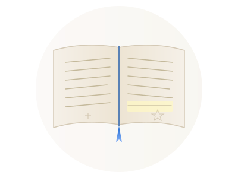

<!--PYKELET

DESCRIPTION: Together, let's turn ideas into reality. Reach out to start your journey!

TITLE:       Andrew Kingdom
SITE:        akingdom.github.io
HOST:        github.io
FILENAME:    README.md
AUTHOR:      Andrew Kingdom

-->
<link rel="stylesheet" href="styles/common.css">
<!-- QR Code -->

<!-- QR Code end -->

##  [Andrew Kingdom](https://akingdom.github.io) · [Contact Me]

<!-- Search Box -->

    

        <input type="text" id="search-input" placeholder="Search my content..." oninput="handleSearchInput(this)" onkeydown="handleSearchKeydown(event)">
        <button class="clear-button hidden" onclick="clearSearchInput()">X</button>
        <svg fill="currentColor" viewBox="0 0 20 20" xmlns="http://www.w3.org/2000/svg" class="search-icon">
            <path fill-rule="evenodd" d="M8 4a4 4 0 100 8 4 4 0 000-8zM2 8a6 6 0 1110.89 3.476l4.817 4.817a1 1 0 01-1.414 1.414l-4.816-4.816A6 6 0 012 8z" clip-rule="evenodd"></path>
        </svg>
    

    

<!-- Search Box end -->

**[Areas of Expertise](#work-i-do)** — [Language](#interests) · [Software](https://github.com/akingdom/akingdom/#current-programming-and-markup-languages) · [Technology](https://github.com/akingdom/akingdom/#platforms) · [Everything Else](#interests) · [Quotes](#quotes)

## How I Can Help

I provide patient, one‑on‑one IT support, tutoring, and custom tool‑building for people who find technology overwhelming — the way NDIS supports health, I support tech. Whether you need a problem solved, a skill learned, or a lightweight tool built just for you, I’m here to help without jargon or judgment.

-  **Patient tech support** — For seniors, non‑tech‑savvy individuals, and anyone who just wants things to work.
-  **Minimalist websites & tools** — Streamlined one‑page websites and lightweight web apps.
-  **One‑on‑one tutoring** — Programming, Microsoft Office, genealogy software, and more.
-  **Custom automation** — Let me build a small tool or script that takes a tedious task off your plate.
-  **Code translation & data pipelines** — Moving logic between languages or transforming messy data into clean output.
-  **Remote or on‑site** — I work with clients across Victoria and beyond; remote support available worldwide.

*"Together, let's turn ideas into reality. Reach out to start your journey!"*

## What Clients Say

> “Andrew was brilliant! Definitely knows his trade. On top of which, he was flexible and patient. All in all, he did a great job in getting the job done! AAA+++” — **Tony H.**

> “Omg this man is a Saint. So knowledgeable, so personable. I was very stressed but Andrew calmed me down and got my scanner and computer talking again all through remote assistance. Thanx Andrew” — **Jane D.**

> “Andrew did an excellent job. Very patient and extremely knowledgeable. Strong recommend if you want to improve your programming skills.” — **Graham H.**

> “THANK YOU SO MUCH Andrew. I had been pulling my hair out trying to figure this out. THANK YOU for everything you did. PLUS your patience waiting and cleaning out the huge build up of dust and dog hair lol. I am most appreciative and highly recommend you.” — **Leonie B.**

> “I was pulling out my hair with Computer stuff beyond my knowledge. Andrew was so wonderful and so happy to help me get my problems fixed. I will definitely be going back to them for any future computer problems. 👌🏻” — **Fleur M.**

> “Andrew is a good knowledgeable teacher and easy to learn from. Professional and reliable. Would recommend.” — **Bernadette K.**

## Featured Projects

<table>
<tr>
<!-- AI Tools -->
<td width="33%" valign="top">
  
   <strong>AI Tools</strong>
   <small>Duplicate Word Finder & Prompt Extraction — sharpen your AI workflow instantly.</small>
</td>

<!-- Scripture Viewer -->
<td width="33%" valign="top">
  
   <strong>Scripture Viewer</strong>
   <small>Offline‑first Bible reader with multiple translations, full‑text search, and calming text‑to‑speech.</small>
</td>

<!-- Talking Clock -->
<td width="33%" valign="top">
  
   <strong>Talking Clock</strong>
   <small>Analog clock with real‑time voice synthesis, inspired by Telstra's classic 1194.</small>
</td>
</tr>
</table>

## Technology Expertise

- **AI** — Ethics, tutoring, prompts, tasking.
  - [AI Governance Policy](https://akingdom.github.io/articles/AI_Governance_Policy_Accountability_First) · [Universal Ethical Framework](https://akingdom.github.io/articles/Ethical_Framework_for_Future_AI) · [AI Communication](https://akingdom.github.io/articles/optimizing_communication_with_ai) · [AI Nomenclature](https://akingdom.github.io/articles/ai_nomenclature) · [AI & Art](https://akingdom.github.io/articles/AI-is-Arts-Next-Tool-Not-Grave) · [AI Protocol](https://akingdom.github.io/articles/ai_verifiable_reality) · [Simplified AI Architecture](https://akingdom.github.io/articles/limits_of_simplified_AI_architecture)

- **Programming Languages** — Objective‑C, Java, C#, Swift, HTML, JavaScript, CSS, and more.
  - [Advice for Students](https://akingdom.github.io/articles/Programming-Advice-AK) · [Source Code](https://github.com/akingdom?tab=repositories) · [Code Extracts](https://gist.github.com/akingdom) · [Guides](https://github.com/akingdom/) · [Standards](https://github.com/akingdom/)

- **Platforms** — Cloud (AWS, Azure, Google), servers (Windows, Linux), desktop (macOS, Windows), mobile (iOS, Android), embedded (MicroChip, Raspberry Pi).
  - [External Content in Apple Apps](https://akingdom.github.io/articles/apple-developer-external-content)

- **Development Tools**
  - [RTF viewer](https://akingdom.github.io/markdown_tools/rtfreader.html) · [Markdown viewer](https://akingdom.github.io/markdown_tools/markdown_viewer.html) · [Markdown TOC](https://akingdom.github.io/markdown_tools/markdown_toc.html) · [HTML → Markdown](https://akingdom.github.io/markdown_tools/markdown_gfm_from_richtext.html) · [GitHub project list](https://akingdom.github.io/git-me/) · [YouTube comment formatter](https://akingdom.github.io/markdown_tools/markdown_to_youtube_comment_formatter.html) · [Duplicate Word Highlighter](https://akingdom.github.io/duplicate_word_highlighter/duplicate_word_highlighter.html) · [QR Code Generator](https://akingdom.github.io/design_tools/generate-qrcode.html) · [Colour Blender](https://akingdom.github.io/design_tools/color-blender.html) · [Image Focal Length](https://akingdom.github.io/design_tools/image_lens_distortion_tool.html)

- **System Tools**
  - [Password Generator](https://akingdom.github.io/system_tools/password_generator.html)

## Interests

- **Nature & Science** — Biology, geology, cosmology, physics.
  - [Venomous Bites & Stings](https://akingdom.github.io/articles/first_aid_venomous_bites_stings) · [Apollo 13](https://akingdom.github.io/articles/apollo13-review_apollo14-17) · [The Moon](https://akingdom.github.io/articles/moon)

- **Practical Thinking** — Philosophy, religion, psychology, mathematics, epistemology.
  - [Creative Thinking](https://akingdom.github.io/articles/creative_thinking_cycle) · [Aspiring Leadership](https://akingdom.github.io/articles/aspirational_leadership) · [Change Imperative](https://akingdom.github.io/articles/change_imperitive) · [Mathematics](https://akingdom.github.io/articles/maths) · [Discipline & Trauma](https://akingdom.github.io/articles/Trauma_and_Discipline_v2) · [Belief & Trauma](https://akingdom.github.io/articles/Trauma_and_Belief) · [Awareness & Healing](https://akingdom.github.io/articles/trauma_healing_and_awareness) · [Gifted People & GTD](https://akingdom.github.io/articles/Executive_Congestion) · [Power to Peace](https://akingdom.github.io/articles/Power_vs_Peace-Beyond_Jurisdiction) · [Peace, Integrity & Evidence](https://akingdom.github.io/articles/Peace_Integrity_and_Evidence) · [Architecture of Authority](https://akingdom.github.io/articles/Architecture_of_Authority-First‑Principles_Analysis_of_Governance)

- **Technology** — Embedded systems to complex networks.
  - [System Design Principles](https://gist.github.com/akingdom/bf3f498810a33e17f2d6d12425ef51ff) · [Local Web App Orchestration](https://akingdom.github.io/articles/Unified_Local_Orchestration_Architecture) · *See AI section above*

- **History & Language** — Archaeology, etymology, genealogy, modern Greek, foreign films.
  - [Etymology](https://akingdom.github.io/articles/etymology) · [Shape Theory](https://akingdom.github.io/articles/ShapeTheory) · [Indigenous Peoples](https://akingdom.github.io/articles/indiginous-peoples) · [Japanese](https://akingdom.github.io/articles/Japanese) · [1820s Newspaper](https://akingdom.github.io/articles/the_times_1820_feb_09)

- **Food & Cooking** — Learning the art (and how not to burn water).
  - [Recipes](https://github.com/akingdom/food-recipes) · [Weight & Health](https://akingdom.github.io/articles/weight-health)

- **Creative Endeavors** — Reading, writing, UI, artwork, music.
  - [Music](https://www.youtube.com/channel/UCJAeF7xHIxwT8UwCKFxfwPQ) · [Art](art2/) · [Stereograph Tool](https://akingdom.github.io/design_tools/stereograph-swapLR+flipL.html) · [Cleopatra Visualisation](https://akingdom.github.io/articles/reconstructing_cleopatra_vii) · [AI Art](https://akingdom.github.io/art2/)
  - **Writing** — [On Writing](https://akingdom.github.io/articles/AK_on_writing) · [Jane Austen](https://akingdom.github.io/articles/AK_on_Jane_Austen) · [Micro Stories](https://akingdom.github.io/articles/microstorywriting) · [The Unsafe Saddle](https://akingdom.github.io/articles/microstory-The_unsafe_saddle) · [The Goose Bride](https://akingdom.github.io/articles/The_Goose_Bride)
  - **Software** — [Talking Clock](https://akingdom.github.io/talking_clock) · [Match Blocks](https://akingdom.github.io/matchblox) · [Code](https://gist.github.com/akingdom/09f1bef20fd0f601cbb2b8d504ef6f9c)

## My Philosophy

Technology should work for people, not the other way around. I approach every problem as a chance to listen, solve, and teach — patiently and without jargon.

> “Where possible, focus on things that are worthwhile.” — *Andrew Kingdom*

> “The fallback rule of systems success: always use the best tool for the job. Build tools to survive tougher jobs than anticipated and to fail safely when they break.” — *Andrew Kingdom*

> “If a lack of effort isn't the problem, more effort is not the solution. If we want to achieve more, we often need to do less.” — *Jessica McCabe*

<strong>More quotes I live by</strong> (click to expand)

> A movie is never really finished, just released. — *Bonnie Arnold*

> If you're not embarrassed by your early work, you spent too long on it. — *Attributed to Neil Gaiman*

> The opposite of addiction is not sobriety but connection. — *Johann Hari*

> Even experts know less than 1% of everything that can be known about life, the universe and everything. — *Andrew Kingdom*

> Being an expert in one field does not guarantee expertise in another. — *Andrew Kingdom*

> No work is ever worth a divorce. — *Andrew Kingdom*

> You can't truly love others if you're not caring for yourself. It's like how airlines say, 'Put on your own mask first, then help others.' — *Andrew Kingdom*

> Intelligence has little to do with a person's value as a human. — *Andrew Kingdom*

> True life transformation isn't the fruit of human effort — it's not something owed or earnt — but a reliable divine gift, granted freely through grace. — *Andrew Kingdom*

> A.I. is a tool made by humans to assist humans; don't confuse it with actual intelligence. — *Andrew Kingdom*

> Un-deception is the successful resolution of misapprehension — changing your own mind concerning a misbelief. — *A. Kingdom on C.S. Lewis on J. Austen*

> I.Q. tests measure a narrow band of mental ability and generally exclude a person's full intellect, emotional quotient, physical intellect, spatial intellect, spiritual intellect, love, kindness, ethics, and mental alertness. — *Andrew Kingdom*

> Understanding emotional context improves decision-making and strengthens relationships. — *Andrew Kingdom*

> Use your connections to find the back door into an organisation rather than worrying about getting stuck in the front door. — *Temple Grandin*

> Add new technology only if it clearly reduces workload — each addition must simplify processes to offset the complexity it brings. — *Andrew Kingdom*

> Thoughts and ideas are like food — we need them to live, but there are junk thoughts and healthy thoughts. — *Andrew Kingdom*

> Computers (and thus AI) are mainly an aid to extend human thinking and memory. — *Andrew Kingdom*

> A person who struggles and moves forwards will generally go much further in life than a person who never had to struggle at all. — *Andrew Kingdom*

> Creating on a computer is like cooking in a kitchen: fairly pointless if no one eats the food. — *Andrew Kingdom*

## Let's Work Together

I'm open to freelance, consulting, and collaboration opportunities — remote or on‑site (Victoria, Australia).

- **Best way to reach me:** [GitHub Issues](https://github.com/akingdom/akingdom.github.io/issues) (public)<!-- or via [email](mailto:akingdom@example.com)-->
- **What happens next:** Send me a message describing your challenge. I'll reply<!-- within 24 hours-->, and we'll figure out together whether I'm the right fit — no pressure, no jargon.

*I focus on individuals, small businesses, and practical tools. I don't take on large‑scale corporate contracts or full‑stack web design — but I can build you a lightweight solution that gets the job done.*

## Footnotes

- *Feedback*: Issues, discussion and initial contact requests can be raised via [*GitHub Issues*](https://github.com/akingdom/akingdom.github.io/issues).
- *Licensing*: This website repository contains content under different licenses. See [`LICENSE.txt`](./LICENSE.txt) for details.
-  My GitHub user icon: Quantum Computing with an artistic twist.
- (C) Copyright 2024 Andrew Kingdom. All rights reserved.

<!-- ALL SCRIPTING -->

