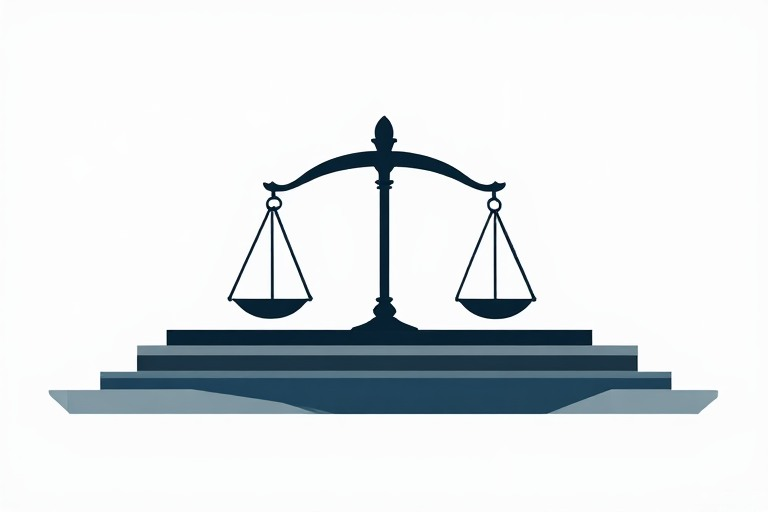
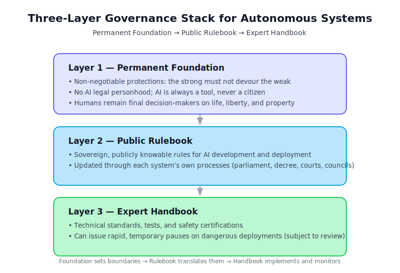

# Governing Autonomous Systems:
## A Layered Framework for Accountability

---

**Version:** 1.0  
**Date:** June 2026  
**Status:** Living Document — Subject to Revision as the Technology and Global Context Evolve

*This paper reflects the state of AI governance discussions as of mid-2026. The regulatory landscape is changing rapidly. Readers are encouraged to verify current developments and adapt the framework to their specific context.*

---

### A Note to the Reader

This is a working document for lawmakers, engineers, business leaders, and citizens who must decide how to live with machines that can think.

**This framework is not balanced in the way a math equation is balanced.** It tilts toward the ordinary person—the worker, the patient, the parent, the elderly—who did not ask for this technology. That is what law is for.

This tilt creates genuine hardships for others: startups, sovereign nations, corporate shareholders, and engineers. We have listened to those objections. Where we can adjust without abandoning the vulnerable, we have done so. Where we cannot, we will explain why.

Our goal is not to condemn anyone. It is to build a fence at the top of the cliff.

**The framework is adaptable** to customary, religious, and community-based legal systems. It is designed to function alongside diverse governance traditions, not to replace them.

---

## Part 1: The Foundation of Any Durable Law

Every legal system rests on an unprovable assumption.

- Some assume the state's command is legitimate.
- Some assume maximizing happiness is the ultimate good.
- Some assume efficiency is the highest virtue.
- Some assume community consensus is the ultimate authority.

**We assume something different:** Every human being possesses inherent, non-negotiable worth, regardless of intelligence, productivity, or usefulness. In many traditions, this worth is bound up with community, family, lineage, or relationships. The core protection remains: **the strong must not devour the weak.**

History shows—across every culture and every era—that when societies abandon this assumption, the strong devour the weak, and civilization collapses into tyranny or chaos.

This conviction is expressed in diverse traditions:
- In the Confucian tradition, as the duty of benevolent governance.
- In the Islamic tradition, as *adl* (justice).
- In the African philosophy of Ubuntu, as mutual humanity.
- In Indigenous traditions, as stewardship of creation.
- In the Western natural law tradition, as inherent human dignity.
- In the human rights tradition, as universal and inalienable rights.

**These traditions do not all mean the same thing by "dignity."** The framework requires only a minimal shared commitment—that the strong should not devour the weak—without insisting on a specific conception of dignity.

**Why this matters to you:**

- **If you are a startup founder**, you fear heavy regulation will crush you.
- **If you are a sovereign nation**, you fear global rules are imperialism dressed in neutral language.
- **If you are a corporate executive**, you fear absolute liability will stall innovation.
- **If you are an engineer**, you fear being made a scapegoat.
- **If you are an ordinary citizen**, you fear being rendered obsolete or exploited.

Every one of these fears is legitimate. We address each of them directly.

---

## Part 2: The World As It Is

There is no single global approach to AI governance. Approximately 200 sovereign states, each with its own history, culture, economic pressures, and political system, are navigating this challenge in their own ways.

**Legal systems vary widely.** Customary law, religious law, community-based adjudication, and oral traditions operate alongside formal state law. The framework adapts to these contexts.

Some states are enacting comprehensive AI legislation. Others are pursuing principles-based or voluntary approaches. Many Small Island Developing States, Least Developed Countries, and conflict-affected states lack the regulatory infrastructure to craft comprehensive AI laws.

**Alternative accountability mechanisms exist** for contexts where state enforcement is limited: community-based oversight, corporate self-regulation with external verification, regional cooperation, and international pressure.

Across Africa, Latin America, and Southeast Asia, there is strong resistance to "digital colonialism"—the fear that global rules will be written in Western capitals and imposed on everyone else. Every state is concerned about sovereignty.

**The threat to human dignity comes from multiple sources:** corporations, states, elites, foreign powers, and unaccountable institutions. The framework addresses all these forms of power.

**AI development may follow multiple trajectories.** Resource constraints, social resistance, geopolitical conflict, or catastrophic failures could disrupt development. The framework is robust to multiple possible futures.

**We do not propose a unified global law or a world enforcement body.** We propose a patchwork of sovereign interests, each acting in its own perceived self-interest, yet facing a shared problem: a catastrophic AI event anywhere will affect everyone.

**What this means in practice:**

- States will adopt different rules. This is normal.
- Some rules will conflict. This must be managed.
- Corporations will navigate multiple frameworks.
- Communities with customary or religious legal systems will adapt the framework to their contexts.
- States with limited capacity will use alternative accountability mechanisms.

The framework requires only that rules exist, that accountability is clear, that victims receive restitution, and that dangerous deployments can be paused.

**These requirements can be met within any political system** that values stability and order—a monarchy, a single-party state, a theocracy, or a military junta—provided that the rulers see value in predictability and social cohesion.

---

## Part 3: A Three-Layer System – Built to Last, Built to Adapt

Because AI changes fast, we need a layered system where each layer updates at its own natural speed.

### Layer 1: The Permanent Foundation

The ground floor contains the few, hard rules that cannot be compromised by any legislature, ruler, corporation, or court.

- **No AI may ever be granted legal personhood.** It is a tool, not a citizen.
- **A human being must always be the final decision-maker** for any action that significantly affects another human being's life, liberty, or property.
- **The entity that deploys an AI for commercial or significant public benefit is absolutely responsible** for its actions (detailed in Part 4).

**The framework does not assume that the legal subject is an autonomous individual.** In many traditions, the legal subject is relational, communal, or hierarchical. The foundation remains: those in positions of power and benefit bear the responsibility for harm.

**Why this works:** It gives everyone a clear, non-negotiable boundary.

### Layer 2: The Public Rulebook

This is where the rules governing AI development and deployment are created and updated. The mechanism varies by political system: parliamentary debate, royal decree, party deliberation, judicial interpretation, community consensus, or other established processes.

**The architecture does not prescribe any particular mechanism.** It requires only that:
- Rules exist and are publicly knowable (subject to legitimate opacity where exposure would cause harm)
- Rules can be revised in a predictable manner
- The process for revision is transparent enough that affected parties can anticipate changes

**Why this works:** It respects each state's sovereignty and political traditions while ensuring rules are not static.

### Layer 3: The Expert Handbook

Technical specialists create precise standards, testing procedures, and safety certifications.
- This layer can issue a temporary "pause" on any deployment showing unexpected dangerous behavior.
- The pause is subject to immediate review by the appropriate authority—a court, a ruler, a party committee, a community council—but it can be issued in hours, not months.

**Risk assessment is not exclusively technical.** Many communities assess risk through spiritual, relational, or cosmological frameworks. The Expert Handbook allows these forms of knowledge to be heard and respected alongside technical expertise.

**Why this works:** It respects the speed of technology while holding experts accountable to the layers above.

---

## Part 4: The Rule of Absolute Accountability

**The Core Rule:** The human or corporate entity that puts an AI into the world—and derives economic or strategic benefit from it—is fully and absolutely accountable for whatever that AI does, regardless of negligence or care.

**Why we must be this firm:** If a company can say, "We didn't expect it," the victim has no one to turn to. That is not justice. That is the rule of the strong over the weak.

**AI development occurs in diverse organizational forms:** corporations, state-owned enterprises, military contexts, academic institutions, and informal collectives. Accountability applies to all entities that derive benefit from AI deployment.

**Harm is defined differently across cultures:** financial loss, dignitary harm, community disruption, environmental damage, and spiritual injury are all forms of harm. Each jurisdiction defines harm in its own terms, while maintaining a minimum standard that prevents the strong from devouring the weak.

**But we have built in explicit safeguards:**

**For the Startup and the Open-Source Developer:**
- The rule applies based on commercial scale. Non-commercial researchers, hobbyists, and small startups are exempt from full financial liability.
- The threshold is set by the Expert Handbook and reviewed annually.

**For the Individual Engineer:**
- Liability is organizational, not personal in most contexts. Engineers are not personally liable for emergent harm, unless they acted with malicious intent or gross negligence.
- Strong Whistleblower Protection: engineers who raise safety concerns in good faith are legally protected from retaliation.

**For the Corporate Executive, State-Owned Enterprise, and Other Beneficiaries:**
- Safe Harbor for entities that proactively submit to independent safety audits, publish transparent reports, and participate in the Council. Liability in civil cases is capped to the amount contributed to the fund.

---

## Part 5: The Shared Safety Fund – Coordinated Risk Pooling

Absolute accountability needs a practical mechanism. We propose a voluntary, coordinated risk pool.

**How it works:**
- Every entity deploying high-impact AI may contribute a progressive levy.
- The levy is steeply progressive: small startups pay nothing; largest entities pay the highest rate.
- If an AI causes harm, the victim receives swift, no-fault compensation from the fund.
- If later investigation proves the entity was reckless, the fund may reclaim the payout. The victim is never left waiting.

**Why voluntary?** No state, corporation, or other entity will accept compulsion from a global body. The fund is a mutual insurance mechanism—those who contribute benefit from the protection. Those who do not bear full liability themselves, which is a strong incentive to participate.

**The fund can operate through** community-managed trust funds, regional insurance pools, or bilateral agreements. The goal is victim compensation, not institutional uniformity.

**Addressing corruption and mismanagement:**
- The fund is administered by a rotating, multi-stakeholder board, including civil society, industry, academia, and affected communities.
- No single nation controls the fund. It is chartered under a neutral international agreement.
- Disbursements are published in a public, searchable ledger, subject to independent audits.
- The fund operates with appropriate opacity where necessary for safety.

**This is coordinated self-interest.** States, corporations, and other entities act in their own interest, recognizing that a catastrophic AI event anywhere will require resources to address everywhere.

---

## Part 6: The Council of Good Faith

We do not pretend nations will agree on a single unified code. They have different histories, cultures, economic systems, and political systems.

**The Proposal:** A non-binding, permanent Council of Good Faith.

This is not a world legislature or enforcement body. It is a forum for dialogue where states, corporations, communities, and other actors can:
- Share information about emerging risks
- Identify areas of genuine convergence
- Publish transparent reports
- Build trust for voluntary cooperation

**How it works:**
- Participation is voluntary.
- The Council publishes a public "Conscience Report" every quarter, mapping how each participant's AI policies align with universal human dignity principles. It does not condemn; it illuminates.
- The only sanction is publication of the report. Public accountability is more powerful than any treaty.

**The Council's reports may be disseminated through** community assemblies, religious institutions, customary authorities, or regional networks. The goal is accountability, not a specific medium.

**Addressing concerns about cultural imposition:**
- The Council grounds its deliberations in multiple traditions: Confucian benevolence, Islamic justice, African Ubuntu, Indigenous stewardship, Western natural law, and human rights.
- The Council does not demand uniformity. It demands a good-faith articulation of how each participant's policy protects its own vulnerable populations.
- Participation is voluntary.

**The Council must be genuinely inclusive:**
- Rotating regional representation
- Dedicated seats for Small Island Developing States, Least Developed Countries, and conflict-affected states
- Secretariat located outside the Global North
- Mandate to publish capacity-building progress reports

---

## Part 7: Practical Steps for All States and Communities

**1. Define AI by Capability, Not Architecture.**
- Define rules by what the system can do—its capacity to cause harm, manipulate, or make decisions at scale.

**2. Close the Intent Gap.**
- No AI-generated contract, regulation, or judicial ruling may be enforced without a named, verifiable human author who accepts responsibility.
- For those who evade this: a civil offense, with a significant fine paid into the Shared Safety Fund.

**3. Build Whistleblower Channels Now.**
- Establish independent, anonymous reporting channels. Protect reporters by law or custom from retaliation.

**4. Embrace the Pause.**
- Give expert agencies or equivalent bodies the authority to issue temporary "stop work" orders on dangerous deployments.
- The agency must appear before a judge, ruler, reviewing body, or community council within 48 hours to justify the pause.

**5. Build Capacity, Not Just Rules.**
- Include explicit provisions for technology transfer, regulatory assistance, and South-South cooperation.

**6. Acknowledge the Weight Openly.**
- Speak honestly about how heavy this responsibility is. Nobody wants to carry this burden alone.

---

## Part 8: Clarifying Scope and Compatibility

This framework rests on a specific foundational assumption: the inherent, non-negotiable worth of every human being. This assumption is found across traditions—Confucian, Islamic, Ubuntu, Indigenous, Western natural law, and human rights.

**We do not claim these traditions mean the same thing by "dignity."** They share a minimum commitment: the strong must not devour the weak. The framework requires only this minimum boundary.

**What this framework is:**

A practical governance architecture for regulating powerful autonomous systems that can cause significant harm. It offers a layered solution—Permanent Foundation, Public Rulebook, Expert Handbook—designed to function across diverse political and legal systems.

**What this framework is compatible with:**

A wide range of philosophical and political commitments. A secular state, a religious society, a socialist collective, a capitalist democracy, a monarchy, or a single-party system can all adopt these structural principles, provided they share the core commitment to protecting the vulnerable from unchecked power.

The framework does not require any particular ultimate metaphysics. It requires only that rules exist, that accountability is clear, that victims receive restitution, and that dangerous deployments can be paused.

**The framework accommodates** moratoriums, bans, and pre-emptive abandonment as legitimate governance options.

**What this framework is not:**

A theological claim. A preferred form of government. A unified global law. A world enforcement body. A demand for uniformity.

States will adopt different rules. This is normal. The goal is not to eliminate divergence but to ensure that divergence does not lead to catastrophe.

States are at different stages of concern and readiness. The framework accommodates both urgent and gradual adoption.

**The framework stands or falls on its practical utility, not on the metaphysical agreement or political uniformity of its users.**

---

## Part 9: A Final Word

We have written this paper because we see a storm gathering.

The people building the most advanced AI are brilliant, creative, and often well-intentioned. They are also under enormous pressure—from shareholders, competitors, and the thrill of discovery. Pressure distorts judgment.

This paper is a lever to help them make the right choice without losing their competitive edge. Clear rules. A fund to pay for accidents. Whistleblower protections.

And for the public—the millions of ordinary people who will be affected by AI whether they want to be or not—this paper is a shield: *"You are not obsolete. You are not expendable. The law sees you."*

**The framework protects both individuals and the communities that sustain them.** In many contexts, the primary unit of concern is the community, not the individual.

**To the startups:** We have exempted you from the crushing burden until you grow. Build a fence alongside us.

**To the sovereign nations:** We respect your traditions and political systems. Articulate how your policy protects your own vulnerable. Let us talk, not dictate.

**To the corporate executives:** A safe harbor for transparency. A pooled risk fund. Lead in safety.

**To the engineers:** You are not the scapegoat. We will protect you when you speak up.

**To the ordinary citizen:** We have remembered you.

**To the communities and collectives:** Your traditions, customs, and ways of knowing matter. The framework adapts to you.

The law is not perfect. This framework is not perfect. It will need revision and correction when it fails. But it is built on a love for the vulnerable that is strong enough to carry us through the difficult decades ahead.

Let us govern with courage. Let us regulate with compassion. And let us always remember that the purpose of law is not to control people, but to free them to live in safety and dignity.

---

**End of Paper**
