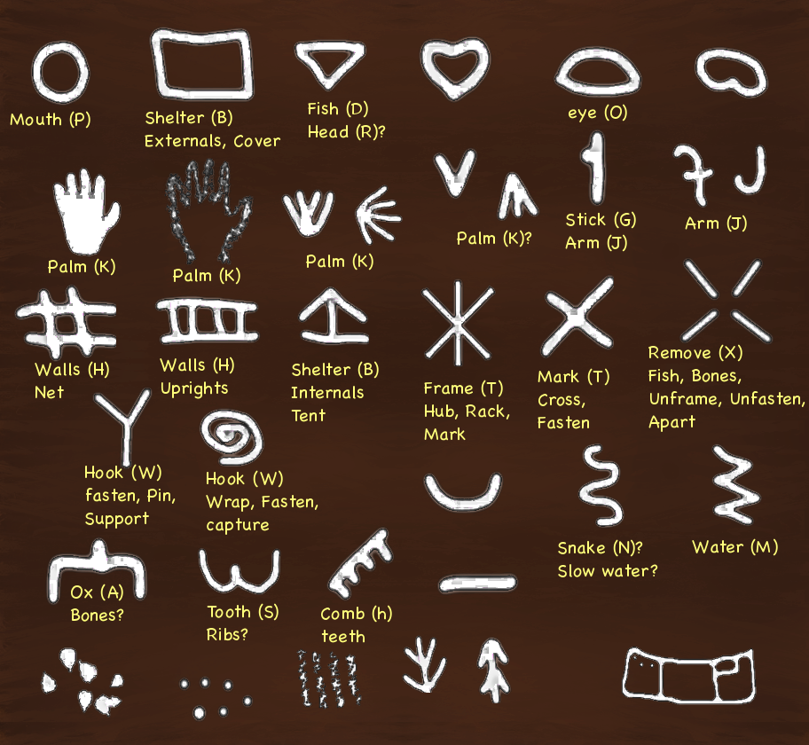

### Shape Theory: A Psychological and Historical Perspective
 
*An exploration of shape theory through the lenses of childhood development and historical practices*, by Andrew Kingdom.

#### **Introduction**:  
Shape theory examines how humans perceive, interpret, and utilize shapes across various contexts, ranging from early childhood development to historical practices. The core idea of shape theory is that certain shapes resonate more deeply with human psychology due to their frequent presence in natural environments and early visual experiences. This text aims to provide a grounded overview of shape theory, highlighting its basis in human development and historical context, avoiding the speculative nature of some other works on the subject. It explores how the familiarity and functionality of shapes like circles, squares, triangles, and hexagons influence human comfort and preference, tying these forms to both early developmental stages and broader cultural practices.

#### **Cognitive Foundations of Shape Perception**

To understand the psychological basis of shape theory, we must delve into the cognitive processes that underpin our perception of visual forms. 

 
*A Navon figure tests various aspects of field dependence vs. independence. Some people see the letter T first, and for others, the embedded letter P is dominant.*

* **Gestalt Principles:** These principles, such as similarity, proximity, and closure, explain how we organize visual information into meaningful patterns. 
* **Independent Elemental Structure:** This perspective is primarily based on the analysis of individual elements, rather than the holistic configuration. By breaking down stimuli into their constituent parts, we can understand the underlying structure and meaning. 
* **Gestalt** and **Elemental** theories are counterpoints, though it varies as to which of these are dominant in a person's perceptions. This relates to why we have the opposing perspectives of Albert Einstein vs. Niels Bohr in physics for example.
* **Analytic vs. Holistic Thinking:** This cognitive style dimension, often assessed through various cognitive tests and questionnaires, measures an individual's preference for analytical or holistic thinking. Analytic thinkers tend to break down problems into smaller parts, while holistic thinkers prefer to consider the big picture.
* **Field Dependence vs. Independence:** Likewise, this cognitive style dimension, often measured by tests like the Rod and Frame Test or the Embedded Figures Test, assesses an individual's tendency to rely on external cues or internal reference points. Field-dependent individuals tend to perceive the whole, while field-independent individuals are more likely to focus on components.
* **Spatial Reasoning:** The ability to mentally manipulate and understand spatial relationships is fundamental to shape perception.
* **Neural Basis:** The visual cortex plays a crucial role in processing visual information, including the recognition of shapes.

#### **Shapes in Early Childhood Development**

The early years of life are a critical period for the development of shape perception. As infants explore their environment, they encounter a variety of shapes, from the rounded forms of faces and objects to the angular structures of buildings and furniture. 

 
*A mother’s face up-close is rounded like an oval or circle to a baby.*

* **Square:** As children begin to interact with objects, they encounter square and rectangular shapes, which are fundamental to understanding spatial relationships and stability.

 
*Children learn that square are good for building.*

* **Triangle:** The triangular shape, with its sharp angles and strong structure, is often associated with stability and strength, as seen in natural formations like mountains and in human-made structures like roofing and pyramids. 

 
*Children learn that rain water falls best off a sharply angled roof.*

* **Hexagon:** While less common in early childhood experiences, hexagons are nonetheless significant due to their efficient packing properties, as seen in honeycombs.

 
*Children learn from observing nature, that a hexagon is a strong, compact shape.*

#### **Historical Foundations of Shape Theory**:

Shapes have held profound cultural and symbolic significance throughout history. 

* **Circle:** Often symbolizing unity, eternity, and perfection in various cultures, the circle is frequently found in religious and spiritual contexts.
* **Square:** Associated with order, stability, and the earthly realm, the square is a common motif in architecture and art.
* **Triangle:** Representing stability, power, and divinity, the triangle is a ubiquitous symbol in many cultures, from ancient Egyptian pyramids to Christian iconography.
* **Hexagon:** Symbolizing balance, harmony, and efficiency, the hexagon is found in various natural and human-made structures. 

## Historical and Cognitive Evolution in Writing Systems:

 
*Ancient symbolic shapes are scattered all across European, mostly in caves. These symbols are picture art symbolic shapes are twice as common as pictures that have survived, mostly in caves. These symbols were collected in many cave visits by Genevieve von Petzinger and her husband Dillon, whom the author (AK) has spoken with on the topic. To hint at the skill and intelligence of these ancient artists, the author has added some speculative meanings and alphabetic letters, largely influenced by overlapping studies of Mediterranean alphabets.*

Ancient usage of shapes in records and storytelling tend to reflect **location elements** (river, tree, animals), **body parts** (hand, eye, mouth), **engineering** (trees or other columns form a wall, angled branches or other beams form a roof).
Scribbling and Symbolic Development: Scribbling in early childhood reflects developmental milestones in motor skills and cognitive processes, including spatial awareness and symbolic representation. Research indicates that the progression from random scribbles to more recognizable shapes aligns with theories in developmental psychology that link motor activity with cognitive development. This stage is crucial for understanding how children conceptualize and externalize their perceptions of the world. 

## Historical and Cognitive Evolution in Writing Systems:

 
*Linear B, a syllabic script used to write Mycenaean Greek, is a significant early writing system as it provides invaluable insights into the Bronze Age Greek language and culture, revealing details about their society, economy, and religion.*

The understood development of writing systems provides insight into the human ability to abstract shapes and symbols for communication purposes. Early writing systems, such as cuneiform, oracle bone script and Egyptian hieroglyphs, illustrate the progression from pictographic to ideographic representations. These early forms often incorporated visual symbols that were abstracted from natural shapes or objects to represent concepts or sounds. The shift to alphabetic systems, including the Semitic and later Greek alphabets, represents a significant abstraction from logographic and syllabic scripts. This transition reflects a move towards more standardized and efficient forms of written communication, paralleling the increasing complexity of human thought and language. Understanding these historical shifts in symbolic representation enhances our comprehension of shape theory, illustrating the innate human capacity to abstract and communicate through visual forms. 
&nbsp; 

## Conclusion

Shape theory provides valuable insights into how humans interact with and perceive their environments, influenced by both psychological development and historical practices. By examining the early childhood experiences with shapes and their historical applications, we can appreciate the deep-seated human preferences for certain forms. This exploration challenges more speculative accounts by grounding shape theory in observable developmental milestones and cultural evolution, demonstrating that the familiarity and functionality of shapes like circles, squares, triangles, and hexagons are fundamental to human cognition and comfort.

My interest in this is largely because: psychology and childhood development theory forms an essential part of software design, which is a large part of what I do professionally.

May be freely reproduced so long as the author is credited. CC-BY
*A brief discussion on shape theory psychology by Andrew Kingdom*
