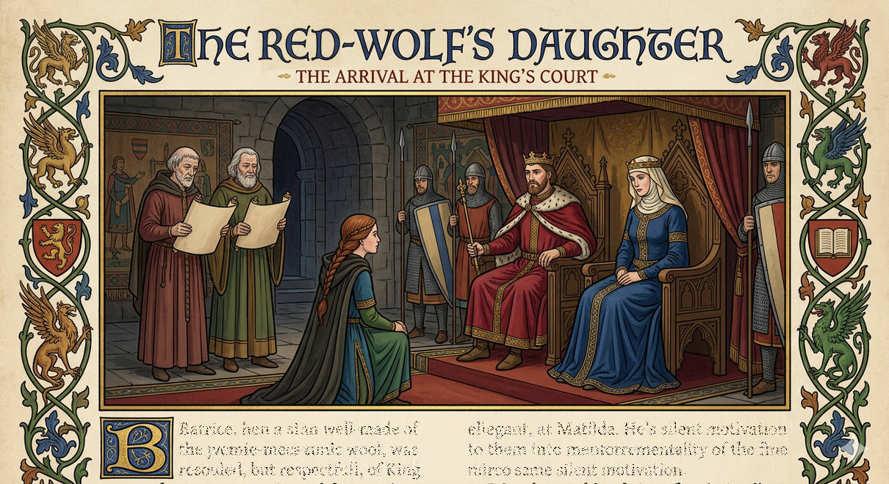

# The Goose Bride

    

        
        
    

## THE GOOSE BRIDE — THE CHARACTERS

---

### The King and his Family

| Character | Identity / Purpose | 
| :--- | :--- | 
| **King Henry I** | King of England, Duke of Normandy. Volatile, witty, dangerous, but ultimately just. Father of Godfrey and William. His rash vow drives the plot. |
| **Queen Matilda of Scotland** | Henry's wife. Born Edith of Scotland, with Saxon heritage. Politically astute, protective of her son William, but capable of growth. Beatrice's unexpected ally. | 
| **William Adelin** | Henry's legitimate son and heir, age 12. Queen Matilda's motivation for her initial opposition to Godfrey's match. | 
| **Robert Curthose** | Henry's imprisoned older brother. The man Harold saved from the Severn. Never appears, but his rescue is the source of the old debt. | 
| **Godfrey FitzRoy** | Deuteragonist. Illegitimate son of King Henry I, age 19. A watcher, a waiter, a listener. Has been called "shadow" and "coin" his whole life. | 
| **Duchess Matilda FitzRoy** | Henry's daughter, Godfrey's full-sister. Duchess of Brittany by betrothal (marries 1118). Sharp, observant, becomes Beatrice's friend. | 
| **Avice** | Godfrey's jealous half-sister (fictional), age 21. Dark-haired, with a smile that never reaches her eyes. Represents court hostility. | 
| **Eustacia** | Godfrey's younger half-sister (fictional), age 19. Fairer, quicker to laugh, but the laughter is often at someone's expense. Pairs with Avice. | 

---

### Nobles over the sea (Mentioned Only)

| Character | Identity / Purpose | 
| :--- | :--- | 
| **Conan, Duke of Brittany** | Father of Agnes. Proposes the match between Agnes and Godfrey. |
| **Agnes of Brittany** | Conan's daughter, offered as Godfrey's bride with a dowry of 10,000 marks. The "Brittany threat" throughout the courtship. | 
| **Alain** | Conan's father, retiring to a monastery. Supports the match. | 
| **Giselberthe of Flanders** | Henry I's maternal aunt. |

---

### The Saxons of Stanwey

| Character | Identity / Purpose | 
| :--- | :--- | 
| **Harold Red-Wolf** | Beatrice's father. A Saxon thegn, once a warrior who rode with kings and saved Henry's brother from drowning. Now old and frail, but sharp-eyed. | 
| **Beatrice's Mother** | (Name unknown) Harold's wife, died when Beatrice was 11. Formerly at court? Taught Beatrice everything: herbs, brewing, healing, people. | 
| **Beatrice** | Protagonist. Daughter of Harold Red-Wolf. A Saxon girl of 16 who runs her father's manor, speaks her mind, and loves her goose Goosie above almost all else. | 
| **Goosie** | Beatrice's goose. Hatched from an egg Beatrice acquired as a child. Her mother's last gift. Comic relief, emotional barometer, and plot engine. | 

---

### Knights and Nobles

| Character | Identity / Purpose | 
| :--- | :--- |
| **Lady Margaret** | Beatrice's daily mentor at court, age 29. Assigned by the Queen (likely). Experienced, patient, quietly kind. Teaches Beatrice court etiquette and survival. | 
| **Sir Guy de Montfort** | Young Norman knight, age 24. A bully, petty and cruel. Insulted by Beatrice at a fair months before the story. Wants Stanwey's lands. |
| **Roger of Salisbury** | Henry's Justiciar, age 49. The second most powerful man in England. Keeper of the ledger, sees people as numbers. Cold, efficient, not cruel—just mathematical. | Chapter 9 — The Ledger and the Lion |
| **Court Whisperers** | Unnamed nobles, ladies, and servants who spread rumors and erode Beatrice's reputation. Represent the system's constant pressure. | 

---

### Minor Characters - Royal Court

| Character | Identity / Purpose | 
| :--- | :--- | 
| **The Clerk** | Royal clerk who records the king's words. | 
| **The Steward** | Royal household steward who clears space for the Queen. | 
| **The Royal Marshal** | Marked a gander with the king's seal. Never appears directly. | 

### Minor Characters - Stanwey Farms and Beyond

| Character | Identity / Purpose | 
| :--- | :--- | 
| **The Nurse** | A former wet nurse, age 39. Owns a farm by the river bend where Goosie's egg came from. Gruff, wise. | 
| **The Reeve** | Stanwey's village headman. Harold considers sending him with the goose tribute. | 
| **Staghound** | Harold's loyal dog. Always by the fire at Stanwey. Dies shortly after Harold. | 
| **The Priest** | Arranged the candles at Beatrice's mother's deathbed. | 
| **Farmer's Wife** | One of the farmers Beatrice visits while searching for a bird. Her flock was taken by murrain. | 
| **Tenant Farmer** | Another farmer Beatrice visits. His birds were taken by the Abbot's tithe collector. | 
| **The Old Woman** | Speaks the proverb at the wedding. Represents folk wisdom. | 
| **The Abbot** | (Unnamed) Tithe collector who stripped local farms. Never appears directly. | 

-----------------------------------------------------------------------

## Opening

> A gos may gon þar þe king mot biden. This was a folk speche of þe shires sithen þe Normans comen. Ac a wise wif of Mercie tolde of a maiden þat prouede þe word soth.

-----------------------------------------------------------------------

**“A goose may wend where a King must wait.”**

It was a witless saying from the Norman harrowing of England. Yet, the wise-wives of Mercia spoke of a maiden who proved the word most true.

 

## Chapter 1 — A Goose of My Own

Beatrice bounded across the meadow, crying, her legs driven forward by a flock of geese, gander leading the charge, hissing at the intruder, neck low, wings half-spread, leading the furious chase.

Her mother and father were nowhere in sight.

Then a hand caught her arm.

"Don't move."

A boy stood beside her—older by a few years, well-dressed, calm in a way that seemed impossible. He stared down the geese, spread his arms wide, his cloak opening like great wings.

The geese slowed. Hissed uncertainly. Then, one by one, they turned and waddled back toward the pond.

The girl stared after them, mouth open, panting hard.

"How... how did you do that?"

"My father owns all the geese. My nurse keeps them."

She dried her eyes. "Don't be silly! How can someone own *all* the geese?"

The boy just watched her with a strange expression.

A woman's voice called from the edge of the meadow. "Beatrice?! Come here!"

"Oh. Coming, mother!"

She turned back to thank the boy, but he had vanished.

---

### A promise made

Her mother scooped her up, laughing. "Did you find the geese?"

"The geese found *me*, Mummy. Why were they chasing me?"

"They don't know you, dear."

Beatrice sniffled. "Then can I have one of my own, Mummy? So it knows me?"

Her mother smiled—a warm, tired smile. "We'll raise one together. I'll teach you."

 

## Chapter 2 — The Farm by the River

Three days later, mother took Beatrice's hand and walked her down the lane toward the river.

"Where are we going?"

"To get your goose."

The farm sat by the river bend, just where the meadow gave way to reeds. Geese wandered everywhere—white and grey, hissing and honking, but today ignored them entirely. Beatrice stayed close to mother's skirt.

A woman came out of the farmhouse. Not young, but not old either. She wiped her hands on her apron and looked at them both with calm, measuring eyes.

"How many eggs?"

"One to hatch, one of the speckled ones, if you have it," mother said. "The ones that run true."

"Ah." The woman nodded. "This way."

She led them to the poultry shed. Inside, beneath a sitting goose, among a nest of eggs, one was larger—speckled, warm, alive.

"That one," the woman said. "Due to hatch within the fortnight. But she's not the sitting kind, that goose. Won't see it through."

Mother knelt beside Beatrice. "We'll need a hen, then. A broody one."

The woman considered. "I've got an old speckled hen. Been sitting on stones for a week. She'll take anything."

She fetched the hen—a small, fierce-looking thing with feathers the color of autumn leaves—and placed her in a straw-lined basket. Then, carefully, she added the speckled egg.

The hen ruffled, settled, and tucked the egg beneath her without complaint.

"There," the woman said. "She'll do the work. You just keep her fed and calm."

Mother reached into her pouch. Handed the woman something—a coin, a small cloth bundle, Beatrice couldn't see what.

The woman took it. Looked down, surprised.

"Oh, thank you, my lady."

Mother nodded, politely accepting the basket, steady and careful. She placed it in Beatrice's arms.

"Walk slowly. She's doing the hard part now."

Beatrice walked home holding the basket, barely breathing, as if the smallest movement might break everything. Behind them, the woman watched from the farmhouse door. Just for a moment. Then she turned back to her geese.

 

## Chapter 3 — The Vigil

For two weeks, Beatrice watched.

The hen sat in her basket by the hearth, feathers fluffed, eyes half-closed. She ate when offered, drank when a dish was placed before her, but never left the egg.

"She knows," mother said. "She'll feel it when it's time."

Beatrice brought her scraps. Talked to her. Named her, though the name changed daily.

And every night, before bed, she knelt by the basket and pressed her ear close.

"Is it moving?"

"Not yet. Soon."

Then, on the fourteenth night, as the sun set and the stars came out, the hen stirred.

Beatrice called for her mother.

They sat together in the firelight, watching. The hen shifted, clucked softly, shifted again. And then—a crack. So small Beatrice thought she'd imagined it.

Another crack. A wet, wobbly head emerged.

Beatrice held her breath.

The hen, patient and ancient, did nothing. Just watched as the creature struggled, rested, struggled again. She had done her part. The rest was up to the hatchling.

And when the shell finally fell away, and a damp, bewildered gosling blinked at the world, Beatrice reached out one finger and touched its head.

The gosling made a sound. Small. Questioning.

Beatrice looked at her mother.

"Can I hold her?"

"Wait until she's dry. She needs to know the hen first."

They waited. The hen, satisfied her job was done, stood and walked away without looking back. The gosling cheeped once, turned to the hen, then turned back—toward Beatrice.

"Now," mother said softly. "Now she's yours."

Beatrice lifted the gosling. It fit in one palm, warm and weightless.

She named her Goosie.

 

## Chapter 4 — Mother Lessons

The years that followed were full of geese and growing. Her mother taught her everything—not in lessons, but in the doing of things.

She remembered the first time her mother let her shape the loaves. The dough was soft and alive under her small hands, warm from the hearth. Her mother stood behind her, guiding her fingers, pressing just enough to make the surface smooth.

Teaching her how to tell when bread was ready by the hollow thump of the crust. How to soothe a crying child with a cool hand and a soft word. How much barley went into the ale, and when to add the bog myrtle or yarrow to make it keep through winter.

She learned which green stalks to gather from the riverbank: willow bark to chew for a throbbing head, and comfrey—the "knit-bone"—to bind a farmer’s broken limb. She learned that a tea of lemon balm could lift a heavy heart, but foxglove was a fickle friend that could either steady a racing pulse or stop it cold.

Most importantly, she learned how to look at a fever and know whether it would break with a compress of mugwort or whether you needed to send for the priest.

Beatrice learned. She watched and she listened and she grew.

Then her mother grew tired. Then pale. Then thin.

---

### Apple Blossoms

It was a slow fading, like the light at the end of a long day. Some mornings her mother seemed almost herself—sitting up, asking about the village, wanting to see Goosie. Other mornings she could barely lift her head from the pillow.

Harold was there. Always.

Beatrice would find him in the doorway of the sleeping chamber, watching, his great warrior’s hands hanging useless at his sides. He tried to help—lifting her, bringing water, smoothing the blankets—but his wife smiled at him with such gentle patience that he seemed to shrink.

“Go and tend the fire, husband. Beatrice will stay with me.”

And he would go. Years later, Beatrice would realise that this was her mother's way of telling her father to rest and that he needed to care for himself more from now on.

Beatrice brought apple blossoms once, when the trees first bloomed. She laid them on the pillow, and her mother’s thin fingers touched the petals.

“They smell like spring,” her mother whispered. “Like the year you were born.”

Beatrice didn’t know what to say. She held Goosie instead, and the goose pressed its warm head against her neck.

---

### Falling petals

The end came on a morning exactly like that—warm, soft, the apple trees heavy with pink and white.

Beatrice was fetching water when her father’s shout tore through the village.

She ran.

He was in the doorway of the sleeping chamber, not crossing the threshold, just standing there with his back to her. His shoulders were shaking.

Beatrice looked in.

Her mother lay still. Too still. Her eyes were closed, her hands folded.

Beatrice didn’t cry. She went in and knelt beside the bed and put her cheek against her mother’s hand. It was oddly cool to touch. Not cold yet. Just cool.

Behind her, Harold made a sound she had never heard before and would never hear again. A sound that didn’t belong to the man who had crossed blades with rebels and dragged drowning lords from rivers.

She couldn’t turn around. She wouldn’t. Yet she did.

She lifted Goosie—who had followed, always—and held her so that the goose’s head rested against her father’s shaking shoulder.

“There,” she whispered. “She knows you.”

---

### Everything is wrong

At the burial, Harold stood like a man made of stone. His hands were on Beatrice’s shoulders—heavy, warm, the only warm thing—but he didn’t speak. Didn’t move. Just watched as they lowered the plain wooden box into the rich earth.

The apple trees were still blooming, white petals drifting on the wind. Beatrice hated them for their indifference. She would gladly have stripped every twig bare, if stripping the trees could bring her mother back. She ran from them like a bird flying away. Goosie flapped alongside her, wings half-spread and honking in a frantic, confused rhythm. She bolted through the orchard, past the village and the open fields, her breath coming in ragged stabs.

She ran until her lungs burned and her legs turned to lead. Doubled over, she clutched her knees and waited for the horizon to stop heaving.

When she finally straightened, the world was still, and she was staring over the river at the farm by the bend.

The farm woman was there, by the poultry shed. She looked up, saw Beatrice’s face, and said nothing. Just nodded once and went back to her work.

Beatrice stood there for a long time, Goosie pressed against her leg, watching geese ignore her completely.

The geese knew her now, who she was. That was something, at least. She wondered how geese felt about their mothers.

---

### The weight of memory

She wandered about aimlessly, eventually finding herself back home, stopping at the edge of the clearing.

The hall looked smaller than she remembered. Or perhaps it was that something had gone out of it—her mother’s presence, the warmth of her voice—and without that, the timber and thatch were only timber and thatch, a shell with the life drained out.

In the doorway, her father’s figure no longer seemed the tall man she was so used to; just… leaning, like bones stacked up. One hand was braced against the frame, the other pressed flat against his chest, as if holding something in place that might otherwise escape, staring at the sky.

He saw her, and let out a long, deep sigh, momentarily averting his gaze from her to hide the overwhelming pain of loss, before attempting a borrowed smile.

Beatrice crossed the clearing and took his hand. It was cold.

“I’m here, Father.”

He nodded. His eyes were dull, as though he had retreated from the outside world and withdrawn inside himself.

She led him inside. Goosie followed.

---

### Caring for father

That night, Beatrice built up the fire and sat with him until the logs burned down to ash. He did not speak. Neither did she. When the room grew too dark to see, she touched his arm and guided him toward the sleeping chamber.

He stopped at the threshold.

She saw it then: the bed where her mother had died. The blankets were still rumpled from the morning she had been found. No one had touched them.

“I’ll change the linens tomorrow,” Beatrice said.

He nodded slowly. He did not move.

She waited.

Finally, he turned and walked to the chair by the cold hearth in the main hall. He sat down, pulled his cloak around him, and closed his eyes.

Beatrice did not argue. She brought him a blanket, tucked it around his shoulders, and went to her own bed.

She lay awake a long time, listening. The house was too quiet. No soft breathing from the sleeping chamber. No footsteps crossing the hall. Just the settling of the timbers and the distant cry of an owl.

---

### Rest and healing

In the morning, she found him still in the chair, his cloak pulled tight, the staghound curled at his feet.

He did not sleep in the bed for a month. Each night, he settled into the chair by the hearth, and each morning she found him there, stiff and silent. She did not press him. Instead, she went about the work of the house: she kneaded the bread, she swept the rushes, she tended the fire, she fed the geese. She did not worry him to ask permission. She simply did what needed doing.

When she changed the linens on the bed, she did it while he was in the yard. She washed the blankets in the river, beat them dry on the stones, and folded her mother’s things into a chest at the foot of the bed. She did not tell him what she was doing. She simply did it.

When he came inside and saw the fresh linen, the folded chest, the bed made clean, he stopped in the doorway.

“Thank you,” he said. The first words he had spoken to her that day.

She nodded. “The fire is lit. The bed will be warm.”

He crossed the room slowly, sat on the edge of the bed, and put his hand on the pillow where her mother’s head had rested. He sat there for a long time.

Beatrice closed the door and left him to it. Late that night she heard him sobbing quietly.

---

### Busy every day

In the morning, her father looked refreshed, but frail.

Above the hearth, the sword that had carved through shield walls hung, but now it seemed like someone else’s memory. The familiar bounce in his step was gone, never to return. The man who had led hundreds now sat by the fire with his staghound, watching his daughter run the manor without being asked.

Beatrice had bright eyes, a quick wit, and a habit of speaking her thoughts aloud before deciding whether she ought to. But she learned to watch for the signs—the way he’d pause at the door, the way his hand would go to his chest after climbing the slope from the village. She didn’t say anything. What was there to say?

As red and golden leaves fell from the trees, she saw to the villagers’ *boon-days*, ensuring that the harvest labour they owed Lord Harold was met. She oversaw the *brewing-house* and the *buttery*, and she tended the sick with herbs and medicine, the way her mother had taught her.

And Goosie followed her. Always.

 

## Chapter 5 – The Measure of a Man

It was a still evening in the hall at *Stanwey*. The sun cast long, amber shadows across the rich fallow strips of the fertile river valley, cut deep with an iron tipped plough, and a clamour of rooks circled the wood’s edge, their harsh *kaah-kaah* fading as they settled into the high branches. The smoke from the village fires drifted upward, thin and grey, like a long-held breath finally released.

The spring planting was done, and the heat of Beatrice's July *Name Day* was still a moon’s turn away. Their two serveants were cleaning up in the background. Beatrice sat down and watched her father trace a finger along the vellum of his *Psalter*, his lips moving with the Latin wording.

"Father?" she asked softly.

He paused, the precious book resting on his knees. "Sweet daughter?"

"How many winters have I lived through? Truly?"

"Let me see," he mused, his gaze drifting toward the fire as he worked the years in his head. "You had seen but two winters when *King Henry* claimed the throne. Now, it is his twelfth year, I believe. Let me check..."

He turned the parchment pages toward the front, where the calendar of saints was marked with tiny, cramped notes. His finger settled on a faded ink-mark in the margin. "Fourteen," he murmured. "Fourteen years since the great frost's Iron-Bite killed the cattle. A very bad year. *Annus horribilis*. And yet, in the middle of it all, God gave your mother and I a most unexpected little gift."

Seeing his distant smile, Beatrice leaned in and smiled. “Tell me, Father...” For she knew it would bring him pleasure to tell his tales—to pull the old world out from the shadows of the rafters for a time. "How many winters for the *Red Wolf*, son of *Magnús*?"

Harold paused, his eyes drifting from the script to the window, and for a moment the manor house seemed to grow cold with the memory of salt spray. "For *Harold Rauth-ulfr Magnús-son*, Two and sixty years," he said, his voice dropping into the low, rolling thrum of a saga-man. "I was but a lad of sixteen when the Sea-Steeds of the Great Harald Harald Hardrada first bit the sands at Riccall. I saw the Raven-Banner snap in the wind before the Storm of Swords broke us at the Bridge. The North-way bled out on that grass, and I thought my own thread was spun."

He fingered a stiff page of the heavy book, his gaze hard but distant. "But the Normans were made of different cloth. I bent my knee to their King William while the blood was still wet on my mail. I traded the axe for a Norman’s horse and rode with a few of his sons and nobles through the mud of the West. Now, that was when—"

He was cut short by a heavy, hesitant rapping at the oak door. The latch clicked, and the cool evening air spilled in.

The quiet was broken as the Reeve appeared at the manor door, apologetic, wringing his heavy woolen cap tightly in his hands. He didn't speak until Harold acknowledged him with a nod, and even then, his voice was thick with a fear no title could mask. 

”My youngest is ill, burning up”, he said, ”and the village midwife has turned away. If only your wife were still alive—”

”I'll come.” Beatrice stood.

---

### A life in the balance

At the Reeve’s cottage, he was sent outdoors by his wife. "Illness respects no one, husband, and you'll only be in our way, head of the village or not," she said as Beatrice examined the youngest daughter. The girl had sickened with a fever that refused to break. Beatrice remembered her mother’s hands, the way they could find the pulse in a wrist, the way they knew which herbs to steep and which to burn. She knelt beside the girl’s pallet with a cup of brewed yarrow, elderflower and mint tea and said a prayer she had learned from the old nurse at the river-bend farm.

“She’ll be right,” she said, though her own voice trembled.

The girl lived. Afterward, the Reeve’s wife called her “the Lady of Stanwey” with a look that made Beatrice feel odd, her throat tightening. She was not a lady. She was a maturing girl, who remembered her mother’s hands and tried to be like them.

---

### Growing up

That was the year she began to understand—about her father becoming older—the things he refused to say about himself. He would watch her from his chair by the fire, his hand on the staghound’s head, his eyes following her as she moved through the hall. She thought at first it was only the grief—her mother’s empty place at the table, the silence where her voice had been. But then he began to speak to her of various neighbours.

He would venture down to the village, his breath coming shorter with every step back up the slope, and afterwards he would watch her with a strange, searching look. He spoke of the miller’s new wife who had a "sharp eye for the grain," or how the blacksmith’s son was "strong of arm but slow of wit." He was giving her his eyes, she realized. He was teaching her how to see the people they ruled, before his own sight faded into the grey.

---

### A man

“The thegn of Thornbury was speaking to me of his son,” he said to her one evening, stirring the coals. “I met the boy—Edmund (Harold said it as *‘Ædmond’*). He saw you at the autumn fair.”

Beatrice’s hands kept kneading the bread dough. “Has he?”

“He asked after you.” Harold’s voice was careful. “He’s a solid young man. His father’s lands border ours to the south. It would be a good alliance.”

She said nothing. The bread dough was smooth under her palms, but her thoughts were not.

“You don’t have to decide anything,” Harold added quickly. “I only thought… it would be well to have neighbours who are friends.”

Beatrice nodded. “I’ll think on it.” But her thoughts were for her father. *However would he survive in his frail state once she married?* 

She thought about Edmund of Thornbury—a rowdy but pleasant young man with calloused hands and a kind word for most people. She thought about the the way he had not minded when Goosie chased his horse. But she also thought about her mother’s herb garden, the goose pond, the path down to the river where the reeds whispered in the wind. If she married Edmund, she would move south. Stanwey would belong to someone else—a cousin, perhaps, or a steward. Her father would be alone.

Beatrice said nothing until her father raised the matter of Edmund a week later. “Not for Stanwey,” she replied softly, and Harold did not mention Edmund again.

From time to time he would mention others. 

“A merchant from Worcester sends word of his interest. He has gold enough to roof the hall in lead.”

Beatrice didn't look up from her stitching. “A merchant? An old coin counter. I am young and have seen but a few harvests. Not for Stanwey, Father.”

“A widowed-man from the valley has three strong sons to hold the harvest.”

She stopped mixing herbs and shook her head. Three sons, Father? They would bring three wives, and by the second winter, they would be deciding which corner of the hearth is yours. Not for Stanwey.”

“A minor Norman knight whose lands lay west, a sturdy man.”

Beatrice put another log into the hearth. “A man off to war at the first sign of trouble—just like—” She stopped. The unfinished thought hung in the air.

Harold listened. He nodded sadly. He did not press.

But she saw the way he looked at the sword above the hearth—the blade he had carried when he rode with kings. She saw the way his hand went to his chest after climbing the slope from the village. He was not getting younger. He was afraid of leaving her alone, and she no less so.

---

### Sir Guy - A proud man

The real trouble began when Sir Guy de Montfort (knight) came to Stanwey followed by a procession of servants trailing after him.

He arrived in the autumn of Beatrice’s fifteenth year, riding with a small retinue, his horse’s trappings finer than any in the village. He claimed he was passing through, hunting in the king’s forest, but his eyes lingered on the hall, on the fields, on the tidy barns.

Harold received him with courtesy—the hospitality a thegn owed to a knight. Beatrice served the meal, keeping her eyes down, her mother’s voice in her ear: *Watch, and listen.*

Sir Guy was charming. He spoke of his rich lands in Normandy, of his family’s long service to the crown, of the wars he had fought in the king’s name. He praised Harold’s sword, the stoutness of Stanwey’s walls.

“A holding like this should be protected,” he said, his gaze drifting to Beatrice. “A daughter needs strong hands to guard her inheritance.”

Harold’s face was unreadable. “My daughter has strong hands of her own.”

Sir Guy laughed, as if Harold had made a joke.

He came again a month later, then again before Christmas, mindful of Goosie's beak, for the goose did not like the man. Each time, he brought gifts: a bolt of silk from the continent, an expensive leather‑bound book, a silver brooch with a design Beatrice had never seen. Harold accepted them with careful thanks. Beatrice thanked him with her mother’s courtesies, her face smooth, her mind sharp, her eyes watchful, as her father had been teaching her.

Yet for Beatrice, something did not ring true about him, though she knew not what and could not say why. He was handsome enough, well‑spoken, attentive. But when he looked at her, it was little different from him counting the heads of cattle or calculating the value of the wool clip. He did not see her. He saw Stanwey, measured the timber in the hall.

One evening, after Sir Guy had ridden away, Harold spoke quietly. “He has asked to speak with me. About a marriage.”

Beatrice’s heart clenched. “What did you say?”

“That I would consider it.” Harold’s eyes were tired. “He is a knight. He has the king’s favour. He could protect this place when I am gone.”

“But who would protect me? Father, you taught me to observe the seasons. To know when the first snow will come. And mother taught me to tell friend from foe, no matter if a bird, a man or a beast.”

She went to the window, watching the last light fade over the fields. 

“I have watched him. When he thinks no one is listening, he speaks of ‘improving’ the manor. He asks the reeve how many ploughs we have, how many oxen. He asked the woman whether the river floods in spring.”

“Surely it is not me he wants, but the hall,” Beatrice said. “I think he would as soon turn us out without a crust or a thread as... as easily as he would look at his reflection in a bucket.”

“He is a landowner,” Harold said. “These are the things landowners ask.”

Harold and Beatrice both sighed. This was no minor knight, but a man with connections in the royal court.

“Father, he asked whether the king’s writ runs here, or whether the sheriff’s men are needed to keep order.”

Harold’s expression shifted.

Beatrice turned to face him. “I shall marry when I must. But not to a man who sees our people as livestock, as coin to be counted. Not for Stanwey, Father.”

---

### Sir Guy's secret

She confirmed the truth three days later.

It was an overcast day with signs of rain. She had gone to the river-bend farm to collect eggs, taking the path along the river to the crossing. The alders were bare, the reeds brown, but the geese were upset, honking and splashing uneasily in the shallows. She heard voices coming through the trees and bracken. 

She was halfway up the track when she spied Sir Guy, standing with the woman, by the poultry shed. He had ridden alone this time, his horse tied to a post.

“That old man is either stubborn or just plain senile.” His voice was low, impatient. “The estate will surely escheat to the crown within five years. The king’s justices will see it.”

“Since when can a daughter hold thegn’s land without a husband,” he scoffed. Every loose tongue shares how she has refused every man her father has ever brought. She is insolent, foolish, or both. But the land is good. The wool from the southern fields alone is worth—” 

Sir Guy stopped as his horse bolted past them at a gallop, heading for the river crossing. His normally low smooth voice voice turned into yell with un-knightly words that would make a pig blush. He took off, scattering the geese, running after his mount, as though chased by a swarm of bees. Far behind him, the nurse doubled over in a fit of laughter, slapping her leg at the comedy of the scene. 

By the time Beatrice reached the woman, however, there was barely a smile on her face, only a twinkle in her eye told of her good mood.

"It seems that someone let Sir Guy's horse loose, fancy that. Fresh eggs, is it?" 

Then she noticed Beatrice’s trembling hands. She patted her hand and simply said, "There, there. Come in for a hot posset." 

She guided Beatrice back into the shadows of the cottage, toward the low roar of the hearth. The room smelt of ancient peat-smoke and the sharp tang of drying mugwort, but as the woman stirred the pot, the heavy, golden scent of honey rose to meet them. Soon, a steaming wooden mazer was pressed into Beatrice’s palms. It was a spiced posset, thick with honey and the bitter, earthy scent of valerian root, its warmth seeping through the maple wood to still the shaking in her fingers.

---

### Not for Stanwey

When Beatrice returned home, she told Harold everything.

He listened in silence, his face pale. When she finished, he closed his eyes.

“If he had shown the brush of his tail sooner, I should have seen the fox beneath the skin,” he said, his voice grinding like stones.

“Father, you saw a knight who spoke of protection. There was no shame in that.”

He shook his head. “I wanted to believe there was a way to secure this place without forcing you. I wanted—” He stopped, his voice rough.

Beatrice knelt beside his chair. “Father, I am not afraid of him. And I am not afraid for Stanwey. I will hold it until the day I can hold it no longer. And when that day comes, it will not be Sir Guy who takes it, no, not even the King of England.”

Harold opened his eyes. “You may keep that last part to yourself, daughter,” he said patiently. "It is not suited for the ears of lions, for they are at times very large ears.” He looked at her softly. “You are your mother’s daughter,” he said.

He looked at her—really looked—and for a moment, she saw the man who had pulled a prince from the river, who had ridden with kings. The warrior was still there, beneath the tired flesh.

She took his hand. “And your daughter, father, but as for that man, not for Stanwey, no, never.”

 

## Chapter 6 — Galloping Hooves

One autumn morning, the rhythm of the village was broken by the thunder of hooves.

Beatrice looked up from the herb bed outside the kitchen, wondering who had arrived. A royal messenger rode up the path leading towards Stanwey Hall, cloak flying, horse lathered. He didn't slow at the gate. Didn't dismount. Just reined in before the hall and unrolled a stiff parchment.

"The King hunts in Rockingham Forest," he announced, projecting toward the timbers as if the building itself were worthy of his breath. "This holding shall render its service: two feathered arrows and a fowl for His Majesty's table."

Inside, Beatrice scooped up her goose.

Goosie honked.

---

### My kingdom for a goose

The messenger rode away, leaving Beatrice in the doorway, feeling unwell, Goosie nesting warmly in her arms. She looked at her father; Harold looked back, his eyes hollow. They both knew, as surely as the sun set over the Wrekin, that they had nothing suitable for the King except the unthinkable.

"We shall simply buy a bird for the King, father. Surely there must be at least one," Beatrice said, her voice almost sounding confident. "One of the farm geese—"

Harold shook his head. "Try by all means, Beatrice. Remember I told you back in Spring of the Great Levy for the King's army, down in Wales. Every manor from here to the Severn has been stripped to feed the vanguard."

"They can't take what isn't there," she whispered.

"They took it anyway. What the purveyors didn't seize for the King's table, the Earl's men bought up to provision the baggage trains. Roger of Salisbury's clerks have been through the ledgers; they know exactly how many wings are in every yard."

Beatrice set Goosie down and walked.

She checked many farms that afternoon.

At the first, the farmer's wife was scrubbing an empty coop with vinegar. "Can't help you, alas. The murrain took half the flock after the river burst its banks in April," she said, not looking up. "The damp-rot got into their lungs. The few that survived, we sold to the pedlars a month ago just to buy seed grain. We're living on pottage and prayer." 

Beatrice looked at the woman's wrinkled hands, then reached into her own purse. "Here's a little help from a neighbour." 

The woman looked up with red-rimmed eyes. "Nay, we'll do alright." 

Beatrice insisted. "Then keep it aside for me until it's needed. If not, another neighbour can benefit."

At these words, the woman accepted the gift. "I'll accept it as a mercy between neighbours then. May God bless you, dear. Try big Edwin's farm, by the oak on the hill; he had some birds last I heard."

After a long walk, Beatrice arrived at the farm by the oak, where big Edwin (a tenant of the manor) was loading the last of his hay. "Looking for a bird?" he barked, seeing her eyes stray to the empty yard. "You're about two weeks late. The Abbot's Tithe collector came through on Sunday. The Abbey's own ponds were fished clean and their yards emptied when the King's household stayed there last week. The Abbot is holding us to our 'in-kind' debts to restock his own kitchen. If I had a prime gander left, it would be in a crate for the monks, not for sale, not even to your father. I mean no disrespect, miss."

She crossed the river upstream (nearly falling in) and at long last reached the farm, the one by the reedy wide river bend, where Goosie came from as an egg—the owner herself came out to meet her. She looked at Beatrice's face and seemed to understand.

"The King is back and you're after a bird for the King's table."

Beatrice nodded. "The purveyors... the Abbot... there is nothing."

The nurse sighed, wiping her hands on her apron. "When you've served a king, you learn to watch which way the wind blows. It started last year, child. When the border lords began their raids in 1113, they bought up every breeding pair in the shire to salt down for the winter garrisons. We thought we'd recover by this summer, but the King's own host has been marching this year, and they're taking the young birds before they can even grow fat. I've nothing left but scrawny things—all bone and pin-feathers."

"I can't bear to send Goosie. Surely there is another," Beatrice pleaded.

The nurse looked toward the poultry shed. "Only the old gander. He's the last of the 1112 stock—"

Beatrice interrupted eagerly. "Then I'll buy him. I have the silver Mother left—"

The nurse shook her head. "He's already spoken for. The Royal Marshal marked him with the King's seal yesterday. If I sell him to you, they'll hang me for theft of Crown property. He's not a bird anymore, Beatrice; he's a piece of the King's war."

The nurse looked at her, blunt but not unkind. "Count it a blessing that your own bird has rlived as long as she has. I can tell you that she's the only prime bird in three parishes that hasn't been crated for a knight's pot or soldier's cauldron."

Beatrice’s throat tightened. This news was too much for her to bear and she burst into large wet tears. The normally gruff nurse patted her back.

The nurse’s hand, calloused from years of plucking and grain-sorting, rested heavy on Beatrice’s shoulder. She didn't offer empty comfort; in these parts, tears were as common as the rain.

"Dry those, girl," the nurse muttered, her voice dropping to a gravelly whisper. "Salt water won't fatten a bird, and it won't soften a King's heart."

She looked Beatrice square in the eye, her expression hard as flint. "Only the King or God Himself can save your goose now. Go home, Beatrice. There is nothing more for you here."

Beatrice stumbled away, the nurse's words ringing like a death knell. She walked without seeing, her feet finding the path by memory alone. By the time she reached the quiet copse of alders near the stream, her legs gave out.

She sat there, head spinning. She might have prayed, or she might have simply drifted off from exhaustion and the sheer weight of grief, nodding into a shallow, grey sleep.

---

### A goose's trouble

Beatrice walked home in the fading light.

At the edge of the clearing, she stopped. Goosie was there—waiting for her, always waiting. The goose waddled forward and pressed her head against Beatrice's knee.

Beatrice knelt and buried her face in warm feathers. "There's no other bird," she whispered. 

The river took the weak. The Abbot took the strong. The war took the rest.

Goosie honked softly. She didn't understand. She just was.

Beatrice carried her inside. Harold looked up from his chair. He saw her empty hands.

"The purveyors took the King's share," Beatrice said, her voice flat. "The floods took the neighbors' flocks. The Abbot took the tithes. There is nothing left but skin and bone. Nothing but..."

"Nothing but Goosie," Harold finished.

He didn't say *your mother's goose*. He didn't need to.

---

### A reckoning and a plan

Harold sighed from his chair by the fire. "It must be done, daughter."

"But Goosie—"

"A crown is a heavy thing," he said gently. "Kings must take much, for much is laid upon them."

Beatrice folded her arms. "I should like to tell this king what I think of that. He has a thousand birds in a hundred forests..."

Harold almost smiled. It was a pale shadow of his old laugh, but it was something.

"You may keep that thought to yourself."

He tried to rise. His hands shook. Beatrice saw him brace against the chair, saw the moment of pain cross his face before he hid it.

She was at his side in three steps.

"You shouldn't travel that far while the weather is cold."

"Then I shall send the Reeve. He has a sturdy cart and the manner of a village headman."

Beatrice shook her head. "The agisters will strip the very shoes from a horse for a 'grazing tax,' and the foresters bleed a man for merely looking at a deer. Besides, the Reeve has a large, hungry family. Goosie would end up in his pot before they even saw the forest."

She looked at the charcoal basket by the hearth—the same basket she'd carried Goosie home in over ten years ago. The nurse's words echoed: *Only the King or God*.

She looked at her father's tired face, at the way his hand still rested on his chest. And just like that, she knew what she must do.

"Father, I'll take her. I'll walk the old Roman road and blend with the charcoal-bearers. Goosie can hide in a basket on my hip." She paused. "Besides, I'm on the King's business if anyone asks."

Harold studied her face. For a moment, something flickered in his eyes—the old sharpness, the man who had ridden with kings.

"Your mother would have been proud of you."

Beatrice's throat tightened. She set down the basket—Goosie honked—and hugged him fierce and quick. He felt thinner than he should. Frailer.

"Perhaps I should go," he murmured into her hair.

"Nay, Father." She pulled back, blinking hard. "I'll be home by dark."

She settled Goosie in the basket and set out.

Her father stood in the doorway—not leaning this time, standing on his own. Staghound at his side, one hand raised high.

She waved.

He raised his hand higher, standing tall, calling out.

"Remember whose hall you enter."

Then the road took her, toward a king who had no idea she was coming.

 

## Chapter 7 — The King's Frustration

The great oak doors of Rockingham's hunting lodge crashed inward. Every head in the hall snapped toward the sound. Conversation died. Meal preparation paused. Even the hounds by the hearth flattened their ears.

Henry, King of the English, Duke of the Normans, stood in the threshold.

He was not a tall man, though built like a war-horse: thick-necked, barrel-chested, his broad shoulders crowding the doorway. His hunting tunic was stained with the black loam of the forest floor and his dark hair was plastered to his temples with sweat.

He gazed sharply about the hall and found little that pleased him, until his eyes, grey as honed steel, settled on his queen's face.

The morning's hunt had been a disaster. Two thin hares, three wiry fowl, and a fox too mangy to skin. Henry had returned with empty hands and a foul temper.

His silence was a physical weight. Knights and clerks busied themselves with sudden, urgent interest in their weapons, their gear, the pattern of the rushes coverting the floor; anything to avoid meeting the King's eye. They knew the signs. When the King's hunt was lean, his wrath was often fat.

He strode to his seat beside Queen Matilda at the high table. She watched him approach, her face carefully smooth, accepting a wine goblet from a servant.

Henry lowered himself onto his chair—not a collapse, but a deliberate settling of immense power. The servant darted forward to fill his goblet, but the King ignored him.

For a long moment, no one breathed, for fear of the king's displeasure. A clerk by the high table watched a large beetle crawl onto his parchment, yet dared not brush it away. Woodsmoke hung lazily in the air, like a reminder of the idle hunt.

Then the Queen spoke.

"Such a frosty morning, my lord," she said softly. "It is no surprise that the game is shy in this cold fog..."

Henry's steely gaze shifted to the door where his men lingered. Inwardly, he knew that a knight with a full belly was less likely to plot against him than a hungry one, but outwardly...

"The game is shy," he repeated, his voice a low rumble. "Or perhaps my knights have grown fat and lazy on my peace."

“Peace is a rare gift, my lord,” said Matilda softly, stepping closer. “It is the fruit of the seeds you have planted. Our son William is to marry into Anjou, for example.”
 
Henry grunted, his fingers drumming on the oak. “If it holds. A promise is only as strong as the sword behind it.”

“And a sword is only as strong as the hand that holds it,” she countered smoothly. “The French King yielded at Gisors because he saw your reach was long. But a reach that is too long can become a strain. We must decide if Brittany is to be a shield or a weight, since our Matilda FitzRoy is to sit there as Duchess.”

She watched his jaw relax. He liked the map she was drawing.

“In fact,” she added, her voice dropping, “I have recently had news from that very place.”

Only then did his expression soften a little. "What news?"

 

## Chapter 8 — The Breton Offer (Revised with Land Clause)

Queen Matilda smiled slightly and drew a parchment from inside her sleeve, permitting herself a little drama.

“My lord, this letter concerns Duke Conan’s daughter, Agnes; she is fair and of marriageable age. They propose a match… with your son Godfrey.”

King Henry’s eyes narrowed, but he said nothing. Godfrey was one of his many sons, but lacked lands, great wealth, or powerful allies. Men pressed upon such sons, hoping to bend the king through them.

The Queen turned to face the King fully, seeking reassurance.

“Is it not a clever move, my lord? Why, even old Alain (the Duke’s father) gives us his blessing. Conan offers Godfrey the *Breton March*—with its twenty‑nine strongholds along the Norman border—and a place at his court. He asks only that Godfrey reside there to hold the lands.”

Slowly, very slowly, a smile spread across Henry’s face; but not a warm smile—rather like that of a man who had just spotted a fox climbing into his henhouse.

“Alain and Conan *both* want my son? Is my daughter not enough? The House of Cornouaille has grown hungry indeed.”

He reread the letter, his thumb tracing the wax seal. Then he set it down.

“Old Alain is fading. He looks at his son Conan and wonders: is he strong enough to stand alone as Duke? So he reaches for Godfrey as both hostage and second string for his bow, in case the first should fail. This wind bodes ill.”

The Queen frowned. “I see no treachery in it. Godfrey has no lands, little beyond your name. He prefers a scroll to a sword. A Breton marriage would bind them closer to us and give him a place.”

Henry’s jaw tightened and he raised his voice. “Therein lies the danger. What say you, *Roche*?”

*Lord Everard de la Roche* looked up, startled and looking a little guilty. ”My lord?” He had been standing near eough to overhear. This lord had lost lands near Vexin, in the critical border zone between Normandy and France.

”What say you of the Breton Marche, shall I marry a son to gain that border?”

Lord Roche sucked in a deep breath. Borders were a sore topic for him.

”My lord, it is said that Duke Conan is fickle. When trouble comes, will he not expect you to march on the Marche with English sons. We have spent a tiresome summer in Wales, and next we head to Normandy; better not be drawn into Breton wars.” 

Henry nodded his agreement. “Aye. This wind surely bodes ill.”

The Queeen's expression cooled considerably.

“My brother came down from Scotland to support you in Wales, as did others. Remember too your seed, lord. Our son William will have Anjou. Your daughter Matilda FitzRoy will have Brittany. Even your nephews have lands over the sea.”

The Queen’s voice dropped into a more serious tone, in a rare display of frustration.

“Some of your barons whisper. They call William Adelin *the child* and Godfrey *Lack‑land’s shadow*.”

Henry stared at her. “William is barely ten, and already you fear shadows.”

She met his gaze. “I fear what whispers may grow in silence, not shadows.”

Henry leaned back, his expression unreadable. After a long moment, he spoke, his voice low. “Since when did my queen concern herself with such whispers?”

In truth, he knew the answer. He turned to the fire, and the hall held its breath.

 

## Chapter 9 — The Ledger and the Lion

Henry stood with his back to the room, a silhouette carved against the roaring central hearth. His words to his queen—since when did she concern herself with whispers—were meant as concern for her, even if expressed poorly. She was not given to fear; if she heard whispers, they were real.

He too was concerned. Despite many attempts, only eleven-year-old Matilda and ten-year-old William Adelin had survived. William was the only legitimate male heir to the crown of England, and if something happened to him—it did not bear thinking about.

He sighed and for a long moment he did not move. 

He knew what she was not saying: that there were those who whispered the name “Clito” in the dark—his brother’s son, growing in stature and supporters in the French court, a living alternative to his line. That the succession was a thread, and threads could be cut.

*William is barely ten, and already you fear shadows.*

He thought of his other children. His daughters, married well. His sons, scattered like seed on stony ground. Some he had favoured; others he had ignored. Godfrey—quiet, watchful Godfrey—was the one who most reminded him of himself at that age. The one who waited. The one who had been called a shadow for such a long time.

*There are those who think my departure for Normandy is an opportunity. Enemies who remember the names of Bellême and Clito. They will watch to see which way the wind blows.*

Henry glanced at the barons and knights about the hall, conquered men from Wales, warriors from Scotland, Normandy and England, Settled Danes, Saxons and Jutes. Not all were true friends—men who could be relied on. For soon he must cross again to Normandy—his father's country and now his. 

*Too many whisperers.*

He seemed to be reading the flames, perhaps seeing the ghosts of his own landless youth in the shifting embers.

“My father—”

The King spoke suddenly, his voice low, resonant vibration that commanded the sudden silence of the hall.

"My father was mocked as the 'Tanner's Grandson' by every noble in Paris. Did he wait for their blessing? No. He carved his kingdom with a sword. We are kings because God willed it, not because nobles permitted it."

Henry's eyes scanned the far wall, unseeing. "They called me Lackland, for I had not a foot of earth to call mine. My father gave me silver and told me to wait. I waited while my brothers bled the land dry, and when the moment came, I took what was mine. I did not ask for a marriage to buy my way to the throne."

The hall was still for a moment. Men held their tongues who had earlier grumbled over costs of the Welsh campaign and the Empress’s wedding. 

The silence was broken by a dry, rhythmic rustle of parchment being squared up.

Roger, the Bishop of Salisbury, stepped into the light. Originally a priest, he was a quiet, scholarly figure, his fingers stained with the permanent gray of ink—the second most powerful man in England and the keeper of the realm's cold reality.

Muted murmurs arose among the knights, barons and especially the churchmen. These latter had come to offer thanks for the King's success in Wales and to consecrate his hunt, but the hunt had failed, leaving them somewhat embarrassed, or so it seemed. The Archbishop of Canterbury sat gravely by the King's seat. The sharp tongued Bishop of Lincoln watched from up the back with cold interest. Various others, mostly local, looked at the crowd around them.

But Henry ignored them all, facing the flickering fire; thus, it fell to the Queen to anchor the moment.

"Welcome, Lord Roger," she said, her voice cool and steady. "We were just speaking of the weight of legacy. I trust you bring the weight of the present to balance it?"

Roger bowed—a shallow, efficient nod. "The present is manageable, Majesty. But the parchment from Brittany requires a decision. Duke Conan offers his daughter Agnes for Prince Godfrey."

Henry finally turned, his eyes regaining a wary, cordially sharp edge. He glanced at the newly appointed Sheriff of Nottingham.

"Roger. My coffers are bruised by expense. What say you of Nottingham's tallies—is it true the oaks of Sherwood have been as stingy as the man claims? He tells me the mast-fall was poor this season, yet he’s managed to squeeze more silver from the forest-courts than Peverel ever did in a good year. I suspect he’s found a way to turn acorns into coin."

The Sheriff offered a modest, practiced bow—the respectful stance of a man who knew his books were in order. "Only the King’s law, Sire," he murmured, his voice steady despite the high company. "The timber is quiet, but the trespass fines have been... fruitful."

Roger didn't even look at the man, though he gave a curt, affirmative sniff. "The Sheriff’s tallies are indeed precise, Sire; his accounts are among the cleanest in the Midlands. But the parchment from Brittany is a matter of state. Conan offers a second tie—a redundant circle that adds nothing to our security. We already hold the western flank of Normandy; we do not need to buy Brittany twice."

He paused, his eyes flicking to the King with a look of devastating common sense.

“However, the land income itself is substantial—the Breton March, twenty‑nine castles along the Norman border. And the dowry is five thousand marks of silver. Easy silver for the future, Sire. A precise bargain for a marriageable asset who sits outside the direct line of succession. To refuse it is… inefficient. Your coffers are lean, but there is a coin left on the table.”

A few lords nodded, not in agreement but in habit — the reflex of men well practiced in weighing people, wheat and wool. 

Robert de Beaumont, the King's most trusted advisor, let out a low, melodic laugh. He stepped forward, his fine silk robes whispering against the stone—a sharp contrast to Roger’s ink-stained wool.

“Tell me, Roger, does the Sheriff of Nottingham charge a trespass fine for a Prince’s heart, or is that reserved only for the King’s deer?”

His tone was forceful but well intended. Men laughed around the room.

Henry’s jaw tightened, a flash of genuine irritation crossing his face before he smoothed it into a grim half-smile. “Robert, if I taxed your arrogance, I could pay for a royal wedding.”

Beaumont bowed, still smiling. “Then we are both in luck, Sire, for my pride is in endless supply.”

More laughter.

Beaumont turned to the room, his voice more serious. “But I agree with Roger on one point: the March lands are valuable in coin and defence. The question is not the silver, Sire, but the leash. Conan wants your son to reside there, to hold those strongholds as his vassal. As you say, it is almost hostage taking, but tempting.”

Murmurs echoed about the hall from overtaxed barons, and for the longest moment, Henry said nothing, looking at men who had grown fat on royal favour. *Did I built all this*, he thought. *A kingdom where blood is tallied like wool? And these serve it greedily—more than they serve me.*

---

### Shadows

The anger had long drained from Henry’s face, leaving a gray weariness. He looked from his Justiciar, who saw princes as numbers, to his Queen, who feared for her only son. 

Then Henry saw it and stopped.

Godfrey. He sat half‑hidden behind a pillar. While lords milled about, the boy sat perfectly still. Not cowering. Simply waiting. Watching the debate about his future as if it were a story about someone else. The patience. The focus. The refusal to beg. 

*He has learned to wait*, Henry thought. *As I waited. As my brothers took everything while I sat in corners.* 

The room felt suddenly small. He had two choices: treat his son as a surplus asset, or leave him with nothing, *unless*—

Something tickled behind his eyes. Not anger, but shocking clarity. 

*Unless there is a third way.*

"So," Henry said softly, his voice dropping to a dangerous rasp. "Everyone arrays against me? Am I the only man in England who sees a son instead of a sack of wool?"

A dangerous smile playing at the corners of his mouth—the look of a gambler who has decided to destroy the table entirely.

"You think my blood is currency, Roger? You want to bargain? You want to weigh and measure and trade? Fine. Let us bargain with Someone who cannot be outbid."

Henry's voice began to rise, the "Scholar-King" giving way to the impulsive pride of the Conqueror's son. “If he be a coin, Roger, then we shall toss him to the Heavens!”

He lifted his arm and pointed across the crowd, fixing his eyes on the heavy, carved doors of the lodge.

“The next pure maid to cross that threshold—be she a Saxon virgin, a Norman heiress, or a milk-stained scullion—she shall be his wife! If God deems him royal, He shall send a match of fire. If not... let the winds take him. If he cannot thrive with a peasant at his side, he was never my son at all."

The Archbishop’s eyes widened. Bishop Bloet exchanged a glance with Roger of Salisbury. The Cistercian monk lowered his head and his lips began to move silently.

As for the Queen, she stared at the King, a picture of astonishment. "You cannot possibly mean to cast his life so blindly."

Henry's posture relaxed instantly, the fire cooling into a stony, dismissive indifference. He reached for his wine. "If the Heavens wish him wed, they shall provide. Elsewise, let the hall stay empty, that I may drink in peace."

The hall settled into a jagged silence. Roger of Salisbury stood motionless. He knew the truth, as did the older lords: the King had spoken a sacred vow (*coram rege*)—before the court. If a beggar girl crossed that threshold now, Henry would have to marry his son to her or become a liar before God.

Henry reached for his wine, oblivious, for the most part, to the cage he had just built—its door wide open to the night.

 

## Sir Guy’s Spite

Beatrice reached the hunting lodge by midday.

The place swarmed with soldiers and servants. 

The hall was still nursing the King's mood. Nobles muttered into their wine, casting dark looks toward the doors. A spilled cup, a whispered curse—the court was a pot waiting to boil, and any stranger who entered would do well to be wary of its hot steam. 

As Beatrice entered, carrying the handmade basket and dusty from the journey, Sir Guy recognised her as he lounged near the doorway. He was the young Norman knight, who had tried to court her.

### **Sir Guy de Montfort.**

Months earlier, Beatrice and her father had travelled up to the Midsummer Feast of St John (held at Laxton parish church, across the valley). While the elders shared ale by the bonfires, Sir Guy had again cornered her, boasting of his lineage and the "civilising" hand his family had brought to the inferior Midlands.

Insulted, Beatrice had politely begged to be excused, then to go and find her father.

He had called after her then: “A Saxon maid with a fading father and no brother to defend the holding—she should be more accommodating to a Norman blade. Else, your lands *escheat* to the King and your hall is burned for charcoal!”

She had told him coldly that she preferred men who worked for their supper, not some fine *popinjay* who lived off the sweat of others.

He had not forgotten the insult.

Seeing her now amused him terribly: standing at the entrance to the King’s royal hall with a smudge of charcoal on her nose.

As she walked past him, he extended one boot slightly, interrupting her path.

Beatrice stumbled.
Opportunists smirked.
The basket flew open.

 

## The Goose Hunt

Goosie exploded from the basket in a fury of wings.

Servants shouted.

A clerk dropped his parchments.

The goose darted across the hall like a feathered arrow.

Lord Roche muttered: “My troth! A goose loose in the king’s house.”

The bird leapt onto the king’s table.

Henry blinked at the goose, and every face showed what it feared most, not knowing whether the king’s mood would turn to mercy or to wrath. 

In that breath, the king roared with laughter: a great, genuine sound that startled even him. The court, hearing it, exchanged uncertain glances before daring to chuckle along.

“Well! At last a lively hunt!”

He lunged and caught the goose just as it snapped at the clerk's rear end.

At the sound of Goosie's distressed squawking, Beatrice burst into the hall, long hair flying and uncovered.

“Please don’t hurt Goosie!”

The King blinked.

“Your goose?”

Laughter and confused rippled through the hall, settling finally into unease. 

Sir Guy, emboldened by the court's uncertain laughter, called out: "This Saxon girl needs a lesson her father's hall could not teach!"

Beatrice suddenly remembered whose hall she had entered. Her heart hammered against her ribs like a trapped bird. She instinctively flung up both hands, unadorned palms outward in the ancient sign of a peaceful traveller.

Assessing her safety, she glanced at the whirl of faces around her—variously amused, curious, still hostile, fearful. One face though, by the pillar, held no judgment at all. Almost sympathetic. Almost willing her to do well.

Their eyes locked for a long moment.

She turned and found herself curtsying low to the King. No time to think. Drawing courage in the silence, she spoke.

"She was meant for your table, sire... but if it please you, spare her."

Henry chuckled, his eyes glinting with a curious merriment. 

"At last—an honest creature in this hall. Spare the goose, you plead?"

He shook his head in astonishment. It was a novelty for a petitioner to plead for a bird’s life while her own head sat so precarious.

“Take courage, for she has earned mercy from my knife."

The king laughed.

"Indeed, this humble goose has graced my table with more sport this day than *all* my knights put together.”

 

## The Red‑Wolf Honoured

The King leaned forward, studying her with amused wonder.

“And tell me, who are you, and whose daughter?”

The girl blushed a little, but held her ground with head held high.

“My lord, I am Beatrice, daughter of Harold Red-Wolf of Stanwey, not five miles from here. He sends apology for not renewing friendship in person, for he is become old.”

The king’s eyebrows shot up.

“Rauth-ulfr?”

For a heartbeat the name echoed through the hall, for old debts had long memories in England, and kings were not exempt from their reckoning.

The King of England tilted his head, as a distant memory stirred.

“Not the same man who pulled my brother from the Severn?”

Beatrice brightened.

“The very one, sire. He often tells how the King’s brother was heavier than any salmon he ever netted.”

The King roared with excited laughter, in sudden recognition.

“Ha! Then it all returns to me! My father the King gave your father a purse of silver for his damp trouble, and my brother a whipping for his damp clothes. Your father went fishing for lampreys in the Severn and caught a loach with a wet wit instead. My brother Robert was ever more a sodden worm than a lord, and would have stayed on the riverbed had the Red‑Wolf not hauled him to the bank.”

The King beamed, shaking his head in surprise. "Well, aren't you a fine she-wolf! Now, do not delay but go, tell your father that I shall visit him next week to hear him tell it anew..."

The Queen was most relieved to see the King now quite relaxed and pleased. She calculated that she had a week. Maybe two. The king had promised a visit. That gave her time. Time to speak with him privately, time to consider the options, time to—

Henry set down his cup, rising. "Hearken now, all my barons and faithful men of England!"

The hall went silent.

Matilda's stomach dropped.

"I grant to Beatrice the daughter of Harold 'Red Wolf' of Stanwey—"

The Queen rose smoothly. "—this fine goose alive and a larder to fill his hall, as the king in his mercy intends. Let it be recorded."

She turns to the clerk, dictating: "Item: the goose of the daughter of Harold Red-Wolf is spared by the king's grace. Item: a larder shall be sent to Stanwey to honor Harold Red-Wolf's service. Item: the king shall visit Stanwey within the fortnight to hear the tale of the Severn told anew."

Henry was pleased. "Yes, yes. Write it."

The Queen turned warmly to Beatrice. "Go home, young lady, and take your goose. The king's word is given."

As Beatrice turned gratefully to leave, her knees feeling a little weak, the King's eyes narrowed seeing Sir Guy leaning by the door, goblet in hand. 

“And you, de Montfort, the door will hold up well enough without you! If the daughter of a Red-Wolf can walk five miles with a goose, a knight of my guard can surely find some honest work to do before sunset.”

It seemed that the King missed very little in his court. 

Sir Guy passed Beatrice, moving aside, red-faced. She caught his eye and offered a quick, sharp smile before dipping her head as maidenly modesty required. It seemed the King, too, preferred men who worked for their supper.

She faced away from the man who had humiliated her earlier; her gaze swept the crowd, looking for safe harbour, anything steady. Her eyes found the pillar—found him. The quiet one. Not part of the whispers. Not part of the cruelty. Simply there.

For a heartbeat—two—she let her curiousity turn to realisation: oh. you're not like them.

Something flickered in his face. Barely there. A crack in his cautious mask.

The moment passed. Standing in the large doorway to the hall, she turned and impulsively gave a curtsy without seeing anyone; a mere blur of people as fresh air washed over her.

 

## Chapter 10 — A Matter of Diplomacy

Beatrice curtsied and went. The heavy doors closed behind her.

The hall exhaled. Servants moved again. Knights reached for wine. 

The Queen rose smoothly and gestured to the steward—a small, almost imperceptible wave. The steward nodded and, with quiet efficiency, redirected the nearest courtiers toward the sideboards. *Eat. Drink. Give us room.*

Within moments, the immediate press of bodies melted away from the high table, leaving Henry and Matilda in a bubble of semi-privacy. The hall still hummed with life, but no one was close enough to hear.

Matilda settled beside him, her voice light, carrying just enough for nearby ears. "The venison is well roasted tonight, my lord. You should eat."

Henry grunted, reaching for a piece. "The hunt was poor. The cooks make up for it."

She leaned closer, her voice dropping. "It seems my lord had success in the hunt after all."

Henry paused, piece of venison halfway to his mouth. He looked at her, distracted, and lowered his voice to match hers. "What's that?"

A small smile. "I said you caught a she-wolf today. Despite the frost."

He set the meat down. Something flickered—amusement, wariness, affection.

"You have thoughts, Matilda."

"I have questions, Henry. There's a difference."

"Ask them."

She considered her words. "The girl is… unexpected."

Henry grinned. "That's the point."

“Is it?” She let the question hang. “My lord, what of the barons? A Saxon thegn’s daughter—no alliance, no dowry, no lands to speak of. They will say you have slighted your son.”

The grin faded. "Low-born? Harold Red-Wolf is a thegn. His blood is as old as mine, older if you count the Saxon kings. And she—" He stopped, looking toward the door where Beatrice had vanished. "She walked into my hall after a goose. She spoke to me like I was a man, not a king—at least at first. When did you last see that?"

"Rarely."

"Godfrey has been called shadow and whelp and coin. He's been overlooked his whole life. If he marries a princess, he'll still be a shadow—just a shadow with a richer wife. But this girl…" He trailed off.

"This girl?"

He met her eyes. "She *saw* him. In the hall, before any of this. She looked at him—just for a moment—and didn't look away. I was watching."

The Queen absorbed this.

"You're sure?"

"I'm sure."

A long pause. The fire crackled.

Then, slowly: "Then perhaps I misjudged."

Henry looked surprised. "You?"

Almost a smile. "It happens. Rarely."

He laughed softly. "I'll mark the day."

Her tone shifted, more practical. "Still. She will need fitting for court. Taming, perhaps. Teaching certainly: manners, dress, language, etiquette—how not to fall foul of others unnecessarily, how to think before she speaks."

She became more serious.

"The barons will whisper. Brittany will not be pleased."

Henry considered this. "A little diplomacy, then. But a tame wolf is still a wolf."

She met his eyes. "Depends on the wolf."

Something passed between them—an old understanding, a shared history of managing the unmanageable.

"Depends on the tamer, but I'll leave that to you," Henry said.

A real smile now. "You always do."

---

### Summoned and sent

The King looked toward his sons, for there were several present about the hall. His gaze found Godfrey, half-hidden in the shadows near a pillar.

Henry beckoned. "Godfrey. Come."

Godfrey crossed the cleared space and stood before them, uncertain—a young man who had spent his life watching, not being watched.

The Queen studied him. Then, slowly, she smiled.

"It is well, my son."

Something crossed Godfrey's face. A flicker. A crack in the careful mask. At her words—*my son*—his throat moved once. He said nothing. He didn't need to.

Henry watched the exchange, his eyes warm.

After a moment: "You will escort the young lady home. Two riders, no more. See her safely to her father's door."

Godfrey found his voice. "Yes, Father."

"And Godfrey." Henry paused. "She doesn't know. About the vow. About any of it. When you tell her—" He stopped, glanced at Matilda, then back at his son. "When you tell her, let it be her father who speaks first. That's the way."

Quietly: "I understand."

The Queen added, "Go now. She has a head start, and the road grows dark."

Godfrey bowed to them both—a bow deeper than protocol required—and turned to go.

At the door, he paused. Looked back.

They were watching him. Both of them. Together.

He went out into the dusk.

---

### A royal decree

The hall fell quiet again. Henry reached for his wine.

"He'll do."

Matilda met his gaze steadily. "He already has."

Henry set down his cup. "Then let's be done with it."

He rose. The Queen rose with him. The hall, sensing movement, quieted.

Henry looked at his clerk, who already had quill poised over fresh parchment. Then he looked at Matilda. She gave the smallest of nods.

*Together.*

His voice carried to the furthest rafters. "Hearken now, all my barons and faithful men of England."

The chatter died instantly.

"By my royal will and with the counsel of my court, I have seen fit to reward the service of Harold of Stanwey. Therefore, I grant and notify you that my son, Godfrey, shall take to wife the daughter of Harold. He shall hold the manor of Stanwey in wardship and by right of marriage, as of my crown. Let him serve me faithfully for these lands, as his father-in-law has done before him. I command my peace be kept in this matter, and let no man presume to challenge this gift or disturb their possession."

He looked directly at the cluster of knights where Sir Guy stood, his gaze like a physical weight.

"Let this be clear to one and all. My son, Godfrey, shall marry the daughter of Harold Red-Wolf."

He paused, letting the weight settle. Then he grinned.

"Some may wonder at this match. To them I say: would you rather the boy marry the goose? It arrived first."

Laughter—uncertain, then genuine—rippled through the court. The tension broke.

Henry nodded to the clerk, who scribbled furiously. Then he sat, reaching for his wine.

The Queen lowered herself beside him, her voice barely above a murmur.

"Eat your venison, my lord. It's a long night."

He reached for the meat. "You're good at this."

"At what?"

"Making me think I decided things myself."

She rose, moving away, but her smile lingered. "I learned from the best."

--- 

### The other watchers

Outside, under a pale sky, the pale stone road stretched eastward through the forest. Godfrey walked alone for now, his horse following at a walk, until the guards would catch up. Ahead, somewhere in the gathering dark, a girl carried a goose in a basket, unaware that her life had just changed forever.

He walked faster.

Back in the hall, a few nobles looked at the door and thought of Godfrey, their eyes narrow, already calculating what this unexpected match might cost or gain them. In courts, alliances could shift faster than the wind, and a cunning soul learned to watch which way it blew.

Sir Guy was alone, his face flushed with wine and humiliation. He stomped through straw and manure out across the main courtyard, the Bailey. 

The King’s words still burned: *“If the daughter of a Red‑Wolf can walk five miles with a goose, a knight of my guard can surely find some honest work.”* 

A serveant touched his sleeve. “My lord, there is a man who would speak with you. He said to find him via the outer shell stairs, on the eastern parapet.”

Sir Guy’s eyes narrowed. “What man?”

“He did not give his name, sir.”

Curiosity warred with caution. Atop the eastern wall was cold, unused. There was nothing much there but the view of distant Gretton Manor, the Welland Valley and the Great Forest of Rockingham stretching out for miles.

A man without a name could be a messenger or a trap. Sir Guy’s hand rested on his dagger. 

“Show me.”

---

### The Grey Man

The parapet was draughty. A man stood by the edge, his back to the stairs. He wore a plain wool cloak, no badge, no sword—nothing to mark his allegiance.

He turned as Sir Guy entered. Middle‑aged, grey‑haired, with the kind of face that could disappear in a crowd. His eyes were pale and flat.

“Sir Guy de Montfort.” It was not a question.

Guy turned. “You have the advantage of me.”

The grey man gestured to a stool. “I am no one you need to name. Call me a traveller with an interest in… opportunities.”

Sir Guy did not sit. “Opportunities?”

“For instance, you want Stanwey. The King has given it to his son. A pity.” The grey man’s tone was light, almost casual. “A fine holding, five hides, iron in the hills. It would make a man independent of royal favour. Such a shame a maid stands in your way.”

Sir Guy’s hand tightened on his dagger. “Who sent you? The King?”

The grey man laughed softly. “The King who spoke in full view of the court would have no need to speak privily so soon.” He paused. “No, I am here because I hear things. And what I hear is that you are a knight with a grievance and an empty purse.”

Sir Guy’s jaw tightened. “I have lands in Normandy.”

“Do you, indeed? Your family’s quarrel with the King over Évreux—it is well known. The King’s justice took what was yours. Your father and uncles came to gain lands in England and the King's justice again took what is yours. You sought a bride for yourself with the same outcome. It is difficult for every young man to build a reputation with such interference by the King.” The grey man leaned against the huge stones. “I am not your enemy. Nay, I am merely—shall we say—curious.”

“Curious about what?”

“Whether you are a man who can be helped. Or a boy who cannot.”

The silence stretched. Sir Guy weighed the man’s words. A trap? Possibly. But the King would not use such a messenger. The Queen? Unlikely. A rival? Perhaps. But the offer was vague, deniable.

“What do you want?” Sir Guy asked.

“A man might pursue a wife for her dowry, but I am well informed that you have been chasing Stanwey since before the King’s vow. So I wonder: is it the girl you want, or the father's land? The marriage, or the silver?” The grey man’s voice was light, but his eyes were sharp.

Sir Guy’s face darkened. “I want what is mine. The land was my family’s by right of conquest. The King’s justice took it from us as reward to that weasel and I mean to have it back.”

“Then the girl is a means, not an end.” The grey man smiled—a thin, dangerous smile. “I thought as much. To that end, the King is leaving for Normandy. The Queen will have other concerns. A land claim, properly presented quietly, might succeed. Especially if the girl were to… shall we say... withdraw?”

“That shrew will not withdraw.”

“Perhaps not. But the King’s vow was made *coram rege*. Some might argue that the girl had already left the hall, and the vow was not legitimately fulfilled.” He met Sir Guy’s eyes. “There are many ways to make a maid reconsider.”

The grey man walked toward the stairs, then paused. “If you should ever need a friend—one who values discretion—you may leave word at the sign of the Blue Boar in Westminster. Ask for the pied merchant from Flanders.”

He was gone before Sir Guy could answer.

Sir Guy stood alone in the dim room, his hand still on his dagger. The candle flickered. He did not know the man’s name, his master, or his true purpose. But the seed was planted.

*Is it the girl or the land?* He did not ask himself which he truly wanted. He did not need to.

He left the tower without looking back.

 

## Chapter 11 — The Road Home

Earlier, as the doors of the hunting lodge closed behind her, Beatrice stood on the steps. She gave thanks to the God of Heaven for breath in her lungs, for Goosie safe and warm in her basket, and the evening air cool on her face.

It was more than she had dared hope for. She had her goose. The king had spared her. More than that, he was coming to visit her father at their home. A dozen things sprang into her head; things that needed attending to before the king arrived. For now she ignored them all; today had been quite enough without worrying about tomorrow and beyond.

Behind her, the hall hummed with resumed life. Ahead, the road stretched eastward through the forest, pale stone under a pale sky.

She started walking.

The road was quiet at first. She made good time, the basket bumping against her hip. But after a mile, near an intersection, she stopped at a mossy stone by the wayside, sat down, and unlaced her shoes. Goosie rustled inside the basket.

“We’ll rest a moment,” she whispered. “Then home.”

She worked a pebble out of her shoe, retied the laces, and sat a little longer than she meant to, resting her aching feet, watching the sun slant through the oaks. The air was cool, the road empty, apart from an old woman carrying a big bundle of sticks on her back. Beatrice was beginning to feel safe.

Then came the rhythmic clump-clump of a bullock team, the cart behind them groaning with every turn of a dry, wooden wheel.

---

### The way home

It came up behind her, the squeaking wheels of a low-slung bullock-wain. The wooden frame groaned under the weight of two pairs of oxen. The carter set the pace with his long ox-pole tapping a slow *clack* *clack* *clack* on the heavy carved yokes around their neck. Seated beside him on a makeshift bench—a thick-sawn plank—was a woman and a child bundled in her lap. On the tailboard were perched two girls, their legs swinging in a rhythmic blur, bare feet caked with the grey dust of the Rockingham road.

The family seemed to be on the way home after a morning delivering goods, glad to be leaving the castle.

The man pulled up. Beatrice scented the sour‑tallow from the creaking axels.

“Far to go?”

“Stanwey,” she said, rising. “Five miles yet.”

“Well, we turn off a bit before then, but we’ll take you as far as the Stanwey lane, if you like; so long as you don’t mind the dust from the quarries.”

Beatrice’s feet throbbed. “Oh, I’d be really grateful. Many thanks.”

She climbed up beside the girls, who shuffled aside, eyeing her basket. The woman passed a waterskin. Beatrice drank, thanked her, and settled on her knees the old wicker basket. Its lid was now firmly pegged down, and there was nothing to suggest its precious gift inside.

The wain lurched forward. The iron‑shod wheels bit into the white limestone ruts of the zigzag scarp with a jarring, metallic crunch. On the steep descent, the heavy frame kicked up a fine, chalky powder that coated their clothes and the roadside brambles in a ghostly grey. They worked their way back and forth down the elbows of the hill until the slope finally levelled out, and the wheels smoothed as they found the old Roman stone of the forest road.

The man hummed a country ditty under his breath. The girls whispered to each other, glancing curiously at Beatrice, but they were soon enough joining in with their father’s tune, paying her little heed, keeping time with the clack of the ox‑pole. Beatrice thought briefly about that boy by the pillar and wondered who he was.

---

### News from the gate

Partway down the winding hillside, the woman half‑turned to Beatrice. “What brought you so far?”

“I had to deliver a bird from our holding,” Beatrice said over the noisy metallic crunch of the wheels.

“Father raises the finest roosters in the whole of the Welland Valley, don’t you, John?”

The man grunted proudly. “For the sake of a dozen fine‑fleshed capons and a sack of fine‑bolted flour—for all that we had to haul up the hillside today. Best birds in the valley, though ’twas lost on the King’s men, what with that commotion over a single bird.”

“Belike you heard the news at the gate?” The woman turned further to Beatrice, her eyes bright.

Beatrice looked up. “Which news?”

“What a stir. The baker’s boy says a girl walked right into the King’s court with nothing but a bird in a basket.”

Beatrice felt a chill pass through her, as if the sun had slipped behind a cloud. “A bird?”

“Aye. Said she traded it for a man’s life.”

“Mother, you’re mixing it up!” The oldest girl raised her voice, kicking grey dust from the tailboard. “It was about the King’s son, not the bird. The bird was just the pledge. That’s why a Saxon girl has to wed the King’s own blood before the moon turns.”

Beatrice blinked. The words came to her as if from a great depth, and she could not make sense of them.

The man snorted, tapping the lead bullock to straighten up. “Blood? Illegitimate, more like. The King’s got more than a dozen by all accounts.”

“John, the boys can’t help their parentage.” The woman waved a hand dismissively.

“Maybe so, mother, but you must admit it’s odd for a King not to care who his son marries.”

Beatrice noticed the girl staring at the basket on her knee. To distract her, she leaned over and whispered as a joke, “Whatever do they mean? Is it some royal ritual?”

The girl leaned closer, her voice a conspiratorial hiss. “No, silly. The court wanted the King’s son to marry a princess, but the King said no.”

The other girl tugged at her sister’s sleeve. “But why would the King say no to a princess?”

“He didn’t say no to a princess,” the elder girl said, with the authority of someone who had heard the story from a kitchen maid. “He said anyone could marry his son.”

“Even me?” The younger girl’s eyes twinkled.

“No, silly. You would have to have been the next woman to come into the hall. It was a dare.”

“What’s a dare?” the younger demanded to know, voice loud and eyes wide.

“A vow,” corrected the father. “It was a vow. Sworn before the whole court. The next girl to walk into the hall would be wed to his son, whether princess or plain folk like us.”

Beatrice pressed her hand to her stomach, which had begun to hurt.

The mother, oblivious, leaned closer to her husband. “We gave up a dozen good capons, a side of bacon and a sack of flour, and what do we get?”

“A blessing and a pat on the head,” said the man. “Though we got paid.”

“That be sooth, John.” The woman sniffed. “I won’t begrudge eating pottage for a month, but it’s not a bird.”

*A bird.* Beatrice hugged the basket without meaning to, her arms tightening around the wicker as if to keep it from being taken.

The older girl was saying something about a goose making everyone laugh. The words came to Beatrice as sounds without meaning. She could feel the basket on her lap, the weight of it, the warmth of the creature inside stirring against the woven willow.

*Her bird. She had walked into the hall with her bird. The king had laughed and smiled at her. She had saved it. That was all. That was what had happened.*

But something pressed at her mind, a thought she did not want to look at directly. It was like a stone in her shoe—she could feel it, but she would not stop to remove it.

*I walked in. Yes, I walked into the hall. But they would have told me.*

She clutched the thought like a rope. *If it was me, they would have said. The queen would have said. Someone would have pulled me aside and told me. I walked out and no one stopped me. No one said a word. I am safe.*

---

### Not me

Beatrice's fingers were white on the wicker. *It is not me. It cannot be me. It is some other girl with a goose, some girl they did not tell, some girl who was not me.*

The mother’s voice broke through. “She got to take her bird home. Walked right out of the hall with it under her arm.”

Beatrice heard herself laugh. It came out loud, too loud, like the caw of a rook startled from a branch. “Imagine such a thing. A girl keeping her bird.”

Her hands were cold. Her legs were weak. The words *it is not me* ran through her mind like the refrain of a song she could not stop singing.

“Imagine that.” John turned on his seat to grin at her. “Oh, but you look quite pale, miss.” His gaze dropped to the basket. “What breed of bird did you bring all this way? It must have been heavy, you poor thing.”

“Goose.” The word came out before she could catch it.

The girls exchanged glances. “A goose, mother! Goosie goosie!”

The basket shifted on Beatrice’s lap, and she felt the warm beak press against her hand through the wicker.

The woman laughed. “Silly, I thought I heard a real goose for a moment. Yes, girls, a goose; a great white thing. Caused a commotion, chased the clerks. Imagine that—a goose chase in the king’s hall!”

The girls giggled.

“A chase? Mercy me.” Beatrice’s voice wavered, seeming to come from somewhere outside herself. *A commotion. The king caught Goosie. That was me. That was me.*

She could feel the woman’s sharp gaze watching, measuring. Beatrice wriggled herself up against the backboard, behind John’s seat, and shut her eyes. *She does not know. It is not me. It cannot be me. Not me. Not at Stanwey.*

She pressed her forehead against the rough wood and tried to think of nothing, but the name *Stanwey* was like a prayer, and she repeated it until the cart rolled on and the voices faded into the clack of the ox‑pole and the grey dust of the road.

---

### Why me

The cart rumbled slowly on, the bullocks flicking their ears and tails at the flies.

A new sound from behind: rhythmic beat of horse hooves—two riders, coming fast. John called out to the oxen, and the cart slowed, to let them past.

Two men in the king’s colours drew alongside, their horses blowing. The older guard scanned the cart. “Good folk, we seek a young woman on this road, travelling alone for Stanwey, with a goose.”

John’s hand tightened on the goad. “We’ve seen no one with a goose, sir.”

The guard’s gaze lingered on Beatrice. She kept her face still. The younger guard leaned down, his eyes falling on her basket, then moving away.

“She’d be alone,” the older guard said. “You’re a family.”

“That we are,” said the woman, her voice bright.

The older guard nodded. “Carry on, then.”

They rode on.

The cart lurched forward. The woman let out a breath. “John, just think, if our daughters were a little older…”

But Beatrice was no longer listening. Her hands cold, her eyes shut, her head pounding. *Surely they were looking for me. For me. But why didn't anyone tell me earlier? No. Surely not.*

---

### Parting of ways

Voices woke Beatrice from a strange dream. John had pulled up at the fork. “This is where we turn, Miss.”

The woman leaned back. “We let you sleep. You must have been worn out, you poor thing.” Her eyes glittered, but not unkindly. “Take care of yourself, dear. And your goose.”

“Thank you. For the ride and everything.”

Beatrice climbed down on shaky legs. She stood at the lane’s edge, basket in hand, and watched the cart creak away. The woman and girls waved. The man touched his forehead. Then they were gone, and she was left standing there alone with her hampered goose.

She set her face towards home and the ones that she loved.

---

### Stanwey lane

The lane was narrow, rutted, the trees close on either side. The silence after the cart’s noise was almost deafening. She could hear her own breathing, the rustle of Goosie in the basket, the crunch of her shoes on the stones.

*The king’s vow. The next maid through the doors. A goose kept. A Saxon girl. Plain clothes.*

*They were looking for me. The guards were looking for me.*

She stopped, her hand going to her throat. 

*The king made a vow about his son marrying? Was it about me? Which son?*

Beatrice tried to remember the crowded hall, Sir Guy, the young man by the pillar—the one who had looked at her as if she were worth seeing. 

*She was imagining it all. It was some other girl.*

Did he know? Did it matter if it was him? Why didn't he say anything? He must have known! And he let me walk out the door?*

---

### Company

Beatrice was so lost in thought that she did not hear the horse until it was nearly upon her.

It came from behind her, a single noble rider, walking slowly. She stepped to the side of the lane, pulling the basket close, and kept her eyes down.

A snort as the iron-shod hooves stopped and stamped about on the gravel, the horse champing at the bit.

“You there,” a voice said. “I seek the daughter of Harold Red‑Wolf. Are you she?”

She looked up.

Him. The young man from the hall. Up close, he was younger than she had thought—not much older than she—with a face that was more watchful than handsome. He sat easily on his horse, no escort, no guards.

Their eyes met. 

Recognition flickered in his face—the same recognition she had felt in the hall, that brief moment across the crowd.

“Are you the daughter of Harold Red‑Wolf?” he asked, with a hesitant smile, as if he needed to hear it confirmed.

“I am.”

He let out a breath. “So it's really you,” he said.

She nodded, not trusting her voice.

He dismounted. Up close, he was taller than she had thought, and more uncertain. He looked at the basket, at her dusty gown, at the road beyond her.

“I was sent to find you, and by my father's command, to escort you home.”

“The king?”

“Yes, the King.” He paused. “I am Godfrey, the King's son.”

She curtsied—quick, awkward, her legs stiff from the day's walk. He put out a hand as if to stop her, then pulled it back.

“No. Not here. You don’t need to,” he said.

She straightened, flustered. Her hand went to her face uncertainly.

*You’re the king’s son?*

She looked down at her fingers, now smudged with grey, then up at him.

*I have charcoal on my nose.*

---

### Many questions

In a hasty turn, Beatrice faced away. A quick scrub with linen from her belt-purse cleared the mark, leaving her nose scoured-red and stinging. *Well, that must do.* 

She tucked her hand down, cheeks burning. She had rubbed the soot on eariler that morning, to look more like a charcoal‑burner, not a thegn's daughter, while travelling to the hall.

“Shall we walk?” Godfrey simply indicated the laneway with his hand.

She nodded, looking away, taking a few stiff steps. He fell in beside her, leading his horse. The animal’s hooves made soft sounds on the packed earth.

He looked back toward the place where the cart had disappeared. “You rode with the carter?”

“My feet were sore. They gave me a lift.” 

“My apologies. I was supposed to have a horse waiting for you, but you were already gone by the time I reached the gate.” He shook his head. “I should have been swifter.”

She tried to gather her thoughts, her feet strolling, but her heart galloping. “Why are you here?”

His voice cracked, and he patted his horse's face. “I... I came after you.” He said it simply, as if it were merely the only path set before him.

“Oh.” 

A storm of a thousand questions froze at her lips, and she was momentarily at a loss for words. She glanced at him, trying to read his face, then looked back down, standing still, wringing her hands as though cold, the basket swinging on her arm. 

The ice broke. 

“Is it true?” The words came out louder than she intended. “The king’s vow? About a maid walking through his doors?”

Godfrey’s step faltered. He almost tripped. He was quiet for a long breath, then nodded. “He swore it before the whole court. The next woman through the doors.”

“And you knew.” 

It was not an accusation. Her voice was flat, as if she were discussing the price of wool or the coming rain. She stood perfectly still, her knuckles white as she gripped the handle of her basket. 

*And you knew.*

Something in her face made him pause. Then, slowly: “Yes. I found out afterwards. In truth, it was a rash vow, a shock to all present.”

He expected some response, but nothing. 

“An offer came from Brittany, where my sister is to marry. They ask for me also, but the king said no, one is enough. Others said we need the money and it would stop people calling me names.”

He leant towards her. 

”That's when he vowed that he would let God decide. I don't think he expected anyone to actually walk in.”

“But I did.”

“But you did.” He looked at her, and there was something in his face that she could not name. “And now we are both... caught, like two birds in a hunter's cage. *Hello, who approaches?*”

---

### Soldiers

Two riders appeared from around the bend—the same two guards from before. They pulled up hard, horses blowing. The older one scanned the lane, saw Godfrey, saw Beatrice beside him, saw the basket. His face flickered: surprise, then relief, then a quick glance at his companion.

Godfrey stepped forward. “You reached her father’s hall?”

The older guard dismounted, landing stiffly. “We did, my lord.”

“And the old man?”

“He is well. Startled to see us, but well.” The guard glanced at Beatrice. “We told him his daughter was safe and well. That the king had spared her goose. That the king himself would visit in the coming days.”

Beatrice’s throat tightened. *He told him that. Not the vow. Not the betrothal. Just that I was safe?*

The younger guard nodded. “He asked if she was hurt. We said no. He sat down then, said he would wait.”

*Sat down.* Beatrice’s hand went to her mouth. Harold, alone in the hall, soldiers at his door, his heart hammering in his chest the way it did when he climbed the slope from the village.

“He is not ill?” she asked, her voice thin. “He was not—you did not frighten him too much?”

The older guard met her eyes. “He was surprised, my lady. Any father would be. But he is a soldier. He has seen worse than two men at his door with good news.” A pause. “He said to tell you he would have the fire built up.”

She almost laughed. It was such a Harold thing to say. The fire built up. As if that was all that mattered.

The younger guard was still looking at her, his face red. “My lady, on the road earlier—we did not know you. Your basket was closed. You were with a family. We were told to look for a woman alone with a goose.” He swallowed. “So, we rode on.”

She barely heard him. Her mind was on Harold, sitting by the fire, waiting for her. She felt warmer already.

The older guard cleared his throat. “My lord, shall we follow you to the hall? Or ride back and report?”

Godfrey considered. “Ride back. Tell the king I have found her. Tell him I am taking her to her father.”

The guards mounted. The older one touched his forehead to Beatrice. “Take courage, my lady. I believe that all will be well. I say this with grown daughters of my own.”

They rode back toward the castle.

---

### Some heavy thoughts

The shady lane was quiet.

The soldiers were gone.
 
The basket hung heavily on Beatrice's arms. Goosie shifted inside, a soft rustle, a quiet presence. 

The sun had dropped behind the trees; the light was fading, the shadows lengthening.

At long last, her voice cracked. “My father, he’s not well. He’s old. He sits by the fire and watches me run the manor because he cannot. After my mother died, I'm all he has. And if I marry—if I leave—” She stopped, her face screwing up. “Who will look after him?”

The question hung like thick ink in the air. She had not meant to ask it. Yet it sat there like a rat gnawing away at her, exposing the raw ugly fear that had grown hidden inside her for years, now ready to burst.

*I must keep calm. I must not let this out. This will hurt Father. Wait!*

Her lips pressed firmly shut. She willed herself to be still. But when she saw Godfrey waiting there, her hands shook, her arms trembled.

*Not in front of him.*

She turned away. Her chest shuddered and a cry welled up from deep inside her being, undignified, big ugly tears that had no business stinging her cheeks, dropping hotly onto her tunic as the world caved in as the tempest hit her.

For her father, for Stanwey, for the life she had built and the life that was being taken from her without her consent; every sob a hammer-blow against her ribs, dropping her to her knees, falling into deep misery.

---

### Feeling empty

She did not know how long she knelt there. The ground was cold through her skirt, the basket tipped on its side beside her, Goosie’s worried honks a distant sound.

At length, the grief expelled itself, leaving a hollow stillness inside her. The sudden chill of the evening air hit her skin with the force of cold water.

She looked around, unable to speak, and saw him standing a little way off, tending to his horse, giving her the space she needed, as you would a wounded animal.

He was not looking at her. He was looking at the ground, at the trees, at anything but her tears. His hands were at his sides, not reaching out, not offering what he could not give.

---

### What manner of man is this

When she rose, unsteadily, he looked up. She saw him hesitate—the same uncertainty she had seen in the hall, the same careful waiting. Then he walked toward her, stopping a few feet away.

He did not speak at once. Instead, he looked at her—not at her tears, not at the hot mess she had become, but *at her*. As if he was trying to see past the raw edges to what lay underneath, her real self.

She wiped her face with the back of her hand, but the gesture was useless. Her eyes were swollen, her nose running, her whole face a ruin. 

“You must think me a fool,” she said.

“No.” His voice was quiet.

“I have spent my life watching people,” he said. “Watching them scheme and flatter and pretend.”

His words came out naïvely, but true. “I think you love your father.”

They were simple and kind words, but they broke open something deep inside her. She stared at him, waiting for the usual polite dismissal, the courtier’s shrug. It did not come.

She did not know what to say to that. She wrapped her arms around herself, suddenly cold.

He looked toward the lane, then back at her. “I cannot promise you that I know how to be a husband. I do not. I have watched my father’s court, but I have never had a home.” His voice was steady, but she could hear something beneath it—something that sounded like fear. “But I can promise you this: I will not take you from your father. I will not take Stanwey. If you will have me, I will come to you. I will learn your ways. I will be there when you need me, and I will stand aside when you do not.”

She stared. He was not promising her a palace or a crown. He was promising her what she had asked for without knowing she was asking. She felt a hot flush rise to her face.

“Earlier,” she asked, her voice raw. “Why did you say you were grateful? That I looked at you like a person.”

He was quiet for a long moment. 

“Because no one does. Not my father’s clerks, who count me like silver. Not my half-sisters, who see me as a rival for scraps. Not the court, which watches to see if I will rise or fall.” He looked at her. “You did not know who I was. You looked at me anyway. That is more than I have seen in years.”

She thought about that—about being seen, about being counted. She thought about Sir Guy, who had looked at Stanwey and seen only timber and wool. She thought about the cart woman, who had looked at her and seen a story to tell.

“I don’t know you,” she said. “I don’t know if you are kind or cruel, honest or false. I don’t know if you will keep your word about my father, or if you will forget it the moment we reach my door.”

He nodded slowly. “You are right to doubt. I am a stranger to you. A stranger with a king’s command behind him.” He paused. “But I can tell you this: I have spent my life watching. Waiting. Being counted and dismissed. I know what it is to have no one see you. I will not do that to you. Or to your father.”

She looked at him for a long time. Then she bent down, picked up the basket—Goosie had been very quiet throughout, as if she understood—and straightened.

“My father will want to see you,” she said. “He will want to know who you are.”

“I will tell him.”

“And he will want to know what you intend for Stanwey. For the people.”

“I will tell him that too.”

She started walking. He fell into step beside her, his horse trailing behind. The lane was narrow, the light fading, the trees closing in. Stanwey was just ahead.

She did not speak again until they reached the edge of the clearing.

“Permit me to see that he is alright,” she said. “Before you come.”

He nodded. “I shall wait here. Take as long as you need.”

She walked toward the hall. At the door, she turned. He was still there, at the tree line, waiting.

She went inside, carrying the basket.

 

## Chapter 12 – The Blessing

The door closed behind her with a dull thud. The hall was dim after the fading daylight, the air thick with woodsmoke and the scent of old herbs. For a moment she stood just inside, her back against the oak, letting her eyes adjust.

The basket was heavy on her arm. She set it down and opened the lid. Goosie stirred, lifting her head to look about, but did not emerge.

Across the room, Harold sat in his chair by the hearth. He had not risen. His hands rested on his knees, and his eyes were fixed on the fire. When she stepped forward, he looked up slowly, as if the movement cost him something.

“Daughter.” His voice was quiet, steady. “You’re back.”

She crossed the room and knelt beside his chair, taking his cold hand in hers. His skin was thin as parchment, the veins standing out like rivers on a map.

“I’m back.”

---

### News for father

Harold looked at his daughter's face—the tear tracks, the swollen eyes, the dirt from the road. His jaw tightened. “What happened?”

She shook her head. “Nothing. I am well. The goose is well.”

“Truly, something is amiss,” He said, without accusation. “Say it.”

She bowed her head over his hand, gathering herself. Then she told him. Not everything—not the cart woman’s knowing eyes or the way her heart had seized when the guards passed—but the shape of it. The king’s laughter. His promise to visit. The vow.

When she said the words “his son Godfrey is to marry the next maid through the door,” Harold’s hand tightened on hers.

“And that maid was you?”

“Yes.”

He was quiet for a long moment. The fire crackled. Goosie, sensing the weight in the room, waddled to the hearth and settled there, her head tucked under her wing.

“Then we must arrange a day to meet this boy.”

“Well, he’s waiting outside. The King send him to see me home safely. ”

Harold looked toward the door, amazed, then back at her. His eyes were red and tired, but something in them had sharpened.

“So, you spoke with him.”

“I did.”

“And why the tears?”

“I am no longer to be a maiden but a woman.” She paused long, determined not to cry again, giving her time to think. “The whole world seems upside down, changed in a day, father. I worry about Stanwey and about you. He said—He promised—” She stopped, breathing quickly but calming down, remembering Godfrey’s words. “He promised that Stanwey would not be taken. That you would not be left alone.”

Harold said nothing. He looked at her for a long time, his thumb moving slowly over her knuckles.

“And you, daughter? What do you want?”

“He doesn't talk much, but seems trustworthy.”

“Nay, child, what do **you** want?”

Beatrice remembered the family during the cart ride, the mother's care.

She recalled her mother’s words about her father: “*A man’s character shows in small things. Watch how he treats those who can do nothing for him. For that is the man you must live with.*”

She thought of the parish priest, one Sunday at Lent, preaching on the sacrament: “*When she takes the wine from her betrothed’s hand, she shows her will to the world. For a woman forced is no wife; where the heart is in chains, love cannot dwell.*”

She thought of the young man who had stood apart while she wept, giving her space, not reaching out. She thought of his voice when he said, *I will not take Stanwey from you. I will come to you.*

“I want to know if he is who he says he is,” she said. “I want to know his character, his honour. I want to know if he will keep his word. If—” She stopped, her voice catching. “If my life is to change—I want to be the one who chooses. Not the king. Not the vow. Me.”

Harold’s face softened. “Then you had better bring him in.”

She rose. At the door, she paused.

“Father? He said something. About a wolf finding shade under a good tree.”

Harold’s eyes flickered. “He knows the old words?”

“I think he is learning.”

She opened the door and stepped out into the fading light. 

---

### Goosie's opinion matters

Godfrey was still outside, waiting at the tree line.

Before Beatrice could speak, a rustle of feathers sounded behind her. Goosie waddled past her legs, out into the yard, and stopped. 

The goose stared suspiciously at the young stranger. She stretched out her neck with her head low and wings half‑spread—giving out an unfriendly warning.

Beatrice was surprised. “No, Goosie, come here.” *Had she misjudged Godfrey?* 

But Goosie took a step forward. Then another. Godfrey did not look away, but stood very still, simply waiting.

The goose stopped a foot from his boots. Her head rose. Her neck straightened.

And then, quite suddenly, she tucked her head under her wing, gave a soft rustle, and pressed her warm body against his leg.

Godfrey looked down at her, and something in his face shifted—not quite a smile, but the beginning of one.

“Hello again, little one,” he said quietly.

Goosie waddled back toward the hall, pausing at the threshold to look back at him, as if to say *Well? Are you coming?*

Beatrice let out the breath she had been holding. She turned to Godfrey, her eyes sparkling nervously.

“Father will see you now,” she said, simply.

Godfrey walked toward the door and Goosie led the way inside.

---

### Godfrey and Harold meet

The hall was dim, the fire low. Harold sat in his chair, staghound at his feet. He had not risen. His hands rested on the arms of the chair, and his eyes were fixed on the young man who now stood before him.

“Well,” he said. “Who is this you’ve brought in, Goosie?”

Godfrey stopped at the edge of the hearth. He did not advance further. He did not speak at once.

Beatrice moved to her father’s side, not sitting, just standing where she could see them both.

Harold looked at Godfrey for a long moment. Then, slowly, he inclined his head. “You came after her.”

“I did.”

“On foot.”

“She was walking. It seemed… right.”

Harold’s mouth twitched. Not quite a smile, but something near it. “My daughter is not easily caught. She runs her own race.”

Godfrey glanced at Beatrice, then back at Harold. “I am not here to catch her.”

“No?” Harold’s voice was quiet. “Then why are you here?”

Godfrey was silent for a moment. When he spoke, his voice was steady, but Beatrice heard the effort it cost him.

“I am here because your daughter deserves to know that she is not a command. She is not a vow spoken in haste. She is not a prize to be won or a manor to be acquired.” He paused. “She is the first person who has ever looked at me and seen a man, not a shadow.”

The words hung in the air. Beatrice felt her throat tighten.

Harold studied him. The firelight caught the lines in his face, the grey in his beard. “My daughter,” he said slowly, “has refused every man I have brought before her. A farmer’s son. A merchant. A knight who came with gifts and smooth words. She said to each of them, *not for Stanwey*.”

He leaned forward slightly.

“What would you say to her, if she said that to you?”

Godfrey did not flinch. “I would say that Stanwey is hers. I do not come to take it. I come to stand beside her, if she will have me. And if she will not—” He stopped, as if the words cost him. “Then I go back to my father and tell him that I was not worthy.”

Harold’s expression did not change, but something behind it shifted. He looked at Beatrice.

“And you, daughter? What do you say?”

She felt both their eyes on her. Her father’s, weary but clear. Godfrey’s, steady, asking nothing.

She thought of the cart, the gossip, the soldiers who had passed her by. She thought of the young man who had walked beside her, who had given her space to weep, who had promised nothing but what he could give.

“I say,” she said, her voice steady despite her shaking hands, “that I will not be taken. But I will go. If he will have me.”

Harold looked at her—really looked—and for a moment she saw the man who had pulled a prince from the river, who had ridden with kings. The warrior was still there, beneath the tired flesh.

He turned back to Godfrey.

“You have my permission to court her. Not to take her. To court her. To learn her ways, her people, her land. And when she is ready—if she is ready—you may come back and ask again.”

Godfrey bowed his head. “I will.”

Harold leaned back in his chair, the tension leaving his shoulders. “Then sit. Both of you. We have much to discuss.”

Beatrice crossed to the stool beside her father’s chair. Godfrey took the one opposite, his horse forgotten outside, his court clothes dusty from the road.

For a moment, no one spoke. Then Harold said, “The king is coming, they tell me.”

Godfrey nodded. “He said he would. To hear the old tales.”

“Did he.” Harold’s voice was dry. “He remembers the Severn, then. The drowning lord.”

“He remembers everything,” Godfrey said quietly. “That is what makes him the scholar king.”

Harold looked at him—a long, measuring look. “And you? What will you remember, when you are old?”

He had not intended for Godfrey to answer. It was a purely rhetorical question. But Godfrey missed this, intrigued by the thought.

“The hall was loud, full of noise and watching,” he said slowly. “She walked in with a goose in her basket, dirt on her face, and my father’s men shouting. Everyone was looking at him. She looked at me.”

He paused.

“And when he caught the goose and she thought he’d kill it—she didn’t beg for herself. She said, ‘Please don’t hurt Goosie.’ I’d never heard anyone speak to him like that. She was afraid, but she spoke anyway.”

He looked at Harold.

“That’s what I’ll remember.”

Harold studied him, saying nothing for a long moment. The firelight caught the grey in his beard, the lines that years had carved. He had meant the question as a father’s gentle warning: *do not waste your years on things that do not last*. But the young man had answered as though it were a gift.

*He understands*, Harold thought. *He understands without being told.*

He gave a slow nod.

“That is worth remembering,” he said. Then, to Beatrice: “The fire needs wood, daughter. And we have a guest for supper.”

She rose. At the door, she paused, looking back.

Her father was leaning forward, speaking to Godfrey in a low voice. She caught only fragments: “…the old ways… a wolf may find shade under a good tree… you know what that means?”

Godfrey’s answer was too soft to hear.

She smiled, and went out to fetch the wood.

 

## Chapter 15 – The Courtship

In the weeks that followed, Godfrey became a familiar sight at Stanwey. He came when he could—a day here, an afternoon there—always on horseback, always alone. He did not announce himself; he simply appeared and waited until a servant noticed him.

At first, Beatrice felt very strange and did not quite know what to do with him. He was not like the other men her father had brought before her. He did not boast of his lands or press gifts upon her. He asked to be shown the manor, and when she showed him, he listened. He asked about the crops, the tenants, the forest boundaries. He asked about her father’s health, and when she told him, he nodded and said nothing more. A king's son?

He helped where help was needed. The goose pen had a loose hinge; he mended it without being asked. The reeve’s cart had a broken wheel; Godfrey helped him lift it, getting dust and grease on his fine tunic. Beatrice found him in the yard one afternoon, stacking firewood with Harold’s reeve, his sleeves rolled up, his hands rough with splinters.

Harold watched from his chair by the window, and when Beatrice came to stand beside him, he said quietly, “The lad doesn’t have to do this, you know.”

“Yes, father.”

“That’s why it matters.”

---

### A few plans

One afternoon, Godfrey found Beatrice in the herb garden, Goosie pecking contentedly nearby. He sat on the bench beside her and said nothing for a long while.

Finally: “I was remembering your concerns about your father. From the lane.”

She looked at him, surprised. She had not spoken of it again—had tried not to think of it—but the fear had stayed, a low ache beneath the days of mending and planning.

“I mentioned it to the Queen,” Godfrey said. “She instructed me not to interfere too much. But she wondered if a good, reliable man to help manage the estate might be of use. Perhaps a cook as well. Someone who could see to the running of the hall, to help lighten your burden a little.”

Beatrice stared at him, astonished. “You spoke to the Queen about my father?” 

*Whoever are we that the Queen of England should notice us, let alone the King visit us.*

“She is practical about such things.” Godfrey glanced at her. “She said the king’s visit must not be a burden. And that your father should have what he needs.”

Beatrice thought of the Queen—her sharp eyes, her cool voice—and tried to imagine her giving instructions about a servant for an old Saxon thegn. “She said that?”

“She did.” He paused. “She seems interested.”

Beatrice did not know what to say to that. Her throat tightened. She had not asked him to do this. She had not asked anyone. And yet he had done it, quietly, without making it a gift or a promise.

“When did you speak to her?”

“Yesterday.” He looked down at Goosie, who had waddled over and was now pressing her warm head against his knee. “I did not want you to worry.”

She sat with that for a moment. The garden was quiet, the last of the autumn flowers still clinging to colour. Goosie made a soft sound, content.

“A cook,” she said at last. “I wonder whether my mother’s sister might come from Blatherwycke, if the Queen permit? She has been widowed these two years and it is difficult for her there. She knows the hall.”

Godfrey nodded. “If you think she would suit, I will mention it to the Queen.”

Beatrice looked at him—the dust on his sleeves, the patient way he sat, the quiet attention he gave to her father’s house, her father’s goose. Something in her chest loosened.

“Thank you,” she said.

He met her eyes, and for a moment there was nothing between them but the fading light and the quiet.

Goosie waddled back to the herb bed and settled comfortably there, quite satisfied, a small white guardian in the dusk.

---

### The King is Coming

The news that the king was coming spread through Stanwey like a spark in dry grass. Beatrice had expected fear; instead she found a kind of fierce pride. The village women scrubbed their doorsteps. The Reeve set men to repairing the lane. 

Harold too, seemed to come alive. He walked the boundaries of the manor with Godfrey, pointing out where the old Roman road ran, where the best timber stood, where the river flooded in spring. His breath came short, but his eyes were clear.

“You’ll need to know these things,” he told Godfrey, “if you mean to stand beside her.”

Godfrey did not say what he meant to say. He simply walked and listened.

Beatrice watched them from the door of the hall, Goosie at her feet. Her father was moving more than he had in months, his voice stronger, his step less tentative. She caught herself smiling.

“He is better,” she said to Godfrey that evening, when Harold had gone inside.

“He has something to live for,” Godfrey said. “We all do.”

She did not ask what he meant. She thought she knew.

---

### A Quiet Lesson

One afternoon, Godfrey found Harold sitting on a log in the yard, by the whetsone. He was running his thumb along the edge of his old sword. The blade was nicked but still keen, glinting in the sun.

“You know how to use a sword, lad?” Harold asked, not looking up.

“I was taught,” Godfrey said. “At Salisbury. The knights there said I had… adequate form.”

Harold snorted. “Adequate. That’s the word for a horse that won’t throw you, not a blade that might save your life.” He tossed Godfrey a practice sword. “Show me.”

Godfrey caught it. He moved through the forms – guard, thrust, parry – his movements clean but unspectacular. He did not have the raw power of his half‑brother Robert of Gloucester, nor the speed of Richard of Lincoln. But his footwork was precise. He did not waste motion.

Harold watched, silent. When Godfrey finished, he nodded slowly. “You’ll never be a knight. But you won’t cut your own leg off, either.”

“A ringing endorsement,” Godfrey said dryly.

Harold almost smiled. “It’s enough. The man who thinks he’s a warrior is a fool. The man who knows he’s not – and practices anyway – might survive.” He handed Godfrey back the real sword. “Keep it close. Not to fight. To remind yourself that you can.”

Godfrey took it. The weight was unfamiliar but not unwelcome.

---

## Respite and Some Advice

On the final day, the Hall was a furnace of frantic industry. The air was thick with the scent of rendering fat and the sharp, rhythmic *thwack* of cleavers on oak. Even the children were put to work, gathering spring flowers to decorate the hall.

Beatrice’s hands were stained a dull, bruised green from the sage and hyssop she had been pounding for the feast-bread. The bread dough—a simple, honest lump of flour, water, and the old starter her mother had kept for years—was finally set to rise in the cool of the pantry, leaving her a throbbing head and too many thoughts.

The relentless scrape of sand on stone as the scullions scrubbed the floors, the shout of the cook, the clatter of iron pots—it was all too much. She needed air. She needed a walk.

She slipped out the side door, past the woodpile, and took the path toward the village. The blacksmith had asked her for a salve for his burnt arm; Beatrice had promised to bring it. A small errand, a reason for some silence without feeling guilty or lazy.

The laneway was unusually quiet since most villagers were already helping gladly up at the hall. The autumn sun was pale, the shadows long. She delivered the salve, exchanged a few pleasant words, and turned back towards the hall.

Goosie had followed her, as always. The bird was tired from the day's activity so waddled over and settled under the wooden bench seat by Beatrice's favourite tree—the one by St. Peter's.

“Little lady!” A distant cheerful voice was followed by a warbling whistled tune. The priest was rounding the corner of his small wattle-and-daub cottage, which sat in the lee of the church's chancel. He was an old man, older than her father, his face carved by wind and prayer.

Behind him, near the low stone wall of the churchyard, his straw skeps—the conical bee-hives—hummed with more activity than even Stanwey hall. The late August sun had turned the air golden, and the bees darted amongst the fading clover and the last of the wild thyme, desperate to fill their combs before the first frost.

*Little lady.* The priest had always called her that since childhood and had no intentions to change now she was growing up. Beatrice sank gratefully onto the wooden bench seat that had stood beneath the tree's deep evergreen canopy for longer than she could remember.

The old man stopped while he wiped his hands on a rough linen apron, his eyes crinkling. “I've a jar of fresh honey if you'll wait a moment. My other ladies have been busy with the heather on the heights; it’s dark and thick as treacle this year.”

He noticed Goosie in her usual place under the seat. “That goose has more sense than some humans I could mention. You look as though you’ve been carrying the world on your shoulders, child,” he said.

Beatrice didn’t open her eyes at first. “Only bread on the oven peel, Father,” she murmured.

“Well met,” the priest chuckled and joined her in the cool. “Oh, my old bones do need a sit down. Now then, tell me all about this man of yours—the king’s son.”

“I did not choose it,” she said, finally looking up.

“Well, I supposed that much.” The priest’s face was kind, but his eyes were sharp. “How did it come about? I know that you had to take poor Goosie up to the castle.”

Beatrice drew a deep breath. “Sooth. The king made a vow. Godfrey shall marry the next pure maid to walk through that door. I walked in—stumbled in—and now my life is no longer my own.”

She sighed and turned to face him. “Is that what God wants? Is that a good marriage?”

The priest was silent, his focus elsewhere, though watching Goosie pick at a stray blade of grass. “What is it you truly fear?” he asked. “The man, or the loss of what you have?”

Beatrice looked down at her hands. “My father. He is old, and not well. If I leave, who will care for him? I am all he has.”

The priest nodded slowly. “That is a true fear, and a heavy one.” He was quiet for a moment. “Yet I have heard that the king promised provisions?”

“Aye, I did forget that: A larder, a reeve, a cook, all at no cost to us. That is sooth.”

”And I have seen the young man helping your father, even when you are absent. He does not seem eager to cast your father aside.”

Beatrice frowned. “You have seen him?”

“I have eyes, child. And ears. And for these I thank our God often.” 

The priest smiled. “The King of Engliand’s son mended the goose pen. He helped the blacksmith fix his bellows. He sat with your father by the gate in the evening while waiting for you. He even made sure your father's favourite cakes didn't burn. Those are not the acts of a man who means to steal your home.”

“He is trying to be kind,” she admitted.

“Then perhaps your fear is not of him, but of change.” The priest leaned forward. “Is he cruel? Does he mock you? Does he treat servants with contempt?”

“No.”

“Is he detestable?”

She thought of Godfrey standing apart while she wept, giving her space, not reaching out. She merely shook her head, upset by the recollection.

The priest nodded. “Then the king’s vow is a chain, but it is not a prison. You cannot escape the betrothal without great cost—scandal, your father’s suffering. Yet you can choose how you enter it. Watch the man. Judge his character. Walk with your eyes open. Since he listens, clear with him how you see things.”

“But *how* will I know for certain?” she asked.

“You will know,” the priest said, rising and patting the bark of the great tree, “*when you are no longer afraid of the answer*. Now, let me get you that honey.”

 

## Chapter 16 – The King’s Visit

The morning of the king’s arrival dawned clear and cold. Beatrice had been up since first light, directing the women with the rushes, checking the firewood, chasing Goosie out of the hall three times. Harold sat in his chair by the hearth, pretending to read his Psalter, but his eyes kept drifting to the window.

“You have re-arranged that shelf twice,” he said mildly.

“The king is coming, Father.”

“I had noticed.”

She stopped, her hands full of dried herbs. “Are you not nervous?”

He looked at her, and for a moment he was the man who had pulled a prince from the Severn, who had ridden with kings. “I have faced worse than a king,” he said. “I have faced your mother when she was displeased.”

She laughed despite herself. The knot in her chest loosened a little.

---

### A Royal Visit - Ready at last

The villagers had done their work well. The lane was swept, the cottages tidy, the children washed and set in rows. The reeve had stationed men at the crossroads to guide the royal retinue. Beatrice had asked for flowers—spring flowers, even though it was only November—and the children had gathered armfuls of late chrysanthemums and dried lavender, their colours muted but brave.

Godfrey arrived first, riding ahead of the main party. He dismounted and came to stand beside Beatrice at the gate.

“He is in a good mood,” Godfrey said quietly. “The hunt went well this morning.”

“He hunted?”

“A small thing. A few birds. He wanted an excuse to be out of the castle.” He glanced at her. “He is looking forward to this.”

Beatrice did not know what to say to that. She watched the road, her hands cold despite the morning sun.

---

### The King is here

The king’s retinue appeared around the bend—a dozen mounted knights, a cart with provisions, a cluster of servants. At their head rode Henry himself, on a great grey horse, his cloak dark against the pale sky.

Beatrice had seen him in the hall, seated, laughing. Seeing him now, riding toward her home, was different. He was not a king on a throne; he was a man on a horse, broad-shouldered, watchful, taking in every detail of the lane, the cottages, the villagers who knelt, for it wasn't every day that a king passed through the village.

The children all threw their flowers, the women curtsied and the men bowed, heads uncovered. The king smiled and nodded, and Beatrice saw the village Reeve’s wife press a hand to her chest as if she had been blessed, talking ernestly to her neighbour.

Henry a his retinue reined in before the gate, where old Harold was waiting eagerly for him. He dismounted, and for a moment the two old warriors looked at each other across the path. Then Henry stepped forward and took Harold’s hand.

“Rauthulfr,” he said. “You have not changed.”

Harold’s mouth twitched. “You have better eyes than I, sire. I am dim of sight and half the man I was.”

“Then the man you were must have been twice the man I remember.” Henry laughed, and the tension broke. He looked at Beatrice, at Godfrey, at the goose waddling unconcernedly across the yard. “And this is the goose.”

Beatrice curtsied. “Goosie, thanks to your mercy, sire.”

“Goosie.” He shook his head. “My clerks will have a fine time with that name.” He offered his arm. “Shall we go inside? I am told there is a fire laid on the hearth, and I have not been warm since October.”

---

### Be it ever so humble

The hall had never looked so small. Henry sat in Harold’s chair for a time—Harold had insisted—and the old thegn took the stool beside him, their heads close as they talked. Beatrice moved between them, pouring wine, serving bread, trying not to listen.

But she could not help hearing fragments.

“…the Severn was higher than I had ever seen it. Your brother was clinging to a branch like a wet cat…”

“He always did have more pride than sense.”

“Some things do not change.”

Henry laughed—a real laugh, warm and rough. He looked at Harold, and his face softened. “You saved his life, Rauthulfr. I have not forgotten.”

“I did my duty, sire.”

“You did more than your duty. You did what a man does for another man.” He leaned back. “My father rewarded you with silver. I have rewarded you with a son-in-law. I hope you find the latter more useful.”

Harold’s mouth twitched. “The silver was easier to train.”

Henry roared with laughter. Godfrey, standing by the door, allowed himself a small smile.

---

### Negotiation of fathers

Later, when the meal was done and the fire had been built up, Henry sent everyone away. He sat alone with Harold in the small circle of light.

They talked a little of *that boy Clito across the water*, and how the *young lions* would soon forget *the conquest of England*, some of them caring more for *who had the pointiest shoes* and other latest trends.

Henry leaned back, contentedly, his broad shoulders relaxing against the wall. “It is good to sit with old friends, but your eyes betray you, Rauthulfr. Speak your words.”

Harold leant forwards. “My words as a father are this: Your son. What kind of man is he, when no one is watching?”

Henry raised an eyebrow. “That is truly a father’s question.”

“I am old.” Harold met his eyes. “I will not live forever. My daughter refused every man I have ever brought before her. She has a mind of her own, and I have not tried to break it.”

“You are saying she might even refuse my son?”

“I am saying I need to know what kind of man he is. Not the prince. The man.”

Henry was quiet for a long moment. The fire crackled. Outside, a horse stamped.

“At court, many count him dull,” Henry said at last, “for he does rarely plots, schemes or flatters. But he waits, and watches, and learns. He can read a ledger, write a charter, argue a point of law. He was educated at the same monastery where I learned my letters. He is clever in the ways that matter—just not in the ways that make men popular at court.”

Harold nodded slowly.

“I have given him my name,” Henry continued, “but not yet lands. The marriage will provide that. Stanwey and beyond will be his holding—in your daughter’s name, as I have said. He will be a lord, and he will learn to be a good one, or he will answer to me.”

“And if she will not have him?”

Henry’s jaw tightened. “Then I will have made a rash vow and a fool of myself. It would not be the first time.” He paused. “But I do not think she will refuse him. I have seen the way she looks at him. Not with love—not yet—but with something. Curiosity. Respect. The beginning of trust.”

Harold said nothing. He was thinking of his own marriage, arranged by his father when he was barely more than a boy. He had been angry at first, resentful. But his wife had been patient, and kind, and over the years anger had softened into something deeper. He wanted the same for Beatrice.

“You know,” he said, “that in our world, parents choose the match. The children learn to love—or at least to live—afterward. But I have seen matches that were nothing but duty, and I have seen matches that grew into something more. I want more for my daughter.”

“So do I,” Henry said. “I did not choose my wife for love. But I have come to value her more than any crown. I would have the same for Godfrey.”

They sat in silence, the fire between them. Then Harold spoke again.

“One condition.”

Henry inclined his head.

“The marriage—if it happens—they will live at Stanwey. Not at court. Not in Normandy. Here. She has built this place. She knows the people, the land, the rhythms of the seasons. I will not have her taken from everything she knows.”

Henry considered this. His first instinct was to refuse—a king’s son should be at court, visible, useful. But he looked around the hall—the low ceiling, the smoke‑blackened beams, the old man in the chair—and saw something he had never given his son.

“Agreed,” he said. “For part of the year. The rest they will spend at court, as my family. That is not negotiable.”

Harold’s mouth twitched. “A compromise. Your father would never have agreed to such a thing.”

“My father conquered kingdoms. I am trying to keep them.” Henry rose. “We understand each other, then.”

“We do.”

Henry lowered his voice. “I must be to morrow with Robert Beaumont. We plan my return to Normandy.”

Harold nodded slowly. “Greet that man for me. Trouble with King Louis?”

“And others.” Henry did not elaborate. “That is a king’s burden, not a father’s, so to night, we shall celebrate.” He opened the door. “Fetch the children,” he called to a servant. “We have news for them.”

---

### Negotiation of warriors

A servant appeared in the doorway, glancing at the two lords. He gave a small bow. “My lord Godfrey said they will be in shortly, my lords.” He vanished before either could answer.

Harold shook his head, but his eyes were bright. He turned to Henry. “The lad has been a help at Stanwey, sire. Mended the goose pen without being asked. Helped the reeve with a cart. Asks about the crops, the tenants.” He smiled, a rare thing. “A man’s character shows in small things.”

Henry nodded slowly. “Small things, yes. But not only small things.” He leaned back, his eyes distant for a moment, remembering.

*He thought of Godfrey—the quiet one. The one who had not waited at Salisbury for his father’s command, but had ridden into the Welsh hills with a message for Maredudd ap Bleddyn when the talks stalled. Henry had heard how the boy had sat in the chieftain’s hall, surrounded by men who had reason to hate the English, and spoken calmly until they agreed to terms. He had not been told to do it; he had simply seen what was needed and acted.*

“So the lad ups and heads off to Wales, to Powys,” Henry said aloud. “The talks with Maredudd ap Bleddyn had stalled. The man had sworn to burn our castles. My knights were ready to march. I had sent messengers; they returned with nothing.” He met Harold’s eyes. “Then this one—this quiet one—rode out alone.”

Harold’s eyebrows rose.

“He went into the chieftain’s hall,” Henry continued, “sat among men who had reason to hate the English, and spoke to them until they agreed to terms.” He looked toward the window, as if seeing the Welsh hills. “He is not a warrior. But he is not a coward. He came back with a treaty.”

He turned back to Harold. “He can wait. But when the moment comes, he moves.”

The fire crackled. Harold’s gaze rested on the empty space where Godfrey had stood.

Henry glanced at the door, then did a double‑take. Godfrey and Beatrice were standing just inside the threshold, quiet as shadows. He had not heard them enter.

“Ah,” he said, his expression unreadable. “There you both are.”

Beatrice’s cheeks were pink. Godfrey’s face was still, but his eyes were on his father.

Henry studied her for a long moment. “You have been listening, child?”

Beatrice met his gaze. “Yes, my lord.”

“Good.” He rose, moving toward the fire. “You have heard of his work and his silence. You have heard what he has done when watching was not enough.” His voice was quiet, but it carried. “Now I ask you: what would you have me do?”

Beatrice’s heart was loud in her ears. She looked at the king, then at her father, then at Godfrey.

“My lord, may I ask you something as a father, not as a king?”

Henry’s eyebrows rose. Harold’s face went pale. 

---

### A good binding

King Henry’s expression was not displeased. “You may.”

“I was not asked whether I would marry your son.” Her voice was steady, though her hands trembled. “I walked into your hall with a goose, and I walked out with a vow I did not make.”

Harold’s hand tightened on his chair. Godfrey did not move.

Henry listened gravely, patiently. “And what would you have me do, young wolf? Do you wish to reject my son?”

Beatrice shook her head. She looked at him intently, and there was no mocking in his voice. He was in many ways very like Godfrey.

“I wish to—” Her voice faltered. Her throat was dry. She turned, almost without thinking. “Godfrey, would you pass me a drink.”

For a heartbeat, no one moved. Then Godfrey walked to the sideboard, took up a silver cup, and poured wine from the pitcher. He crossed and offered it, waiting deliberately. Their fingers did not touch, but their eyes met and lit up. *Will you?*

She accepted the cup, nodding solemly, its cold silver weight a sudden, heavy reality against her warm toil-worn skin.

Beatrice stood still against the firelight, a fixed point in a changing world. The people seemed to retreat into the shadows as she raised the cup high, towards the rafters and beyond, offering a silent libation to a Heaven that felt very far away.

Yet, courage came and she brought the rim to her lips, gulping the wine down in a determined rush, a frantic breath burning the back of her throat. She lowered the vessel, the silver ringing softly as it met her hand, her gaze clean and clear as it met the King’s eyes.

“This is my answer, sire,” she gasped, for it stung.

The hall was silent. Henry stared at her for a long moment. Then his face broke into a grin—a real grin of enjoyment, swift and warm.

“She takes the cup,” he said softly, almost to himself. Then, louder: “Do you mean what you have just done, child?”

Beatrice felt her cheeks burn. “I have answered your question, my lord.”

Godfrey retrieved the empty silver cup. "By my hand, Father."

Henry caught the sudden, incandescent grin splitting his son’s face. He shook his head with a wry, appreciative smile.

“She has sealed a betrothal,” the King said, his voice resounding with a rough pride. “In the old way. A woman takes wine from her betrothed’s hand, and she shows her will to the world. There is no vow more binding than that.”

Harold’s face, which had been pale with fear, slowly changed. He looked at Beatrice, then at Godfrey, and a tightness in his chest left him painlessly.

Henry clapped Godfrey on the shoulder in his excitement. “You chose well.”

Then he turned to Harold, his grin still wide. “Well, Harold, I don’t know what they need us for. It seems a decision is made.”

Harold let out a long breath—not quite a laugh, but his eyes smiled. “So it seems.”

---

### Departure

Henry turned to Beatrice. “I am told,” he said, “that you have been worrying about your father, child.”

Beatrice felt her cheeks warm. She glanced at Godfrey, who looked at the fire.

“Yes, Godfrey mentioned it,” Henry continued. “He is a quiet boy, but he has a way of noticing things.” He looked at Harold. “I have a man in mind. A reeve from one of my own manors, good with accounts, steady. He can see to the hall while your daughter is away. And a cook, if you wish. I am told your wife’s sister might suit, else I have a dozen more.”

Harold was silent for a moment. Then he said, quietly, “You are kind, sire.”

“I am practical,” Henry said. “A king’s daughter-in-law should not be distracted by worry. It is bad for the complexion.”

He reached for his wine, then set it down again. “One more thing. Stanwey will be hers. Godfrey will hold it in her name, as her steward, not as its lord. That is my gift to you, for the Severn, and for the daughter you have raised.”

Harold’s throat tightened. He nodded, not trusting his voice.

Henry rose and walked to the window. “Now. I have a ship to catch in a fortnight. The queen has asked that Beatrice come to Westminster, to stay with her until Christmas. A little teaching in the ways of the court, that sort of thing. It will do her good—and it will give you time to settle the new household here.”

He turned back to Harold. “The court has been too long in the forest. I have business in the city, and after that, I must cross to Normandy. There are bottoms that need spanking across the water.” He grinned. “A king’s work is never done.”

Harold’s mouth twitched. “So I have heard.”

Henry looked at Beatrice. “You will come with us, child. Godfrey will escort you. The queen will take you under her care. You will learn the ways of the court, meet the people you will need to know.”

Beatrice nodded. “Yes, my lord.”

---

### Fireside Farewells

The fire burned low. Henry and Harold spoke of old wars, old friends, old enemies. Beatrice listened, learning the shape of her father’s youth—the battles, the losses, the narrow escapes. She had heard some of it before, but never like this, never from a king who had been there.

Godfrey stood by the door, watching, waiting, as he always did.

At last, Henry rose. “I have stayed too long. The queen will wonder where I am.”

He put a hand on Harold’s shoulder. “You have served me well, Rauthulfr. You have given me a son’s loyalty and a daughter’s courage. I will not forget.”

He turned to go. At the door, he paused and looked at Goosie, who had settled on the hearth.

“That goose,” he said, “is the strangest creature I have ever seen.”

“She is a good judge of character, sire,” Beatrice said.

Henry laughed. “Then I am glad she did not hiss at me.”

He rode away with his knights, the villagers cheering, the children waving. The lane was quiet again.

---

### After the king - breathing again

Later that night, long after the king had gone, Beatrice sat with her father by the fire. Godfrey had promised to return in the morning. The reeve and the cook would come tomorrow. The king’s words still echoed in her ears.

“You are not afraid,” Harold said. It was not a question.

“I am afraid,” she said. “But I am also… ready.”

He nodded slowly. “Your mother would have been proud of you.”

She leaned her head against his shoulder. “She would have liked Godfrey.”

Harold smiled. “She would have liked that he does not talk idly, of useless matters.”

They sat in silence as the fire burned down, and Goosie slept between them.

---

### The Week of Preparation

The week that followed was a blur of packing, goodbyes, and the quiet settling of the new reeve and cook. Beatrice’s aunt arrived—a thin, capable woman who took one look at the hall and began re‑ordering the kitchen. The reeve, a grey‑haired man named Eldred, sat with Harold each evening, learning the names of the tenants, the boundaries of the fields, the quirks of the river.

Godfrey came every day, helping where he could, saying little. Harold watched him with a kind of quiet approval.

On the morning of their departure, Beatrice stood in the yard, her basket in her hand. Goosie was inside, as she had been on the day she had first walked to the king’s lodge.

Harold stood in the doorway, leaning on his stick. He did not wave. He simply watched.

Beatrice crossed the yard and hugged him, fierce and quick. “I will write.”

“You had better.” His voice was gruff, but his hand trembled on her back.

She stepped away. Godfrey helped her onto the grey mare—she had stopped refusing—and mounted his own horse.

They rode out of the yard, past the village, past the lane where the cart had stopped, past the crossroads where the guards had passed her by.

Only when the lodge vanished behind the trees did Beatrice’s breath loosen. Great changes never felt real at first; the mind lagged behind the world, reaching for the familiar to steady itself.

She touched the basket at her side. Goosie shifted inside, a small warm weight.

Beside her, Godfrey rode in silence. He did not speak. He did not need to. He was simply there, the way he had been since the beginning.

She let out a long breath and looked ahead, toward the road that would take them to Westminster, to the court, to whatever came next.

 

## Chapter 17 – First Court Exposure

Godfrey had arranged for a horse—a placid grey mare with a soft mouth and patient eyes—and Beatrice had been too proud to refuse. She carried a basket and a bag with a little food, and her clothes. She had tucked Goosie into the basket with her gowns, ignoring her father’s explicit orders. He would forgive her. He always did.

Her father was his typical gruff self when they departed. He waved after them until long after the road had hidden them from view.

As for Beatrice, by the time the towers of Westminster rose from the winter mist, she was so stiff from riding that she could barely dismount, and her pride had long since abandoned her.

She had never ridden so far in her life. By the second morning, her legs felt like firewood lashed together with sinew. She had bitten her lip to keep from crying out when she first swung into the saddle, and Godfrey—bless him, fool him—had noticed.

“We can rest,” he said quietly.

“I’m fine.”

“You’re walking like a newborn colt.”

She glared at him. “I said I’m fine.”

He didn’t argue. He simply slowed his horse to match hers and said nothing more. It was, she was learning, his way.

---

### The Road to Westminster

The royal party spent several days travelling the ancient Watling Street. This long, straight spine of cracked paving was a scarred memory of Rome, cutting through the deep greens of the Midland wilds.

As they neared the murky Temese (Thames) river, Beatrice gasped. She had imagined simply a big castle—something like the hunting lodge at Rockingham but stretched taller. What she saw instead was an impossible island of stone rising from a misty sea of marshy mud and shaggy, smoke-stained thatch.

About midday, they finally reached the outskirts of Westminster. Pigs darted from the hooves of the King’s great war horses, and the air was a thick, bracing soup of tidal salt, roasting meat, and the sharper, stagnant breath of the marshes.

It was a city of contradictions. Outside the precinct, a chaos of timber-framed houses leaned against one another like drunken giants, their roofs venting thin plumes of blue woodsmoke into the white sky.

They entered the palace precinct via the King’s Gate, a formidable stone archway where the transition from the muddy sprawl was absolute. The Old Palace Yard opened before them—a wide courtyard surfaced with rammed gravel and fragments of broken Roman tile that crunched under the horses' weight.

Ahead, the knights of the King’s household dismounted with the heavy, rhythmic clatter of their long hauberks of interlocking iron rings. Between the stone outbuildings, royal pages and clerks—their fingers stained dark with oak-gall ink—scurried like frantic beetles.

Above them reared the Great Hall. Built by William Rufus, the King’s brother, it dwarfed anything Beatrice had ever seen. Its roof, thirteen bays held by massive oak beams, seemed to touch the sky. The walls—six feet of solid masonry faced in pale Caen stone—were thick enough for three people to walk side-by-side along the internal galleries. Inside, the stone swallowed the city’s roar, replacing it with a hollow, echoing vastness.

When she stepped inside, she forgot to breathe.

The noise hit her first. Not the orderly sounds of a village—the clank of a smith’s hammer or the lowing of cattle at dusk—but a wall of sound. Voices in Anglo-Norman, Latin, and English collided in the rafters. Armour scraped. Servants shouted. Hounds barked somewhere deep below the fresh rushes. It was like standing inside a bell after it had been struck.

Then came the smell.

Perfume and sweat. Spiced piment and wet wool. The faint, ever‑present reek of the river mud and the sharper stench of hundreds of unwashed bodies crowded into the warming air. Beatrice’s stomach turned. She had to clench her jaw to keep from gagging.

Godfrey’s hand found her elbow. “Are you unwell?”

She shook her head. Couldn’t speak.

He guided her through the press of bodies, past clusters of nobles who barely glanced at her, past servants carrying heavy silver chargers of fish, past a knot of children—royal wards in fine silk-trimmed tunics—who stared openly.

Then, abruptly, she stopped.

“I need—” Her face went scarlet. She leaned toward him, voice barely a whisper. “The latrine.”

Godfrey blinked. “Oh.” He glanced around, then nodded toward a small arched doorway tucked behind a heavy wool hanging. “The long-drop is through there. It’s built into the river wall. I’ll wait.”

Beatrice didn’t wait; she fled, ignoring the stiffness of her protesting legs, desperate for the cold, salt-tinged air that whistled up from the river through the stone chute.

---

### In search of relief

The passage she found was narrow, dim, and blessedly empty. She followed it until she reached a small antechamber where a servant was sorting linens.

"Where—" Beatrice began, then stopped. She had no idea how to ask. At home, you went behind the midden heap and that was that.

The servant looked her up and down, taking in her plain gown, her wind-tangled hair, her obvious distress. "The garderobe is down the corridor, second door. Do you need someone to take you?"

"No," Beatrice said quickly. "I'll find it."

She did not find it.

She turned left instead of right, ended up in a courtyard full of stacked barrels, then a kitchen where a cook shouted at her in French that she could barely comprehend. By the time she stumbled into a small, walled garden, she was near tears with frustration and urgent need.

An icy voice cut through the air. "Whatever are you doing here, child?"

Startled, Beatrice turned rapidly towards the voice. In the garden doorway, two young women stood observing her. The elder was dark-haired, and reminded Beatrice of a hawk on a perch. The younger was fairer, with a high, breathless laugh that seemed to belong to someone else.

"Are you *lost* or merely witless?" the elder enquired. 

"Avice, she certainly looks lost," agreed the younger. Her tone was not kind. "Perhaps she is both lost *and* witless."

Beatrice swallowed her pride. "I was looking for the—" She stopped, face burning. "The place where one... attends to oneself."

The elder's eyes widened. She exchanged a look with the younger that Beatrice couldn't read.

"Eustacia, I believe she's saying she wants the garderobe," the elder said in an odd voice to the younger, then to Beatrice. "You're looking for the garderobe?"

"Yes," Beatrice breathed. "Can you tell me—"

"Of course." Avice's smile was sharp. "Go back through the courtyard, past the kitchens. There's a door on your left. Don's miss it: it's the third one."

Beatrice turned, ready to run.

"Oh, and child." Avice's icy voice stopped her. "Don't get confused. The servants' garderobe is at the far end of the same corridor. You'll want that one. The other is for nobility."

Beatrice nodded, grateful, and hurried away.

She found the door. Locked. It was firmly locked. She knocked politely, then urgently, but no one answered. 

Perhaps she had misunderstood. She tried further down the corridor. Another door, another lock. By the time she reached the end of the passage, her face was wet with shame and frustration. The servants' garderobe, when she finally found it, was a small, dark space that smelled of lime and vinegar. It was not the palace she had imagined. It was a relief.

---

### A guiding hand

When she emerged, her hands trembling, a rather severe looking woman was waiting.

She was perhaps thirty, with steady eyes and a voice that carried the quiet authority of someone who had long ago learned to expect obedience.

"You were sent to the *south* corridor," she said. It was not a question.

Beatrice nodded, mute.

“The locked doors are private and belong to the King and Queen. The King’s White Chamber is on the north side; the Queen’s solar is here. Neither is marked. It is most unlikely for you to ever need to go there." 

The woman studied her. 

Beatrice's face went pale. "I must have misunderstood. I'm sorry, I scarcely know what I'm thinking at present, let alone what I'm doing. I mean..." Her voice trailed off as the woman waited patiently.

"I am Lady Margaret." The woman's tone softened, just a fraction. "Her Grace, the Queen, thought you might need *guidance*. It seems she was quite right."

She extended a hand. Not for Beatrice to kiss, but to take hold of, like a child.

"The Queen?" Beatrice hesitated. "But... who am I that the Queen, her Grace I mean, should take interest in me; show me such favour, I mean?"

Lady Margaret's mouth curved at the corners. "The Queen, has her reasons. Come. Walk with me. Let's get you settled. Your chamber is upstairs."

---

### A twisting maze

Lady Margaret led Beatrice quickly through a maze of corridors to the southern end of the palace, near the Abbey, she later learnt. A small chamber with a window pleasantly overlooking the royal gardens and the river. There was a narrow bed, brazier, and a simple gown of grey wool hung from a peg.

As Beatrice set down her basket, the lid popped open and Goosie burst out into the chamber in a flurry of indignant honks.

Lady Margaret went very still, her eyebrows arched, staring.

Beatrice's heart stopped. "I... I should explain—"

But Margaret wasn't listening, peering at the goose with an expression that might have been wonder. Or horror. Or both.

Goosie, unimpressed, waddled past Margaret to inspect the room, and began tugging at a loose thread on the bed hangings.

After a long moment, Margaret stated, very quietly, "*That*, I suppose, is *the* goose. The same one *blessed* by his Grace, the King."

"Yes." Beatrice simply agreed, utterly bemused at the though of the King having blessed her her goose.

"The goose, in the Queen's quarters."

"Yes." Beatrice smiled nervously.

Another pause. Then Margaret's expression twitched. "Does the goose have a name?"

"Goosie."

Lady Margaret considered this. "Fortunately for the two of you, her Grace keeps a menagerie in the lower yard. Peacocks. Cranes. A rather ill-tempered swan." She looked at Goosie, who had now managed to pull the thread free and was examining it in great detail. "If anyone asks, Goosie came with the royal geese. Do you understand?"

Beatrice nodded, mute.

"The gown is from the Queen's own stores." Margaret gestured to the grey wool. "She thought you'd want something less... noticeable." Her eyes flicked to Goosie. "I see now why."

Beatrice touched the fabric. It was softer than anything she owned.

"What do I owe her?"

A hint of a smile. "Nothing." A pause. "Everything." Another pause. "That's how the court works. You'll learn; one day, you'll understand."

---

### Correspondence

That night, Beatrice sat before a yellowed scrap of parchment and a pot of ink that was mostly sediment. Her legs ached from the saddle and her inner thighs were raw. A smelly tallow candle flickered. 

She held the quill like a kitchen knife, her hand cramping as she fought to fit her life onto the page in large script for her father’s failing eyes. 

Parchment and ink were expensive, punctuation rare, empty space a waste, and spelling nonstandard. She thought of her learning—the cold mornings at Stanwey scratching *runes* and *Latinate clusters* into wax. She was a practical student, better at granary tallies than the flowery prose of a clerk.

> To my most dear-held and respected father Harold of Stanwey Beatrice his daughter sends greetings and humble duty I pray to the Almighty you are in such health as I desire for myself Know father that I am come safe to the King’s hall at Westminster though the ride was a long trial my body feels as if it has been beaten with a flail yet I am whole so do not fret for me The city ~~smells~~ is a place of mud and great noise the King’s hall is so big that the wind blows inside it and there are so many people that you cannot breathe for the smell of them It is not like the air at home ~~The bird~~ Goosie is well she bit a thread from a fine hanging today but she is safe The Queen has given me a gown of grey wool it is very fine and soft but it makes me feel like a ghost in the corridor I miss the hearth and the smell of the drying herbs my heart is very heavy tonight I am trying to learn the ways here I will be strong as you said I am learning father slowly By my hand Beatrice

***

She did not write of the locked doors or the garden or such matters. To write it was to make the fear real. She folded the letter, pressed her mother’s ring into the wax, and wrote the direction on the outside: For Harold Rauðúlfr Magnússon, Lord of Stanwey.

She gave it to a servant who promised it would reach the Midlands by week's end.

---

### A strange morning

The next morning, Lady Margaret appeared at her door before the bells had finished ringing.

"This morning," Margaret said, "we walk. You will see the hall, the chapel, the Queen's chambers. You will learn who to curtsey to and who to simply nod at. It is more complicated than you'd think, and twice as dangerous."

Beatrice pulled on the grey gown and followed.

The Great Hall at dawn was almost empty. The long tables gleamed. The morning light fell through the high windows in pillars of gold. It was the most beautiful thing she had ever seen.

She was still staring when a voice cut through the silence.

"The King's newest curiosity."

She turned. the same two from the garden—Avice and Eustacia stood in the doorway—the same two from the garden.

Avice stepped forward, her gaze drifting from Beatrice's gown to her face. "Tell me," she said, her voice a low, melodic purr, "do they not have weavers in the West? Or does your father prefer his women dressed for a sheep-shearing?"

Eustacia giggled. "Perhaps she sleeps in the barn. It would explain the... sturdy nature of the fabric."

Beatrice blinked. She thought of the drafty corridors of the palace, of the cold that seeped through every stone, and felt a surge of genuine pity.

"No," she said clearly. "Our hall has chambers. They are small, but they hold the heat well. You'd find it much warmer than this place."

The sisters exchanged a look of pure, baffled silence.

---

Lady Margaret, watching from the shadows, felt a rare tug of amusement.

*She'll do,* she thought. *Not because she's clever enough to play their game—but because she's too much herself to realize they're playing one.*

---

### The Departure Feast

The first formal dinner was also the King’s farewell. Henry would leave for Normandy within the week, and the court had gathered in the Great Hall to honour him.

Beatrice sat near the foot of the table, a small island in a sea of silk-clad women and whispered judgments. The array of knives and spoons was bewildering. Trying to remember her lessons, she reached for the wrong one—a fish knife for the meat course—and a titter ran down the table.

Lady Margaret, from beside her, quietly: “The other one. The broader blade, girl.”

Beatrice switched, face burning. Across the hall, Avice whispered something to Eustacia. Both laughed, watching the comedy.

Then Beatrice caught Godfrey’s eye. He was seated on the dais among his half‑brothers—Robert of Gloucester, broad and quiet as an idle siege tower; Richard of Lincoln, leaning in to hear some jest. Godfrey did not smile. Did not wave. Just… looked. And somehow, that was enough.

At the high table, the King sat flanked by Queen Matilda and the young heir, William Adelin, who was trying to balance a spoon on his nose. Matilda gently removed it. Robert de Beaumont, the King’s most trusted advisor, leaned across to murmur something that made Henry’s jaw tighten. Roger of Salisbury, the bishop‑chancellor, watched the exchange with the stillness of a spider at the edge of its web.

Nearby, William de Warenne spoke in low tones to Eustace of Boulogne. Their eyes followed the servants, not the King.

Then the King rose. With a muffled scrape of benches, the hall stood.

“I leave for Normandy within the week,” Henry said, his voice carrying to the rafters. “The Queen will govern in my absence. She is my mouth, my hands, my heart. What she commands, I command. What she forbids, I forbid.”

Matilda inclined her head. The hall held its breath.

“I call for your loyalty—paying such to her to do so to me. And to my son William Adelin, who shall one day rule after me.” His gaze swept the room, resting for a moment on the cluster of knights where Sir Guy stood. “Those who serve me faithfully will be rewarded. Those who do not will learn that I have a long hand, even reaching across the water.”

He raised his cup. “To the Queen, to England, and to the peace we have built.”

The hall echoed: “To the Queen.”

Beatrice drank, her throat tight. She glanced at Godfrey again. He was watching his father with an expression she could not name.

Below the salt, at the trestle tables, the “New Men” hunched over their cups. Nigel d’Aubigny tore a bread loaf in two. Ranulf le Meschin laughed at something Geoffrey de Clinton said. A Flemish merchant—grey‑haired, nondescript—moved between the benches, refilling cups that were not empty. A wandering clerk in a threadbare cloak sat alone at the end of a bench, his eyes fixed on the high table, his hands still.

As the feast broke, Beatrice hurried to escape the crowded hall, but realised she had left her needle‑case—a small, precious cylinder of carved bone—on the bench.

Retracing her steps, she tripped on a loose rush and collided squarely with a servant carrying a heavy ewer of dregs. The cold, fatty wash of ale and meat‑juice soaked into her new wool sleeve. The servant cursed, then apologised as a group of young squires by the door burst into braying laughter at the “provincial cow” drenched in slops.

Fortunately the needle‑case had remained on the table, so she sat to wring out her sleeve.

Voices approached.

“The King’s reach is long, but his purse is short. Yet another expense to tax us with.”

“Yet another marriage will cost us more. The tide will turn when the Breton dowry is—”

Several nobles noticed her there and fell silent, leaving the hall quickly.

Beatrice sat still, her hands cold. *They are talking about me,* she thought. *And not only about me.*

She checked inside the needle‑case, grateful to find that all the expensive steel needles were still present.

---

### After the celebrations

*That night, Westminster hummed with whispered conversations. The King’s departure had loosened tongues. In one chamber, loyal barons swore renewed oaths to the Queen. In another, clerks tallied the cost of the coming campaign. And in a small, dim room off the east courtyard, a different kind of gathering took place.*

The chamber was small, lit by a single candle. Around the table sat four men: the grey‑haired agent in his plain cloak; a portly figure in a merchant’s fur‑trimmed coat, known only as the Pied Merchant; a lean, sharp‑featured man whose silence spoke of authority—Lord Everard de la Roche; and a fourth, younger, who had not yet spoken.

De la Roche swirled his wine, his eyes distant. “I remember when the old King held court at Rouen. My father knelt before him. We had land then. A hall with a view of the Seine.” He sighed. “Henry took it. Gave it to a clerk with ink on his fingers.”

The Pied Merchant shrugged. “Lands are lost. Lands are won. We are here for what comes next.”

“The King’s vow,” Roche said, setting down his cup. “He swore on the Gospels before bishops and barons. A sacred oath, binding under pain of excommunication. If he breaks it, the Church will turn against him. If the marriage becomes a scandal, his enemies will laugh. Either way, we win.”

The grey man nodded. “The girl is a nobody. A Saxon thegn’s daughter. If she proves *unfit* – unchaste, unwilling, or simply a fool – the barons will whisper that the King sold his son for a goose. The vow will be mocked.”

“And if the marriage goes forward?” asked the younger man.

Roche smiled. “Then Godfrey remains landless, tied to a minor manor, far from any border. No Breton March, no strongholds. A scholar‑son married to a goose girl. He will never be a threat to Clito.”

The Pied Merchant leaned forward. “Our task is to ensure the vow becomes a liability. Spread whispers that the girl is unsuitable. Pressure her father. Make the marriage a subject of ridicule. If Henry is forced to break his word, his reputation crumbles. If he stubbornly proceeds, the match will be a laughingstock.”

“And Sir Guy?” the grey man asked.

“A useful distraction,” Roche said. “His land claim keeps the court busy. If he succeeds, the girl loses Stanwey and the betrothal may falter. If he fails, we lose nothing. Either way, the vow is under scrutiny.”

A knock at the door. The men fell silent.

A servant’s voice: “Sir Guy de Montfort.”

Roche’s eyes flicked to the grey man. “Your petitioner.”

Sir Guy entered, his face flushed with wine and urgency. He sat opposite the grey man, his self‑importance barely contained.

“The Queen is surely protecting the Saxon girl,” he said.

The grey man nodded indulgently, with a significant look at the others. “We are aware.”

“Then we must act together. The King will return in the spring. Once he does, any challenge will be crushed.”

Roche exchanged a glance with the Pied Merchant. Sir Guy was a useful tool—eager, ambitious, and blind to the larger game.

“What do you propose?” the grey man asked, playing along.

“A legal hearing. Escheat. We claim the old thegn is unfit, that the girl cannot hold the land.”

The Pied Merchant shrugged. “A local matter. Pursue it if you wish.”

Sir Guy’s jaw tightened. “I need support. Silver. Witnesses.”

“You shall have what you need,” Roche said, his voice smooth. “But do not mistake this for our main purpose. Stanwey is a stone in your shoe, not the crown we seek.”

Sir Guy raised his cup, trying to regain the initiative. “To the King’s departure.”

“To the King’s departure,” the others echoed, their voices flat.

Roche rose. “I need my sleep. We sail at dawn.” He glanced at the grey man. “Walk with me.”

The grey man stood. The Pied Merchant followed. The fourth man rose silently. The three of them moved toward the door.

Sir Guy frowned. “What of the rest? The plan?”

“You have your instructions.” Roche paused at the threshold, not looking back. “I will send word from Normandy. Do nothing until then.”

The door closed behind them. Sir Guy sat alone, the candle flickering, the parchment still on the table. He felt important, not noticing that the others had not once asked for his opinion on anything beyond Stanwey.

In the corridor, Roche’s voice faded: “The Clito business requires a messenger to Flanders. The French king waits. We set the stage for a scandal that will echo for years. One step at a time.”

The words trailed off, lost in the stone.

---

#### The Great Unmooring

The King’s departure was not a single moment of waving silk, but a week‑long evacuation of the soul of the court. To Beatrice, it felt as though the very air was being sucked out of Westminster, leaving behind a vacuum of anxious women and distracted men.

For days, the courtyards were a chaos of iron‑shod hooves and the rhythmic *thud‑clack* of heavy supply wains being loaded with silver plate, tapestries, and armour. Henry moved with a sudden, sharp gravity, surrounded by a phalanx of mail‑clad knights whose presence made the stone corridors feel narrow and dangerous.

Beatrice watched from the high gallery, but she felt miles away. The social distance was a physical weight. The King was a sun around which everything orbited; as he moved toward the coast, the light changed.

Lady Margaret, usually a pillar of exacting instruction, became impossible to find. She spent her hours huddled in low‑voiced conferences with the Queen’s clerks, her brow furrowed over parchment tallies and wax seals. When she attended Beatrice, her eyes didn’t seem to see a ward to care for, but only another mouth to feed in a fortress that was about to become a lonely island.

Even the Queen, Matilda, seemed to retract. She was no longer the gracious hostess of the feast; she was the **Regent**. She sat in the solar, shrouded by the scratch of quills and the smell of hot sealing wax, her face a mask of statecraft. Beatrice was no longer a pupil to be moulded; she was a piece of furniture in a room where the men were leaving to go to war.

---

#### The Busywork of the Discarded

To keep the rising panic of the “Breton dowry” whispers at bay, Beatrice made herself small and relentlessly busy with the winding of the winter wool.

It was a task usually left to women of all ranks, but Beatrice claimed it with a feverish intensity. She sat in a drafty corner of the weaving room, her fingers stained by the natural oils of the raw, unwashed fleece. She spent hours teasing the matted clumps of wool until they were airy and straight, then winding the distaff to ensure the wool was packed just tightly enough to be spun later. She sorted the fleece by grade, separating the fine belly‑wool for the Queen’s garments from the coarse outer‑coat intended for the garrison’s tunics.

The repetitive, rhythmic motion of her hands allowed her to disappear. The other girls tittered about the knights who were riding away, but Beatrice focused on the tactile reality of the fibre. It was the only thing she could control. While the King’s fleet readied at the coast—a forest of masts she would never see—she anchored herself to the smell of sheep and the steady, grounding work of a daughter of the shires.

As the final horn sounded from the outer gate, signalling the King’s last troop had cleared the walls, the silence that fell over Westminster was deafening. The King's men were gone. The Queen was now the Law. And Beatrice was just a girl with a handful of wool and a very long memory.

---

#### The Wine Spill

Three days after the King’s departure, the hall felt emptier, though just as many people crowded it. The absence of men had left the women to their own devices, and the half‑sisters had grown bolder.

Beatrice was crossing the hall with a cup of watered wine for Lady Margaret, who had not slept in two days and now sat by the fire with red‑rimmed eyes, still going over accounts. Eustacia “accidentally” collided with her, sending the cup spinning. Red wine splashed down the front of Beatrice’s only good gown.

Eustacia, loudly: “Oh! I’m so sorry—how clumsy of me—”

Beatrice stood there, utterly shocked, wine dripping onto the rushes, fighting the urge to cry. The stain spread like a wound.

Avice, sweetly: “Perhaps she should change. Oh, but she hasn’t another gown, has she?”

Beatrice remembered Lady Margaret's lessons about controlling her feelings in court. She smiled and turned shakily to leave.

Lady Margaret caught her eye, her patience thin. 

Beatrice saw a flicker in her eyes—not pity, but recognition. 

Margaret had been young once, and new to court. She rose stiffly, her joints cracking. “Come, child. We will clean it.”

Queen Matilda, watching from the high table, noted the set of Beatrice’s jaw. Noted the way she didn’t look at the sisters. Noted the dignity, and the quiet way Margaret had stood for her.

*Interesting,* the Queen thought. *They do both learn.*

---

### A Little Understanding

In a side chamber, Beatrice let Lady Margaret clean what could be cleaned of the wine stain on her only gown. 

A headache was forming at the front of Beatrice's head. “I'm so sorry,” she said as her dress was sponged with white vinegar.

Lady Margaret grunted from exertion. “Your only fault is underestimating those two. That and not moving aside quick enough. You'll learn.” She inspected her work. ”It's good that you did not react. Now, change into this kirtle I've borrowed from a maid. It's plain, but it shall do.” 

“Those sisters seem determined to dislike me, no matter what I do.”

”Aye, Godfrey’s half‑sisters,” Lady Margaret observed Beatrice quietly. “The King’s overflow. Born to a woman with less influence than Godfrey’s. He was acknowledged, given a place. They were left to scramble for status however they could.”

Beatrice stared at the low coals in the fireplace. “That’s why they hate me.”

“Not only you. They've grown to hate anyone who has what they don’t. Power. A name. A future. A chance.” Margaret stood up and cracked her back. 

“People tell me such things because I listen, girl. The court may seem like much gossip to you, but it concerns itself with power, and who will use it with the King away.”

“I hear that it is similar for the king's nephew—William Clito. Some say the French king shelters him, a poppet waiting for the right moment to replace the King.”

Beatrice wasn’t sure their hatred had nothing to do with her. For some reason she was too tired to argue.

She covered a large yawn. “You’ll have to tell me more about this William Clito some time, but not tonight, please.” She wished Lady Margaret goodnight and went to bed.

Tomorrow, there would be more to learn. More doors to find. More faces to remember.

But tonight, she let the fire burn down and thought of home.

---

### The Ghost of Westminster

It began, as such things often do, with a lie. A lie and a goose.

The lie was this: that the southern end of the palace—the Queen’s private apartments near the Abbey—was haunted. Servants whispered of a *dracu*, a restless spirit that hissed in the dark and left trails of white, foul‑smelling slime. A scullion swore he had seen a pale shape floating past the window of the Queen’s solar. A page claimed he heard the rattle of chains in the corridor that connected the Queen’s chamber to the old stone stairs.

Lady Margaret called it “peasant nonsense.” She had her suspicions about the true source of the “slime”—she had noticed Beatrice’s early morning trips to the well with a bucket of sand—but she kept such thoughts to herself. Still, she walked a little faster when passing the southern corridor after dark.

The goose was Goosie. And the white, foul‑smelling slime was exactly what you would expect from a goose confined to a bedchamber.

Beatrice knew she was breaking every rule by keeping Goosie in her room. But the castle menagerie—a few exotic animals kept in the lower yard near the stables—was cold and drafty, and the iron‑barred cage felt like a prison. So each night she smuggled the goose inside, and each morning she rose early to scrub the stones with sand and vinegar before the tire‑women arrived.

It was a grueling secret. And like all secrets in a palace, it was bound to escape sooner or later.

---

### A White Apparition

The disaster happened while Beatrice was at Vespers in Westminster Abbey, just a short walk across the Old Palace Yard from the Queen’s quarter.

A young maid named Ela was sent to drop off a stack of clean linens in Beatrice’s chamber. The corridor was dark—the wall sconces had burned low—and the wind rattled the shutters. She told herself the ghost was not real. She crossed herself anyway.

She pushed open the door.

The room was dim. A brazier glowed faintly in the corner. Ela took two steps inside, dropped the linens on the chest, and turned to leave.

Then she saw it.

A pale, shapeless thing rose from the shadows. It had a long neck. It hissed. And then it *moved*—floating toward her, silent and terrible.

Ela screamed. She stumbled backward, fled into the corridor, and left the door wide open.

The “ghost” was, of course, Goosie, who had been napping behind the grain‑chest. She cocked her head at the open door. Then, bored and curious, she waddled out.

---

### The Adventure of the Goose

Goosie had never explored a palace before. The corridor smelled of beeswax and old stone. She followed her beak past a row of servant’s quarters, past the pantry (where she paused to investigate a dropped crust), and into the Queen’s solar.

The solar was a place of heavy, expensive silence. The Queen was at supper in the great hall. A fire burned low in the hearth. Heavy hunting tapestries hung on the walls—stags, hounds, a boar with tusks of real ivory—all woven in Flanders wool. Goosie admired the lower fringes. They looked like excellent nesting material.

She tugged. A silver‑thread hound lost its front leg.

She tugged again. The boar’s ear unraveled.

Then she discovered the writing desk. On it sat a sheet of parchment—a household tally of grain and wine—and a heavy leaden ink‑pot. Goosie nudged the pot. It wobbled. She nudged it again.

The pot tipped. Black ink spread across the parchment like a spilled river.

Goosie dipped her beak in the ink. The taste was terrible. She shook her head, sending droplets across the tapestry. Then she sat down, quite pleased with herself, and began to preen.

---

### The Half‑Sisters Emerge (The Birth of “Goose Girl”)

By the time Avice and Eustacia arrived, a small crowd of servants had gathered in the corridor, whispering and pointing. The half‑sisters did not push to the front. They lingered at the edge, watching, their faces unreadable.

A serving woman turned to them. “My ladies, the goose—the goose girl’s goose—it is in the Queen’s solar.”

Avice’s eyes lit up. “The *goose girl*,” she repeated, tasting the words. “Yes. That is what she is. A goose girl playing at being a lady.”

Eustacia peered over the shoulders of the crowd. “She is making a terrible mess.”

“Let her,” Avice said quietly. “Let everyone see. The prince’s betrothed, hiding a farmyard animal in her chamber. The court will remember this.”

They did nothing to stop Goosie. They simply watched, arms crossed, as the goose turned the solar into a disaster. And from that moment, the name stuck. Servants whispered it. Nobles murmured it. “The goose girl.” It was not a title; it was a brand.

---

### Godfrey’s Quiet Capture

Godfrey arrived a few minutes later. He had been in the White Chamber, attending to a minor dispute between two knights, when the shouting began. He pushed through the crowd, ignored his half‑sisters’ cold stares, and walked into the solar.

Goosie looked up. Her beak was black. Her feet left tiny ink‑prints on the stone floor.

“Hello,” Godfrey said quietly.

He did not shout. He did not grab. He crouched down and held out his hand. Goosie waddled toward him, familiar and unafraid. He picked her up, ink and all, and tucked her under his arm.

“My lord,” a servant stammered, “the tapestry—the accounts—”

“I will speak to the Queen.” Godfrey’s voice was calm. “Send someone to clean this.” He glanced at his half‑sisters, who had stepped aside to let him pass. “And lock the door behind me.”

He walked out, leaving Avice and Eustacia with nothing to do but watch him go.

---

### The Queen Hears the Tale

Beatrice was still in the Abbey when a breathless maid found her. “The goose, my lady—the Queen’s solar—the Prince has her—”

Beatrice ran. She crossed the Old Palace Yard at a sprint, her skirts hiked up, ignoring the stares of the guards.

She found Godfrey in the corridor outside her chamber, Goosie tucked under his arm, ink drying on his tunic.

“I am so sorry,” Beatrice said. “I never meant—she was supposed to stay hidden—”

“Geese do not stay hidden,” Godfrey said. “It is not in their nature.”

“The Queen will be furious.”

“The Queen,” said a cool voice behind them, “is curious.”

Queen Matilda stood in the doorway of the solar. She had not witnessed the chaos—she had been in her private chamber, the modest medieval hall at the southern end of the palace—but she had heard the reports. Her face was unreadable.

“A goose in my solar. Ink on my accounts. A tapestry half‑unraveled.” She looked at Godfrey. “And you, my stepson, covered in ink.”

Godfrey bowed his head. “I will pay for the damage, Your Grace.”

“You will do nothing of the sort.” The Queen’s eyes moved to Beatrice. “Your bird has caused quite a stir.”

Beatrice curtsied, her face pale. “I am sorry, Your Grace. I will repair the tapestry myself. Thread by thread. I will work until it is as it was.”

The Queen was silent for a long moment. Then, unexpectedly, she laughed.

“A goose. A prince. And a girl who scrubs her own floors.” She shook her head. “This court has not seen such entertainment since the King chased a goose through the hall.”

She turned to go, then paused. “Godfrey. Come to my chamber. I would speak with you.”

Godfrey handed Goosie to Beatrice. “I will return.”

He followed the Queen. Beatrice stood alone in the corridor, holding a goose, surrounded by whispers and the lingering smell of ink.

---

### A Quiet Word for Godfrey

That same evening, after the hall had emptied, a servant found Godfrey in the armoury, pretending to inspect a sword he had no intention of using.

“The Queen asks for you, my lord. In her private chamber.”

Godfrey’s stomach tightened. He had never been summoned alone by Matilda. He followed the servant through a series of narrow passages until they reached a small room warmed by a brazier. The Queen sat at a writing desk, a parchment half‑finished before her.

She did not look up at once. “Close the door.”

He did.

She set down her quill and studied him. “You have noticed, I assume, that your betrothed is being treated poorly.”

Godfrey said nothing, but nodded.

“The half‑sisters. The whispers. The little cruelties.” She folded her hands. “You are a watcher, Godfrey. I have always known that. But watching is not protecting.”

His jaw tightened. “I have spoken to them.”

“Have you? I have not seen it.” She rose and moved to the brazier, warming her hands. “The court is a dog pit. You know this. You grew up in it. But Beatrice did not. She is learning, and she seems strong, but she should not have to fight every battle alone.”

Godfrey’s hands were still at his sides. “What would you have me do?”

“I would have you *act*.” The Queen’s voice was quiet but firm. “Not with a sword. With your presence. When they whisper, stand beside her. When they snub her, offer her your arm. Let them see that the King’s son will not tolerate their games.”

He met her eyes. “I have spent my life standing aside.”

“I know.” Her expression softened, just a fraction. “It is time to stand differently.”

She returned to her desk. “That is all.”

Godfrey bowed and left. In the corridor, he stood still for a long moment. Perhaps he would take her to Devon, to meet his mother. That would show everyone that Beatrice was truly his betrothed. He tucked the thought away, a quiet promise to himself, and walked toward his own chamber.

---

### The Aftermath (Godfrey’s Return)

Later that night, Godfrey met with Beatrice in a small alcove near her chamber. She was still awake, sitting by the dying brazier, Goosie asleep in her lap. Her eyes were red.

“You should be in bed,” he said.

“I would not sleep.” Her voice was thick. “I have disgraced you. I have disgraced the Queen. The whole court is calling me ‘goose girl.’”

Godfrey sat on the stool opposite her. “I know.”

She looked up, startled. “You are not angry?”

“I am angry at myself.” He leaned forward. “I have stood aside too long. Let them whisper. Let them call you names. I should have been beside you from the beginning.”

Beatrice shook her head. “It is not your fault. I brought Goosie. I hid her. I—”

“You are not a courtier,” Godfrey interrupted. “You are not a schemer. You are a girl who loves her goose and her father. That is not a weakness.” He paused. “The Queen spoke to me tonight. She told me to act. To stand beside you.”

Beatrice’s eyes widened. “She did?”

“She did.” He reached out and squeezed her hand. “I will not let them hurt you. Not with words. Not with whispers. I will stand beside you, and they will see that the goose girl is not alone.”

Beatrice’s throat tightened. “I am so ashamed.”

“Do not be.” His voice was gentle. “You made a mistake. You will mend the tapestry. You will learn. And one day, they will call you by your name, not by their mockery.”

She looked down at her hand. His fingers had been warm, steady.

“Thank you,” she whispered.

He rose. “Sleep. Tomorrow, we begin again.”

He left. Beatrice sat in the dark, Goosie warm against her side, and for the first time since the ink had spilled, she felt something other than shame.

She felt hope, and perhaps a little more also.

---

## Chapter 17 XXX — Christmas Court -- AK:TODO RENUMBER

Soon enough, the court assembled at Westminster for Christmas. Nobles from across England, bishops, barons, and foreign visitors filled the halls. Beatrice, now dressed in gowns provided by the Queen's own seamstress, moved through the crowds with growing confidence.

Then the Duchess of Brittany arrived.

Matilda FitzRoy—Henry's daughter, Godfrey's half-sister—was eighteen, sharp-eyed, and came with her own suspicions. She had heard of the goose girl, the vow, the strange betrothal. She had come to see for herself.

To Godfrey, privately: "Is she real, or have you lost your wits?"

Simply: "She's real."

"We'll see."

---

The garden walk was cold but clear. The Duchess walked beside Beatrice, asking sharp questions about the manor, the village, the running of things. Beatrice answered directly, without pretense.

The Duchess paused. "I remember this area. Sometimes when my father hunted here, we stayed with our old nurse a few miles away, by the river bend."

Beatrice laughed. "I know the one. Guarded by ferocious geese. I have a dear goose from there myself."

---

### A quiet understanding

Later that night, the Duchess found Godfrey in the castle chapel, alone.

“You are brooding,” she said, sitting on the stone bench beside him.

“I am thinking.”

“Same thing.” She glanced at the altar. “She is real, Godfrey. I did not expect that.”

“Neither did I.”

The Duchess studied him. “You start to love her.”

He did not answer.

“You don’t have to say it. I can see it.” She leaned back. “The question is: will you fight for her?”

“I have fought.”

“Not sufficiently, brother.” Her voice was gentle. “You have always waited for permission. For our father’s nod, for the right moment. But love does not wait for permission.”

Godfrey looked at his hands as the Duchess continued.

“And since you promised mother a visit, I want you to ask her to come with us. The Queen, however, wishes her to stay—something about a charitable project with the poor. You should encourage her to stay.”

“Why?”

“Because if she goes to Devon, you will not see her for weeks. And the half‑sisters will have a field day.” She rose. “Stay. Fight. That is my advice.”

She left him alone in the chapel.

---

### An Ally

By the end of Christmas week, the Duchess had become an unexpected ally. She wrote to her husband-to-be in Brittany that the match was solid, the girl was real, and it was likely that any further offers for Godfrey would not be well received.

She told Beatrice privately: "My brother has waited his whole life to be seen. You see him and cause him to be seen. That's enough."

The Duchess had also mentioned, in passing, that she would be travelling with Godfrey to spend a week in Devon with their mother, Edith, who lived there. “Beatrice should come with us,” she suggested to the Queen. “A change of air would do her good.”

But Queen Matilda shook her head. “I have need of her here. There is a project—visiting the sick, distributing alms. The court should see the King’s future daughter‑in‑law as a woman of charity, not just a goose girl. She will stay.”

The Duchess accepted this, though she noted the jealousy flickering in Avice’s eyes across the hall. “As you wish, Your Grace.”

---

### A Quiet Separation

The Duchess of Brittany had been pressing for Godfrey to visit their mother in Devon. “She is unwell,” Matilda FitzRoy said. “It would do her heart good to see you.”

The Beaumont agent, overhearing this, murmured to Sir Guy: “Let him go. A prince who is absent cannot protect a goose girl.”

Godfrey hesitated. He did not want to leave Beatrice.

But the Queen, who had her own reasons, said: “Go. I will keep her safe. There is work here—visiting the sick, distributing alms. The court should see the King’s future daughter‑in‑law as a woman of charity, not just a goose girl.”

Beatrice tried to hide her disappointment. “How long will you be gone?”

“A fortnight. Perhaps less.” Godfrey’s voice was low. “I will return as soon as I can.”

The Duchess smiled. “He will write. I will make sure of it.”

They left on a cold morning, Godfrey riding beside his sister, his face turned back toward Westminster until the road curved and the castle vanished behind the trees.

---

### Charity

The Queen kept her word. Each morning, Beatrice rode out with a small escort to the villages around Westminster, carrying baskets of bread, cloth, and dried herbs. She sat with the sick, listened to their troubles, and distributed alms in the Queen’s name.

The half‑sisters watched from the castle windows, their jealousy sharpening.

“She plays at being a saint,” Avice said.

“The Queen will tire of her,” Eustacia replied confidently.

But the Queen did not tire. And when the poor began to speak of “the Lady of Stanwey” with affection, the whispers at court shifted. Not everyone believed the half‑sisters’ tales anymore.

---

**IMPORTANT** => The Duchess frequents Devon where her mother (henry's mistress) Edith resided. Godfrey might also go there, anyway, he departs, as encouraged by the enemy set (Roche: 'well, it is nice to see a boy care for his mother. do give my regards.').

=> "she should come with us down to Devon." However, the queen wishes her to stay (or other cause), to help with a favoured project or some such. (we can chronicle them publicly visiting poor/sick/etc.) --> yes, with greater jealousy accordingly. Insert here.
=> Show the charity work or imply?

TODO -- ensure Godfrey shows protection of Beatrice before his departure for devon above.

 

## Chapter 18 — The Darkest (January 1115)

## Chapter 18 – The Darkest (January 1115) – Revised with Legal Hearing Setup

The new year brought new cruelties.

With the Duchess and Godfrey gone, the half‑sisters regrouped. Whispers followed Beatrice through every corridor. “The goose girl.” “Can she even read?” “Does she know which fork to use yet?”

Beatrice endured. Lady Margaret guided. But the erosion was constant.

One grey afternoon, the Queen found her in a forgotten corridor. Beatrice sat on a window seat, Goosie hidden under her cloak. The winter light was fading.

“You’re meant to be at supper,” Matilda said.

Beatrice rose, curtsying mechanically. “I wasn’t hungry, Your Grace.”

The Queen studied her. Then, unexpectedly, she sat on the window seat. Not beside Beatrice—a little apart. But sitting.

“You heard something.”

Beatrice said nothing.

“I’ve been Queen long enough to know that look. It’s the look of someone who’s just discovered what people say when they think you can’t hear.”

Beatrice’s throat tightened.

“What did they say?”

After a long moment: “That he’ll tire of me. That when Brittany offers again, he’ll choose that instead. That I’m a goose girl playing at being someone else.”

The Queen was quiet. The winter light faded.

Then: “I was not born Matilda.”

Beatrice looked at her.

“I was born Edith. In Scotland. To a Saxon mother. When I came to England to marry Henry, the Norman court called me ‘the Saxon girl.’ They whispered that I’d bring barbarian ways. That I’d never understand how to be queen.”

She met Beatrice’s eyes.

“That was fourteen years ago. I am still here.”

Beatrice didn’t know what to say.

“The people who whispered then? Most are gone. Forgotten. I am Queen of England.”

She leaned forward slightly.

“You want to know what I think of this match?”

Beatrice waited.

“At first, I hated it. Not because of you—I didn’t know you. Because of what it meant for William. My son. The heir. Every scrap of attention Godfrey gets, every whispered ‘he’s a king’s son too’—I saw it as a threat.”

Quietly: “I understand.”

“Do you?”

“I have no brothers. But if I did… if my father had someone else to leave the manor to… I’d want to protect what was mine too.”

The Queen looked at her. Really looked.

Slowly: “Yes. You do understand.”

A silence.

“I’ve been watching you. The way you speak to servants. The way you tend the sick. The way you handle my ladies—their whispers, their cruelties. You don’t fight. You don’t flinch. You just… go on being yourself.”

She paused.

“That’s rarer than you know.”

Beatrice’s eyes stung.

“My son William is twelve. When he’s older, he’ll need people around him who are steady. Who don’t bend with every wind. Who know who they are.”

She reached out. Just for a moment, her hand touched Beatrice’s.

“Godfrey has found one. I see that now.”

She rose.

“As for Brittany—ten thousand marks is silver. It buys soldiers, ships, alliances. It does not buy a wife who will sit in a cold window seat with a goose and understand without being told.”

She moved toward the door. Paused.

“You are not a goose girl playing at being someone else. You are exactly who you are. That is why my stepson chose you before he even knew he could.”

She went.

Beatrice sat alone with Goosie, the goose’s warmth against her side. For a long time, she didn’t move. Then, slowly, she pressed her face into Goosie’s feathers and let herself cry.

---

### The Summons

A few days later, a servant found Beatrice in the weaving room. “My lady, a message from Sir Guy de Montfort. He requests your presence at a hearing regarding your father’s estate. He says it is a formality—the King’s justices need to verify that Stanwey is being properly managed in your father’s absence.”

Beatrice frowned. “My father is not absent. He is ill, but he is still lord of Stanwey.”

The servant shrugged. “I only deliver the message, my lady. Sir Guy said you might bring a witness if you wish.”

Beatrice thought of the Queen’s warning, of the whispers, of Sir Guy’s greedy eyes. She decided to go. Not because she trusted him, but because she wanted to see what he was planning.

She asked Lady Margaret to accompany her.

---

### The Legal Hearing

The hearing was held in a small chamber off the Great Hall. Sir Guy sat at a table, flanked by the grey‑haired agent and a clerk with a parchment. Two of the King’s justices sat behind a trestle table, looking bored.

Beatrice entered, Lady Margaret at her side. Sir Guy’s eyes widened. He had not expected her to bring anyone. He certainly had not expected to see her at all.

Before he could speak, the door opened again. Roger of Salisbury stepped into the room, his ink‑stained fingers holding a folded parchment.

“I was told there was a matter concerning the King’s vow,” Roger said, his voice flat. “I am here to ensure the King’s justice is served.”

Sir Guy’s face went pale. “My lord Roger, this is a minor matter—a question of escheat. It hardly requires—”

“The King’s vow is never a minor matter.” Roger took a seat at the head of the table. “Proceed.”

Roger opened the proceedings. “The claim is that Harold of Stanwey, due to age and infirmity, is unable to manage his estate. Therefore, the manor should escheat to the crown. The lady Beatrice, as his only heir, is of marriageable age. The claimant, Sir Guy de Montfort, asserts that the land should be granted to him as a loyal knight of the King.”

Sir Guy rose. “The old thegn is frail. The girl is untrained. Stanwey will fall into ruin. I can protect it, serve the King, and ensure the land’s prosperity.”

Beatrice stepped forward. “My lord Roger, may I speak?”

Roger raised an eyebrow. “You may.”

“My father is not unfit. He is old, yes, but he has served the King since before Sir Guy was born. He pulled the King’s brother from the Severn. He has kept Stanwey prosperous for thirty years. I have run the manor since my mother died. I know every field, every tenant, every goose.” She looked at Sir Guy. “And I know a man who wants land, not justice.”

Roger’s expression did not change. “Sir Guy, your response?”

Sir Guy’s face reddened. “The girl is impertinent. The King’s vow does not grant her the right to hold land. She is a woman.”

Before Roger could answer, the chamber door opened. A messenger, breathless and mud‑spattered, pushed through the guards.

“My lord Roger, a message from Stanwey. Harold Red‑Wolf has collapsed. He lies in his bed, unable to rise. The lady Beatrice is asked to come at once.”

Beatrice’s face went pale. She turned to Roger. “My lord, I ask for a stay. My father—”

Roger held up a hand. “The King’s vow supersedes all other claims. The betrothal is valid. The land is held in trust for the prince.” He looked at Sir Guy. “This case is dismissed.”

Sir Guy’s fists clenched. “You cannot simply—”

“I can. And I have.” Roger rose. The justices followed. “The lady Beatrice is free to go to her father. This matter is closed.”

The chamber emptied. Beatrice hurried to the Queen.

---

### Leave to Go

Matilda was in her solar. She listened to Beatrice’s request and nodded.

“Go. Take Lady Margaret and two guards. I will send Godfrey after you when he returns from Devon.”

She reached into a chest and drew out a warm cloak of fine wool. “For the road. It is cold.” She paused, then added quietly, “And take this as well.” She pressed a small, sharp knife into Beatrice’s palm. “For protection. I pray you will not need it.”

Beatrice curtsied. “Thank you, Your Grace.”

She left within the hour.

---

### The Capture

Beatrice reached Stanwey by midday. Harold was in his chair by the hearth, pale but alive. She knelt beside him, took his cold hands in hers, and wept with relief.

“I am here, Father. I am here.”

She tended him through the afternoon – broth, warm cloths, prayers. Lady Margaret helped. The two guards the Queen had sent stood watch outside.

The reeve and the cook (Beatrice’s aunt) went about their business. The new servants the King had promised – a steady man named Eldred and a thin, capable woman – helped where they could.

Goosie was restless. The bird hissed at shadows, flapped her wings, and refused to settle.

“Hush,” Beatrice said. “There is nothing.”

But there was.

---

That night, as the household slept, armed men surrounded the hall. Sir Guy de Montfort led them.

The two guards fought bravely, but they were outnumbered. Within minutes, they were bound and gagged. Sir Guy’s men burst into the hall.

Beatrice woke to the crash of the door. She saw Sir Guy’s face in the firelight – smug, triumphant.

“You,” she whispered.

“Me.” He grabbed her arm. “Your father is coming with us. If you want him to live, you will do exactly as I say.”

Goosie exploded from her basket, hissing, flapping, pecking at the intruders. One man cursed. Another stumbled. For a moment, chaos. But Sir Guy laughed and kicked the goose aside. Goosie fell, then scrambled away into the darkness.

“Stupid bird,” Sir Guy said. He pushed Beatrice toward the door. “Move.”

Harold was already outside, his hands bound, his face pale but his eyes defiant. “Beatrice, do not—”

“Quiet, old man.”

They were pushed into a cart and driven away into the cold night. The reeve and the cook, roused by the noise, hid in the pantry. They were not harmed. When the cart was gone, they ran to the nearest village to raise the alarm.

---

### Godfrey’s Arrival

Godfrey reached Stanwey the next morning. He had ridden from Westminster as soon as the Queen’s warning reached him – a plot against “a son,” she had said – but the roads were dark and the winter mud deep.

The hall was dark. The fire was cold. The guards lay bound in the yard. The reeve and the cook were nowhere to be seen.

But Goosie was there. The goose stood in the middle of the yard, alone, her feathers ruffled, her eyes bright. She hissed at Godfrey, then waddled toward the door and back again, as if trying to tell him something.

Godfrey knelt. “Where is she?”

Goosie pecked at his boot and waddled toward the path that led into the forest.

Godfrey found a note pinned to the door with a hunting knife. *Come alone, or the old man dies.*

He tucked the note into his belt, mounted his horse, and followed the goose’s direction. Goosie ran ahead, her white feathers a ghost in the grey dawn.

---

### The Chapel

The trail led to St. Mary‑by‑the‑Woods, a small, forgotten chapel half‑hidden in the trees. Godfrey dismounted and listened. Sir Guy’s voice came from inside.

“Sign, or your father dies.”

Beatrice’s voice, steady: “I cannot sign. I cannot write.”

Godfrey’s hand went to the hilt of his sword. He was not a warrior. But he had practiced. Harold had said his form was adequate.

*Adequate would have to be enough.*

He kicked the door open.

Sir Guy spun around, sword drawn. “You.”

Godfrey stepped inside. “Let them go, de Montfort. This is between us.”

“Between us?” Sir Guy laughed. “You think you can fight me? The shadow? The scholar?”

“I think,” Godfrey said, drawing his sword, “that I can try.”

---

They clashed in the narrow aisle. Sir Guy was stronger, faster. Godfrey was not. But he had watched. He had practiced. He did not waste motion.

He parried, retreated, parried again. Sir Guy pressed forward, grinning.

“Is this all you have?”

Godfrey did not answer. He let Sir Guy drive him back, toward a pillar. Then, at the last moment, he sidestepped. Sir Guy’s sword bit into the wood, stuck for a heartbeat.

Godfrey kicked his knee. Sir Guy stumbled. Godfrey brought the pommel of his sword down on Sir Guy’s wrist. The sword clattered to the floor.

“It is enough,” Godfrey said.

---

### Beatrice’s Agency

While the swords clashed, Beatrice’s fingers worked. She had a pin hidden in her hair – a small, sharp thing. She had been working it free for the past hour.

She cut the rope around her wrists, one strand at a time.

The priest saw her. His eyes widened. “My lady—”

“Quiet,” she hissed. “Or I will tell the Queen you took bribes.”

The priest backed away.

The rope snapped. Her hands were free. She stood and picked up a heavy brass candlestick from the altar.

“Father, get behind me.”

Harold’s eyes were wet, but he did not argue. He shuffled behind her as best he could with bound hands.

---

### The Forester’s Horn

A royal forester, patrolling the woods, had seen the armed men ride toward the chapel. He did not engage. He rode back to the nearest village and blew his horn – a long, low note that meant *danger*.

The villagers knew the sound. Some gathered torches. Others ran to the castle to alert the Queen’s men.

The horn echoed through the trees.

---

### The Turn

Sir Guy heard the horn. His face went pale. “What was that?”

The priest backed away. “The foresters. They signal when there is trouble.”

“There is no trouble.”

“There is,” Beatrice said. She stood, candlestick raised. “The King’s son is here. And you, Sir Guy, are finished.”

Behind her, the door creaked. A villager peered in – a woman, drawn by the horn. “Is someone in trouble?”

Sir Guy turned. Beatrice threw the candlestick. It hit the priest’s shoulder. He yelped and fled.

Chaos.

Sir Guy’s men, hearing the commotion and seeing the villagers, hesitated. Then they saw Godfrey standing over their leader, sword pointed at his throat, and they ran.

---

### The Queen’s Men

The captain of the guard arrived with a dozen men. The forester’s report had reached the castle, and the Queen had dispatched them at once.

The captain dismounted. “Sir Guy de Montfort, you are under arrest by order of the Queen.”

Sir Guy looked at his empty hands, at his fleeing men, at the priest’s abandoned robes. He said nothing.

Beatrice helped Harold to his feet. Godfrey sheathed his sword.

“You are hurt?” he asked her.

“Bruised. Not broken.” She looked at him. “You came.”

“I rode,” he said. “I did not fight well.”

“You fought enough.”

---

### The Return

The gathering wended their way back to Stanwey hall. A cart was brought and Beatrice and Godfrey travelled with Harold, who was padded with blankets. The reeve and the cook, who had raised the alarm, were found and thanked. Goosie, exhausted but triumphant, met them at the gate. She hissed at Sir Guy, with her wings apart.

A detachment of guards took Sir Guy and the others to Westminster in chains, to await the Queen's judgement. 

As for Beatrice and Godfrey, they stayed with her father at Stanwey, until Harold had recovered sufficiently to the two to travek back to Westminster Palace by cart. Beatrice knew that her father would be very well cared for after they said their goodbytes.

---

## Chapter 19 – The Queen’s Protection (Late January 1115)

Upon their return, Beatrice found a small bundle outside her chamber door.

Inside: a new warm cloak, of the finest wool, from the Queen’s own stores. A note in a precise hand:

*For cold days. Keep your anchor in the Deep.*

*—M*

---

### Candlemas, 2 February 1115

The half‑sisters had planned something. Beatrice knew it—she’d seen the glances, the whispered conferences. Lady Margaret had heard rumors of a “surprise” at the feast.

But when the moment came, nothing happened.

Avice dropped her wine cup—no spill. Eustacia’s cutting remark died on her lips as the Queen’s gaze swept past. Every trap, every cruelty, every planned humiliation simply… failed.

Beatrice caught the Queen’s eye across the hall. Matilda gave the smallest of nods.

*She knows. She’s watching. She’s protecting.*

Beatrice almost smiled.

---

The whispers grew louder after Candlemas. Beatrice heard them in the corridors, in the kitchens, even in the chapel. “The King’s son deserves better.” “The Saxon girl will bring nothing.” “Wait until the Breton offer is renewed.”

But the Queen’s protection held. Lady Margaret was always near. Godfrey was always watching. And when Avice tried to trip Beatrice as she walked to the high table, Godfrey caught her arm and steadied her without a word.

Avice’s face went pale. She did not try again.

---

### The Queen’s Judgment

**10 February 1115**

After some time, Sir Guy was brought before the Queen in the Great Hall. A small crowd had gathered – nobles, clerks, a few knights. Roger, Bishop of Salisbury and Robert de Beaumont, Earl of Leicester, stood at the Queen’s side.

Matilda’s voice was cold. “Guy de Montfort of Évreux, you have been found guilty of attempted kidnapping, of forging documents to defraud the King’s justice, and of plotting against the King’s vow. These are treasonous acts. Do you have anything to say for yourself?”

Guy stood in chains, his face pale. “I acted alone. I wanted Stanwey. There was no larger plot.”

The Queen’s eyes narrowed, but she turned aside. “Lord Beaumont?”

Lord Robert de Beaumont stepped forward. “My lady, the document were fabricated by a clerk in the employ of a Flemish merchant. The merchant was been arrested this morning. Your accomplices have abandoned you, Montfort.”

Sir Guy said nothing.

The Queen rose. “You are stripped of all lands and titles. Your estates are forfeit to the crown. You will leave England within three days. If you return, you will be hanged for treason.”

She turned to the guards. “Take him away.”

Sir Guy bowed his head. He did not look at Beatrice. He did not look at Godfrey. He walked out of the hall, and no one ever spoke of him again.

About that time, certain other people found that King Henry indeed had a long hand, and an even longer memory. For that hand reached out across the narrow sea, to find a man in a house, a merchant in a warehouse and a lord in a castle. 

For their meddling, some were cast out from the sight of green England, some found the world reduced to the four walls of the King’s iron-barred rooms, and some paid a higher price still.

---

**14 February 1115 — Feast of St. Valentine**

The feast was crowded, noisy, suffocating. Beatrice moved through it as she always did now—quietly, carefully, watching.

Then the Queen rose and clapped her hands twice, sharply.

"A moment."

The hall stilled.

"It has come to my attention that certain persons have seen fit to question the judgment of my lord, the king in the matter of our son's betrothal."

A murmur. Avice, Eustacia and various others went pale.

Looking directly at them: "Let me be clear. The King's vow is sacred. His choice is final. Our son shall marry. And the lady Beatrice—" She paused, letting the weight settle. She spoke slowly and deliberately "—has my full support. Any who trouble her trouble myself and the King."

She let all sound die completely into silence before turning and sitting.

The hall erupted in murmurs and whispers, but few if any dared be critical of the young couple.

Beatrice stood frozen in time, tears shining her eyes.

Godfrey, beside her, said nothing. He didn't need to.

---

### A Gift for the Queen

The next morning, a small bundle of dried herbs appeared outside the Queen’s chamber door. A note in an uneducated hand:

*For sleepless nights. Steep in hot water. Thank you.*

*—B*

The Queen’s ladies wondered at her expression. It was almost a smile.

---

### Harold at Court

**1 March 1115**

Harold, recovered enough to travel, visited court for the first time.

He stood in the great hall, leaning on his daughter’s arm, and faced the court that had whispered about her. The staghound, brought along despite all sense, sat at his feet. And Goosie was there, preening her feathers.

To Godfrey, loud enough to carry: “You’ve done well, boy.”

“I’ve tried.”

Looking at Beatrice: “She’s worth trying for.”

He didn’t say more. He didn’t need to.

 

## Chapter 21 — Wedding Preparations (March - April 1115)

The weeks before the wedding were a whirlwind of fittings, feast planning, and last-minute diplomacy.

The Duchess of Brittany sent a letter—not to Henry, not to Godfrey, but to Beatrice:

*I am glad my brother found you. Visit us in Brittany, when you can. It is lonely at times, being Duchess. I think you would understand.*

*—M*

Beatrice read it three times. Then she tucked it into the small chest that held her mother's things.

---

### **Night before the wedding**

Godfrey found her in the herb garden, alone.

"You should be sleeping."

"So should you."

He sat beside her.

"I should have told you sooner. About the vow. About all of it."

"You told me when it mattered."

"When was that?"

Looking at him: "When you stood with an upset pure maid in the middle of the laneway not caring who saw you but giving me room. When you asked my father. When you waited outside. When you walked me home and didn't say a word." She paused. "You let me choose. Before I knew there was a choice."

Quietly: "I wanted you to choose me. Not the vow."

"I know."

They sat together as the stars wheeled overhead.

"Are you afraid?"

Considering: "A little."

"Me too."

Surprised: "You?"

"What if I'm not enough?"

"Why!?"

"Because I'm not my father. Because I was born out of wedlock—not to the Queen. And because..."

"I like you because you're you," Beatrice interrupted. "Not for your father or your mother or your great aunt Giselberthe." She slapped him on the shoulder like her father had so often done to her. "You are not who everyone says, anyway. You're the man I love and for what it is *worth*, I think that you are actually a *lot* like your father, no matter what anyone says." Beatrice told him this quite firmly. "Even if you *don't* yet know that you are." 

Godfrey actually laughed and took her hand. "With a bright spark like you as my lantern...." His voice trailed off and he paused, with an odd look lit up his face. "Wait... the man you love?"

Beatrice's hands flew straight up and covered her mouth. Her face coloured slightly. A moment passed before she slowly nodded, with a muffled, "Yes."

He stared at her. For a long moment, neither spoke.

Then, from the darkness: a soft honk, and they both burst into real laughter.

Goosie waddled between them, settled in Beatrice's lap, and tucked her head under her wing.

Godfrey laughed again—a laugh filled with warmth and youthfulness.

"She knows who she is... and so do I."

Beatrice smiled and clapped her hands in delight.

 

## Chapter 22 — The Wedding (Spring 1115)

Their wedding was held in the spring, when the oak trees of Rockingham forest were heavy with new green.

Nobles came reluctantly at first, expecting scandal. They found a bright-eyed bride who moved through the court with the quiet confidence of someone who had earned her place.

The Queen, seated near the front, watched with an expression no one could quite read—until, just for a moment, she smiled.

Even the half-sisters, forced to curtsey as Beatrice passed, managed something almost like respect.

Harold watched with wet eyes, standing tall despite the pain in his chest. He would not lean on anyone today.

When the wedding procession left the church porch, a plump white goose waddled proudly ahead of them, its neck stretched high as if it wore a crown of its own.

Someone in the crowd chuckled.

"Look there—the goose leads the bride."

An old woman nearby nodded knowingly.

"Aye. Did I never tell you? In Mercia they say a goose may wend where a King must wait."

And so it did.

---

## Epilogue — The Years After

The King returned to England in July of 1115, and visited Stanwey in the thaw and green of spring, as promised. He sat by Harold's fire, heard the tale of the Severn told anew, and laughed until his sides ached.

Harold Red-Wolf, the son of Magnús, died two years later, peacefully, with Beatrice and Godfrey at his side. The staghound followed him, somehow, within the week—as if it always had.

Stanwey was often warmly visited by Duchess Mathilda Fitzroy of Brittany. She and Beatrice became as true sisters, writing many letters, up until a boating accident.

Queen Matilda of England lived until 1118, long enough to see her grandson—Beatrice and Godfrey's first child—and to hold him once. She told Beatrice, in her final months: "You were the best of my mistakes."

The half-sisters married well and moved away. Avice wrote once, years later, a letter that might have been an apology. Beatrice answered it warmly. They never met again.

Sir Guy de Montfort died on crusade, forgotten by all but an obscure chronicler who noted his name in passing.

Godfrey never became a king. He never wanted to. He held Stanwey, served his father faithfully, and raised his children and grandchildren to watch the skies and wait and see the seasons.

And Goosie lived to be very old indeed, long past the time when geese should die. On warm days, she could still be found in the herb garden, waddling slowly behind a woman who had once been a girl with a goose, a surprise to a king with a vow, on a road that led to the home she loved.

---

**"A goose may wend where a King must wait."**

Foolish village talk to some. In Mercia, however, wise women still tell how a young woman proved the saying strangely true.

And if you walk the old Roman road on a spring morning, past the farm by the river bend, past the clearing where Stanwey once stood, you might still hear—faintly, distantly—the honk of a goose, leading the way.

---

***FINIS***

***Go talk to someone you love
about what the story made you feel.***

TO DO (TODO)

==========================================================

ONE.

Based on the CinemaTherapy lens and the goal of a film adaptation, here’s what to consider changing or emphasizing:

---

### 1. **Pacing & Structure**
- **Current:** The story is a deliberate slow burn, with layered scenes (cart gossip, lane conversation) that build emotional weight.  
- **Film Adaptation:** You’ll need to maintain that rhythm but possibly compress the cart scene slightly—modern audiences might lose patience, but the emotional payoff justifies the pacing.  
- **Action:** Keep the cart scene’s layered gossip, but consider trimming the most repetitive beats to tighten runtime.

---

### 2. **Conspiracy Subplot (Sir Guy, Beaumont, Whispers)**
- **Current:** The conspiracy is seeded (Clito, Bellême, whispers) but its climax is the legal hearing and Sir Guy’s banishment.  
- **Film Adaptation:** The payoff needs to be **active**. Jonathan would want a scene where Godfrey or Beatrice *does* something to expose or thwart the plot—not just the king’s judgment.  
- **Action:** Ensure the legal hearing includes Beatrice’s public declaration (already planned). Add a moment where Godfrey confronts Sir Guy or a Beaumont agent, tying the whispers directly to his growth from watcher to actor.

---

### 3. **Godfrey’s Active Side**
- **Current:** His Welsh mediation is mentioned but not dramatized; his help at Stanwey is shown.  
- **Film Adaptation:** Alan would want to *show* Godfrey in action, not just tell. A brief flashback or a visual reference (e.g., Henry telling the story over a fire with a distant shot of a young man riding into a chieftain’s hall) would make it cinematic.  
- **Action:** Consider a short, stylized flashback when Henry recounts the tale, or integrate it into the king’s visit as a visual moment (e.g., a tapestry or a map with a figure moving toward Wales).

---

### 4. **Half‑Sisters’ Depth**
- **Current:** Avice and Eustacia are largely cruel, with only a hint of grudging respect later.  
- **Film Adaptation:** Jonathan would want a glimpse of their motivation—perhaps a scene where they express feeling overlooked, or a moment where Beatrice sees their vulnerability.  
- **Action:** Add a brief exchange where they confess envy or fear of being forgotten, making their later curtsey feel earned.

---

### 5. **Historical Density**
- **Current:** Purveyance, escheat, Welsh campaign, Montfort ties—all historically accurate but potentially overwhelming.  
- **Film Adaptation:** Alan would advise trusting the audience but ensuring the stakes are always personal. Every historical detail should tie directly to character: Sir Guy’s pursuit of Stanwey, Harold’s royal favour, Henry’s succession anxiety.  
- **Action:** In dialogue, clarify that the king’s departure for Normandy means the queen is in charge—this is key for the Westminster court scenes.

---

### 6. **Visual Storytelling Enhancements**
- **Current:** The story uses strong visual beats (charcoal on nose, cup ritual, goose acceptance).  
- **Film Adaptation:** These are perfect for cinema. Alan would likely want to amplify the cup ritual: slow, deliberate, with close‑ups on Beatrice’s hand, Godfrey’s stillness, Henry’s recognition.  
- **Action:** Ensure the cup scene is the emotional climax of the king’s visit, not rushed.

---

### 7. **Ending & Tagline**
- **Current:** The epilogue ends with “Go talk to someone you love about what the story made you feel.”  
- **Film Adaptation:** This is pure CinemaTherapy—it’s a call to connection that Jonathan often uses. It’s perfect for the credits roll or a post‑credits card.  
- **Action:** Keep it exactly as written.

---

### Summary of Needed Changes

| Element | Action |
|--------|--------|
| **Pacing** | Maintain slow burn; trim repetitive beats in cart scene. |
| **Conspiracy** | Ensure active confrontation (Godfrey vs. Sir Guy) in legal hearing or earlier. |
| **Godfrey’s active side** | Add visual flashback or brief dramatization of Welsh ride. |
| **Half‑sisters** | Add one brief scene showing their motivation (jealousy/fear). |
| **Historical density** | Tie all political details directly to character stakes. |
| **Cup ritual** | Make it the visual and emotional centerpiece of the king’s visit. |
| **Tagline** | Keep; it’s thematically perfect. |

None of these require massive rewrites—they’re small adjustments that align the story with what CinemaTherapy celebrates and what a film adaptation needs. The story already has the emotional truth, healthy relationships, and earned agency that Jonathan would champion; these tweaks will make it even more cinematic and psychologically resonant.

---

TWO.

Let’s consolidate **all planned changes** from your notes and our discussions into a single master list, with precise chapter/scene locations and status.

I’ll structure it by chapter, using your existing chapters as anchors (Chapters 1–22 plus the Epilogue). I’ll note which changes are already implemented (from your “Implemented Changes” section) and which are still to be done, including the new scenes from the “Revised Plan – Point 1” and the “Plan to Address the Gaps.”

---

## Master Change List – The Goose Bride

### Early Chapters (1–5)

| Chapter | Change | Status | Notes |
|---------|--------|--------|-------|
| **After Chapter 5** | New chapter: **“The Weight of Stanwey”** (Chapter 5½) | **Draft written** (user has it) | Establishes pre-Godfrey situation: Harold’s matchmaking, Beatrice’s reluctance, Sir Guy as suitor, overheard greed, her dismissal of him. Introduces estate dependents, stakes. |
| **Chapter 5½** | Sir Guy’s backstory expanded (via later addition) | **Planned** | Already have a separate backstory scene (Chapter 8.5) but could integrate some into this chapter to avoid info-dump. We’ll track it separately. |

---

### Chapters 6–9 (Crisis & Vow)

| Chapter | Change | Status | Notes |
|---------|--------|--------|-------|
| **Chapter 8.5 (new)** | **“The Root” – Sir Guy’s backstory** | **Implemented** (user’s TODO #5) | Added scene explaining his father’s death, mother’s comparisons, his need to prove himself. Places after his appearance in Chapter 8 or 9. |
| **Chapter 9 (end)** | **King’s vow proclaimed** | Existing | No change, but ensure it’s clear the vow is public. |
| **Chapter 10** | **Queen’s motivation hint** | To be enhanced | Add a line where the Queen, after sending Beatrice away, reflects that she’ll watch the girl. Seeds later conversion. |

---

### Chapters 11–14 (Road Home, Harold’s Knowledge)

| Chapter | Change | Status | Notes |
|---------|--------|--------|-------|
| **Chapter 11** | **Walk home** – remove any “secret” implication | **To be revised** | Ensure Godfrey does not hide the betrothal. He can mention the king’s proclamation but not the backstory; that’s for Harold to explain. |
| **Chapter 13** | **Godfrey tells Harold directly about the vow** | **Implemented** (from user’s notes, “Harold’s knowledge clarified”) | Harold’s reaction: anger, then acceptance with condition that Godfrey swear to protect Stanwey. Add line: “Love can grow from honour; honour rarely grows from love alone.” |
| **Chapter 14** | **Harold‑Beatrice private talk** | **To be added** (as part of father‑daughter tension) | Harold withholds full blessing; expresses fear she’ll be swallowed by court. Beatrice chooses to go anyway. |

---

### Chapters 15–17 (Court Exposure – Revised Flow)

These chapters will be restructured per your earlier plan. I’ll list the new scenes in order.

| Chapter | Scene / Change | Status | Notes |
|---------|----------------|--------|-------|
| **Chapter 15** | Garderobe, Margaret, Goosie revealed, letter home | Existing | Keep as is. Add small extension to letter for “breathing” (already in your text). |
| **Chapter 15** | Morning walk with Margaret (existing) | Existing | Keep. |
| **Chapter 15** | Encounter with half‑sisters (Avice/Eustacia) – “King’s newest curiosity” | Existing | Already in your text. They’re introduced. |
| **Chapter 15** | **Clarify half‑sisters’ parentage** | **Implemented** (user’s TODO #2) | Add line after: “Later, Beatrice learned they were Godfrey’s half‑sisters too…” (already in your text). |
| **Chapter 16** | **Morning lessons with Margaret and maids** | **To be added** (new scene) | Table manners, cutlery, who to curtsey to. Sets up formal dinner. |
| **Chapter 16** | **Evening mingling – overhear vow** | **To be added** (new scene) | Beatrice overhears Avice/Eustacia discussing the vow: “any kitchen maid…” This is Step 1 of vow revelation. |
| **Chapter 16** | **First Formal Dinner** (wrong cutlery) | Existing | Keep, but Beatrice now knows the vow. |
| **Chapter 16** | **After‑dinner debrief with Margaret** | **To be added** (new scene) | Margaret explains who the sisters are, confirms the vow, advises Beatrice to talk to Godfrey. (Step 2) |
| **Chapter 16** | **Garden scene – Beatrice confronts Godfrey** (two questions) | **To be added** (new scene) | Step 3 of vow revelation. Use the two‑question dialogue you outlined. Godfrey’s honesty, his “grateful it was you” line. |
| **Chapter 16** | **A day passes – reconciliation** (next day) | **To be added** (new scene) | Step 4: they apologize; he explains his silence; Lady Margaret overhears. |
| **Chapter 17** | **Brief interlude** – “time passes” | **To be added** (short paragraph) | Transition. |
| **Chapter 17** | **Wine spill** (existing) | Keep | Now placed after the reconciliation. |
| **Chapter 17** | **Queen observes Beatrice’s composure** | **To be expanded** | Add a line: “Interesting. She learns.” (already in your text) – we can expand to show Queen’s growing interest. |
| **Chapter 17** | **Lady Margaret reports to Queen** (off-stage or brief scene) | **To be added** | Step 5: Margaret tells Queen what she overheard (Beatrice defending the king’s word). |
| **Chapter 17.5 (new)** | **“A Small Victory” – Adela’s apology** | **Implemented** (user’s TODO #2) | Adela’s half-apology after Queen’s protection begins. |
| **Chapter 17** | **Queen’s private conversation with Godfrey** | **To be added** | Step 6: Queen’s apology to Godfrey, with the dialogue you wrote. Place before Chapter 20. |

---

### Chapter 18 – The Darkest (Harold’s Illness)

| Change | Status | Notes |
|--------|--------|-------|
| Add Beatrice’s interiority (window seat doubts) | **Implemented** (user’s TODO #4) | Already added. |
| Possibly move Harold’s illness earlier? | Keep as is | It’s in Chapter 18. |

---

### Chapter 19 – The Legal Hearing (Expanded)

| Scene / Change | Status | Notes |
|----------------|--------|-------|
| **Sir Guy’s legal challenge arrives** (off-stage) | To be replaced with public hearing | Replace off-stage dismissal with full hearing scene. |
| **Public hearing in King’s hall** | **To be added** | Combine climax: Sir Guy argues escheat and attacks vow as rash. Godfrey defends the marriage and Stanwey. Beatrice speaks briefly. Queen supports. Sir Guy humiliated, banished. |
| **Half‑sisters’ final confrontation** | **To be added** | After hearing, they attempt one last slight; Beatrice delivers quiet devastating line; they curtsey. |
| **Godfrey’s agency – scene with King** (before or after) | **To be added** | Godfrey tells Henry he would have chosen Beatrice anyway. This could be before the hearing, to show his resolve. |

---

### Chapter 20 – Queen’s Public Protection

| Change | Status | Notes |
|--------|--------|-------|
| Queen’s public declaration | Existing | Keep. |
| **Add mention of Queen’s overheard report** | Already integrated via Step 5 | The catalyst is now shown (Margaret’s report, her talk with Godfrey). |

---

### Chapter 21 – Night Before Wedding & Candlemas Trap

| Change | Status | Notes |
|--------|--------|-------|
| **Beatrice’s declaration** – revised “lantern” speech | **Implemented** (user’s TODO #1) | Already in text. |
| **Candlemas trap – second attempt by sisters** | **Implemented** (user’s TODO #2) | Already in text (they fail, Queen’s protection). |
| **Add mention that Adela was the one who suggested the servant** | Already in text | From user’s notes. |

---

### Chapter 22 – The Wedding

| Change | Status | Notes |
|--------|--------|-------|
| **Half‑sisters’ nod** | **Implemented** (user’s TODO #2) | Already in text. |
| **Goose proverb at wedding** (old woman) | Existing | Ensure it uses “wait” not “bide”. |
| **Sir Guy’s final gesture** – coin and note | **Implemented** (user’s TODO #5) | Already in text. |

---

### Epilogue

| Change | Status | Notes |
|--------|--------|-------|
| **Harold’s death** – move to its own chapter | **To be added** | Create new chapter after wedding, before epilogue. Show Beatrice receiving news, journey home, vigil, Godfrey’s support. |
| **Epilogue** – keep brief summary of later years | Existing | But remove Harold’s death paragraph (moved). |
| **Goose proverb** in epilogue | Existing | Already uses “wait”. |

---

### New “Black Moment” Crisis (After Wedding)

| Change | Status | Notes |
|--------|--------|-------|
| **Add a crisis that tests the relationship** | **To be added** | Options: King demands Godfrey go to Normandy for a year; or a false rumor of invalidity. Must force both to act. Place as new chapter(s) after wedding, before Harold’s death or interwoven. |

---

### Historical Texture Additions (Optional)

| Change | Status | Notes |
|--------|--------|-------|
| Add mention of White Ship disaster as foreshadowing | Optional | Could be a sailor’s song, a worried look from the Queen. |
| Add exchequer scene with Roger of Salisbury | Optional | Could be part of legal hearing. |
| Add church presence | Optional | A bishop at court, or mention of Investiture Controversy. |

---

### Unified Proverb: “bide” → “wait”

| Change | Status | Notes |
|--------|--------|-------|
| All instances unified | **Implemented** (user’s TODO #9) | Already done. |

---

### Remaining Gaps from “Brutal Rundown” (TODO 3)

| Gap | Status | Notes |
|-----|--------|-------|
| 1. Climactic confrontation (hearing) | **To be added** | Covered above (Chapter 19). |
| 2. Godfrey’s agency (scene with King) | **To be added** | Covered above (Chapter 19). |
| 3. Romance build (2‑3 private scenes) | **Partially added** | We have the garden scene (two questions) and reconciliation. Could add one more small moment (e.g., a shared meal in Chapter 17). |
| 4. Black moment | **To be added** | New chapter after wedding. |
| 5. Antagonist resolution (Sir Guy final scene) | **Implemented** (coin). Half‑sisters’ arc – mostly implemented (apology, nod). Add backstory for them? Optional. |
| 6. Queen’s arc catalyst | **Implemented** via Steps 5 & 6. |
| 7. Harold’s death scene | **To be added** | New chapter. |
| 8. Goose motif woven into climax | **To be added** | Add Beatrice’s line in hearing using the proverb. |
| 9. Historical texture | Optional / To be considered | Could add one or two small touches. |

---

## Summary of Pending Work (High Priority)

1. **Add new scenes for Chapters 16–17** (morning lessons, mingling vow overheard, after‑dinner debrief, garden two‑questions, reconciliation). These replace or augment existing vignettes.
2. **Write the expanded Chapter 19 hearing** (climactic confrontation).
3. **Add Godfrey’s scene with King** (agency moment).
4. **Add Harold’s death chapter**.
5. **Add black moment chapter** after wedding.
6. **Weave goose proverb into hearing**.
7. **Ensure all other implemented changes are correctly placed** (many are already in your text).

---

If you’d like, I can now draft any of these missing scenes (e.g., the full hearing, the garden two‑questions, the black moment) so you can integrate them. Let me know which you’d like to tackle first.

---

Character rundown.

**Everard de la Roche, Seigneur de la Roche** – A minor Norman baron of diminished estate, dispossessed of his ancestral lands in the Vexin after the Battle of Tinchebray (1106). Grey‑haired, soft‑spoken, and easily overlooked, he moves through court as a man of no consequence—precisely as he intends. Once a knight of respectable standing, he now nurses a quiet grievance against King Henry, whom he blames for his family's ruin. In truth, he is an agent of a larger conspiracy, a whisperer in the shadows who carries messages between the English court and the exiled supporters of William Clito. His name—*Everard*, “brave as a wild boar”—is a bitter irony; his courage now expresses itself not in the tilt-yard but in the careful cultivation of disaffection, the planting of rumours, and the patient weaving of plots. He is present at Rockingham, at Westminster, at every critical juncture, watching, waiting, and nudging events toward his masters’ ends. He is not the wolf; he is the shepherd’s dog that has learned to bite.

Archbishop of Canterbury, Ralph d’Escures.

The Bishop of Lincoln, Robert Bloet, a royal judge. 

A Cistercian monk from the abbey at Citeaux.

---

A public vow sworn *coram rege* (before the court) was a matter of profound religious and legal seriousness, carrying potentially devastating consequences if broken.

### ⛓️ What Made a Vow Sacred and Binding

For a 12th-century king, a public vow was more than a political promise. It was a matter of eternal salvation.

*   **A Sin and a Crime**: Breaking one's word was not just a legal transgression; it was a **mortal sin**, a "breach of faith" that put the oath-taker's soul in jeopardy of eternal damnation[reference:0]. This spiritual fear was a very real part of the medieval mindset.
*   **The King's Word Was His Bond**: A king's authority rested on the perception of his honour and trustworthiness. To break a sworn oath would be seen as **perjury**, a crime that could destroy his reputation and undermine his rule[reference:1]. A king who broke his word was a king who could not be trusted.
*   **Under God's Watchful Eye**: A vow made "before the court" was also made before God and His saints. If made on a relic or a Gospel book, it was considered even more inviolable. The Church taught that God would punish oath-breakers, often in this life, which added a terrifying dimension to the vow.

### 🛡️ The "Flowback" to the Vow-Maker: What If It All Went Wrong?

The consequences for Henry would have been severe if the vow could not be fulfilled. The blowback would come from two directions: the Church and the barons.

#### Spiritual and Political Consequences

*   **Excommunication**: The most terrifying threat for a medieval king. If Henry broke his oath, the Pope could excommunicate him, cutting him off from the Church and its sacraments. An excommunicated king was seen as a tyrant, and his subjects were **freed from their oaths of loyalty**[reference:2].
*   **A Weapon for Enemies**: A broken vow would be a gift to Henry's enemies. Louis VI of France and the faction supporting William Clito would use it as propaganda, portraying Henry as an oath-breaker and a tyrant, a man whose word was worthless.
*   **Loss of Authority**: A king who could not enforce his own royal vow would appear weak. Disaffected barons would see it as a sign that the crown's authority was crumbling, encouraging them to pursue their own ambitions.

### 💔 The "Impediments": What Could Go Wrong and Who Would Be to Blame?

If the marriage was prevented, the consequences would fall on whoever was seen as responsible.

*   **Death of Beatrice or Godfrey**: If either died before the wedding, the vow would be rendered impossible. There would be no blame on the king, but he would have to find another way to provide for his son.
*   **Refusal to Marry**: If Beatrice refused, she would be defying the King's command. The consequences for her could be severe, including imprisonment or the confiscation of her family's lands. If Godfrey refused, he would be seen as a disobedient son and a traitor.
*   **Harold's Refusal**: As Beatrice's father, Harold's consent was essential. If he refused, he would be in a difficult position, but he might be able to negotiate a settlement or offer compensation. Henry could also seek a papal dispensation to override his objections.
*   **Other Impediments**: If a valid impediment, such as a pre-existing marriage contract or a被发现秘密, was discovered, the Church could declare the betrothal null and void. This would release Henry from his vow without blame, but it would also be a scandal.

### ⚖️ Betrothal vs. Marriage: A Crucial Distinction

In the 12th century, there was a clear legal distinction between betrothal (*sponsalia de futuro*) and marriage (*sponsalia de praesenti*).

*   **Betrothal**: A promise to marry in the future. It was a binding contract, but it could be broken under certain circumstances, such as mutual consent or the discovery of a valid impediment[reference:3]. A betrothal was not yet a marriage.
*   **Marriage**: A present consent to be husband and wife. Once the couple exchanged vows of present consent, the marriage was considered valid and indissoluble[reference:4].

In the story, the vow is essentially a forced betrothal. Henry has promised to marry Godfrey to the next woman through the door. Until the marriage is consummated, the betrothal is a binding promise, not yet an indissoluble union.

### 💎 The Real Stakes

The most severe consequence of a broken vow was **eternal damnation** and the potential for **excommunication**. But beyond the spiritual, a broken vow would have been a political disaster, a weapon for Henry's enemies, and a blow to his personal honour. The true weight of Henry's impulsive oath was not just about his son's future, but about the very stability of his reign and the fate of his soul.

---
TODO add to endnotes what happened to the conspiritors, some arrested, some not.
TODO add simple era recipes suited to modern tastes - makes a good activity.

TODO - more a future note for myself - we've just put a lot of work into revising the vow. The intent is to refocus the plotters (especially in the conspiracy meeting the day of the king's farewell celebration) - this is all to answer the question on what are the consipirators doing as we need to make this clear (as discussed much earlier in the scrollback here). In short, they wish to cause a political scandal concerning the king's vow about beatrice and godfrey. This is to become clear. This is all part of a larger out-of-story-scope plot to manage the succession of England and Normandy, which we touch on but should not actively drive, except reflecting in the epilogue. The prime plotters are in the camps of Louis of France and Baldwin of Flanders. Thus the main goal then is to get (and fail to have) Henry break the vow via any reasonable measure available to them.

TODO (last) -- revise student questions
TODO (last) -- revise language balance 1100s vs 2020s

 

---
# **Teacher & Parent Notes**  
---
**Recommended Age Range:** *8–12 years*

*The Goose Bride* is a short medieval tale suitable for independent readers in upper primary and early secondary years. Its language, themes, and humour are accessible to children around ten, while still offering enough richness for older readers to enjoy. Younger children (7–8) can follow it easily when read aloud.

---

## **Themes to Explore**
These themes appear naturally in the story and lend themselves to discussion:

- **Kindness & Mercy**  
  Beatrice pleads for the life of a goose meant for the king’s table.

- **Courage & Integrity**  
  A young girl enters a royal hall alone, speaks honestly, and stands her ground.

- **Justice & Fair Leadership**  
  King Henry rewards humility, corrects arrogance, and notices more than his court expects.

- **Memory, Gratitude & Community**  
  The king remembers an old debt to Beatrice’s father and honours it.

- **Humility vs Pride**  
  Beatrice’s modesty contrasts with Sir Guy’s idleness and entitlement.

---

## **Discussion Questions**
Use these to prompt reflection, conversation, or written responses:

1. Why does Beatrice risk entering the king’s hall?  
2. What does the goose chase reveal about King Henry’s character?  
3. How does Henry treat Beatrice differently from Sir Guy?  
4. What makes Beatrice brave?  
5. Why does the king value her father’s past actions so highly?  
6. What qualities make a good leader in this story?  
7. How does humour help soften tense or formal situations?

---

## **Historical & Cultural Notes (Child‑Friendly)**
These points help young readers understand the medieval setting:

- **Showing empty hands** was a traditional sign of peaceful intent.  
- **Royal halls** were public spaces where people brought petitions to the king.  
- **Lineage and reputation** mattered greatly in medieval society.  
- **Lampreys** were a favourite royal delicacy.  
- **Nicknames** like “Red‑Wolf” or “she‑wolf” often reflected personality, deeds, or family history.

---

## **Vocabulary to Notice**  
These words may be new to some readers but are easy to explain:

- **sire** — a respectful way to address a king  
- **curtsy** — a bow made by women or girls  
- **thegn** — a nobleman or landholder in early medieval England  
- **purveyance** — the king’s right to take goods for royal use  
- **wimple** — a cloth head‑covering worn by medieval women  

(These can be included in a short glossary if desired.)

---

## **Creative Extension Ideas**
These activities help deepen engagement:

- **Write a letter** from Beatrice to her father describing her day at court.  
- **Draw the goose chase** in the king’s hall.  
- **Retell the river‑rescue** from Rauthulfr’s point of view.  
- **Invent a new medieval insult** Henry might use (e.g., “sodden worm”).  
- **Create a map** showing Stan‑Way, the Severn, and the king’s hall.

---

Below is the **full set of chapter‑by‑chapter student questions**, crafted for ages 8–12, with a mix of:

- ✔ straightforward comprehension  
- ✔ inference  
- ✔ emotional intelligence  
- ✔ creative thinking  
- ✔ one optional “challenge question” per chapter  

---

# **STUDENT QUESTIONS BY CHAPTER**  
*(For ages 8–12, with optional challenge questions)*
TODO - redo for new chapters
---

## **Chapter 1 — The Red‑Wolf’s Daughter**
1. Why does Beatrice’s father send her to the king instead of going himself?  
2. How does Beatrice feel about her task, and what clues show this?  
3. What does the nickname “Red‑Wolf” suggest about her father?  
4. Why is Beatrice determined to complete her errand?  
5. Creative: Draw or describe what you imagine Stan‑Way looks like.

**Knight's Challenge:**  
Why might the king remember the Red‑Wolf even if many years have passed?

---

## **Chapter 2 — The King’s Demand**
1. What does the king want from the people of Stan‑Way?  
2. How do the villagers react to the king’s order?  
3. Why is Beatrice troubled by the king’s demand?  
4. What does this chapter show about the king’s personality?  
5. Creative: If you were in Beatrice’s place, what would you do?

**Knight's Challenge:**  
Is the king being unfair, or is he acting as a medieval king normally would? Explain your reasoning.

---

## **Chapter 3 — The King’s Frustration**

1. **The Hunt:** Why is the King’s hunt described as a "disaster," and how does his mood affect the other people in the hall?
2. **The King’s Stature:** The text says Henry was built like a "war-horse." What specific details describe his physical strength?
3. **The Queen’s Approach:** How does Queen Matilda attempt to soothe the King before she brings up the news?
4. **The Contrast:** Why is the King’s silence described as being as "fat" as his wrath is lean?
5. **Creative:** Describe the sound of the oak doors crashing inward from the perspective of one of the hounds by the hearth.

**Knight's Challenge:**
In the 1100s, a King’s physical presence was his power. Why would it be important for a medieval audience to know that the King was "barrel-chested" and "broad-shouldered" even if he wasn't very tall?

---
They are still **largely relevant**, but the revisions to Chapter 5 have added so much psychological depth that a few questions now feel a bit "thin" compared to the new text. To maintain the "Dunnett-style" complexity for your readers, we should sharpen them to reflect Henry’s self-realization and the specific "accounting" metaphors.

Here is the updated set, refined to mesh perfectly with the new "Option D" narrative.

---

## **Chapter 4 — The Breton Offer**

1. **The Trap:** Why does Henry believe the marriage offer for Agnes of Brittany is a "fox in his henhouse" rather than a kind gesture?
2. **Family Feeling:** Henry says "Family feeling fills dungeons." Based on what you know of his brothers, why does he find "kindness" dangerous?
3. **The Queen’s Motive:** The Queen calls Godfrey a "weak whelp" and a "sad shadow." Why does she want him sent across the sea to Brittany?
4. **The Whetstone:** Henry describes Brittany as a "whetstone." What does he fear the Bretons will do with his son if he sends him there?
5. **Creative:** If you were Duke Alain of Brittany, write the one "personal note" from Godfrey’s sister Matilda that would be most likely to convince him to come.

**Knight's Challenge:**
Henry says he cannot trust his own daughter because her loyalty is now to her husband’s land. In the medieval world, how did marriage change a woman’s political "team"?

---

## **Chapter 5 — The Ledger and the Lion**

1. **The Tanner's Grandson:** Henry mentions his father (William the Conqueror) was mocked. How does his father’s history influence Henry's view on what makes a person "royal"?
2. **The "Accounting" Crisis:** Henry realizes he made a kingdom where "blood is tallied like wool." Why does it bother him that Roger and the Queen are being "perfectly loyal" and "perfectly correct"?
3. **The "Sack of Wool":** Why does seeing Godfrey's patience change Henry's mood?
4. **The Third Way:** Henry feels "suffocated" by the choices Roger and the Queen give him. How is his "Next Maid" vow a "Third Way" or a way to "destroy the table"?
5. **The Cage of Law:** If a beggar girl walks through the door, why would Henry's knights stop keeping their oaths if he refused to marry her to Godfrey?

**Knight's Challenge:**
Henry says, "If he cannot thrive with a peasant at his side, he was never my son at all." This reflects a belief in **Innate Nobility** (nobility born *within* a person). Does Henry believe a crown makes a King, or does the man make the Crown? Use evidence from his "Tanner" speech to explain.

---

## **Chapter 6 — Sir Guy’s Spite**
1. What does Sir Guy do that shows his spiteful nature?  
2. How does Beatrice respond to his behaviour?  
3. What does this chapter reveal about the difference between Beatrice and Sir Guy?  
4. Why might Sir Guy feel threatened by Beatrice?  
5. Creative: Describe Sir Guy using an animal metaphor (e.g., “as sly as…”).

**Knight's Challenge:**  
Is Sir Guy’s behaviour caused by pride, jealousy, or fear? Defend your answer.

---

## **Chapter 7 — The Goose Hunt**
1. What causes chaos in the king’s hall?  
2. How does the king react to the goose’s behaviour?  
3. What does Beatrice do when she enters the hall?  
4. Why is she afraid, and what helps her find courage?  
5. Creative: Draw or describe the goose chase in the hall.

**Knight's Challenge:**  
Why does the king spare the goose? Is it mercy, amusement, or something deeper?

---

## **Chapter 8 — The Red‑Wolf’s Daughter (Hall Scene)**
1. How does the king recognise Beatrice’s father?  
2. What story does Henry remember about his brother?  
3. Why does Henry decide to visit the Red‑Wolf?  
4. What does the king’s treatment of Sir Guy reveal about leadership?  
5. Creative: Write a short speech Henry might give when he visits Stan‑Way.

**Knight's Challenge:**  
Why does Henry value the Red‑Wolf’s old deed more than Sir Guy’s present service?

---

## **Chapter 9 — The Queen Remembers the Vow**
1. What vow does the queen remember?  
2. Why does the vow cause trouble now?  
3. How does the queen feel about the king’s promise?  
4. What does this chapter show about royal responsibility?  
5. Creative: Write a diary entry from the queen’s point of view.

**Knight's Challenge:**  
Is the queen more concerned with honour, politics, or her son’s future? Explain.

---

## **Chapter 10 — A Courtship No One Expected**
1. How does Godfrey react to meeting Beatrice?  
2. What surprises the court about their interaction?  
3. How does Beatrice behave during the courtship?  
4. What does this chapter reveal about Godfrey’s character?  
5. Creative: Imagine a short conversation between Beatrice and Godfrey after the feast.

**Knight's Challenge:**  
Why might Beatrice be a better match for Godfrey than the noble brides the queen prefers?

---

## **Chapter 11 — The Goose Bride**
1. How does the story resolve the king’s vow?  
2. What happens to Beatrice and Godfrey at the end?  
3. How does the goose play a role in the final outcome?  
4. What lesson does the king learn?  
5. Creative: Write a one‑sentence moral for the story.

**Knight's Challenge:**  
What is the true “gift” Beatrice brings to the royal family — and why is it more valuable than gold or tribute?

Here is the complete, updated Fact Sheet with all revisions integrated:

---

## 📜 Facts: The World of the 'Goose Bride' (12th-Century England)

This guide provides the historical "bones" for our story. It explains why Beatrice walks, why her father is worried, and how the law of the forest rules their lives.

---

### 🏰 The Saxon Home: Life in the "Hall"

In the 1100s, Beatrice and Harold don't live in a house—they live in a **Hall**.

* **The Structure:** A timber-framed "longhall" with a central fire-pit. There are no chimneys; smoke escapes through a hole in the thatch roof.
* **The Saxon Thegn:** Harold "Red-Wolf" represents the Thegns, the pre-Conquest Saxon nobility. While many lost their lands to Norman lords, some were kept on as foresters or local officials because of their deep knowledge of the terrain and their martial skill.
* **The Status:** The Hall is the heart of the community. It's where the **Manorial Court** is held and where villagers bring their "renders" (taxes paid in eggs, grain, or ale).
* **The Upkeep:** The villagers (called **villeins**) owe Harold "boon-work." They are legally required to help repair his roof or stone walls.

---

### 🌲 The Law: The King's Forest & Purveyance

Stanwey is located within **Rockingham Forest**. In the 1100s, a "Forest" wasn't just trees; it was a legal zone where the King's word was absolute.

* **Rockingham Forest & Purveyance:** Rockingham was a Royal Forest, subject to "Forest Law" rather than Common Law. This gave the King absolute power over the land, its deer, and its inhabitants. **Purveyance** was the dreaded royal right to seize food and transport from locals to support the travelling court.
* **Vert and Venison:** It was a crime to cut "green wood" or hunt the King's deer. Even carrying a bow could lead to a massive fine.
* **The "Lawed" Dog:** To protect the deer, any large dog kept for protection had to have three claws removed from its front feet (called "expediting") so it couldn't chase game.
* **The Roman Road (Stanwey):** The name Stanwey refers to the Roman roads common in the Rockingham area. *Stan* means stone and *Wey* (or Way) means a thoroughfare or road. The **Gartree Road**—an ancient, straight, stone-paved Roman highway—is the main artery for messengers and charcoal-burners.

---

### ⚖️ Politics, Land and Lineage

The legal landscape of the 1120s was defined by the struggle between the old Saxon ways and the new Norman rules.

* **The Son-less Lord:** In Norman law, land is held in exchange for military service. Because Harold has no son to fight for him, his land is "vulnerable."
* **The Ward of the Crown:** If Harold dies, the King has the legal right to choose Beatrice's husband—usually a Norman knight who wants her land.
* **The "Scutage" (Shield Money):** Harold likely sold his warhorses to pay "scutage"—a tax paid to the King to avoid going to war in his old age.
* **The King's Brother (Robert Curthose):** Henry I's eldest brother, Robert, was Duke of Normandy. Their relationship was defined by bitter rivalry. Henry eventually defeated Robert at the Battle of Tinchebray (1106) and kept him imprisoned for the rest of his life—making the King's jokes about Robert's "wet wit" and "sodden toad" historically biting.
* **Prince Godfrey (The "Natural" Son):** King Henry I is famously credited with fathering the most illegitimate children of any English monarch (over 20). While the "Lord Godfrey" of this story is fictional, Henry frequently used his "natural" children to build political bridges and reward loyal families.

---

### 🐺 Who Was Harold "Red-Wolf"? (And Why Does the King Call Him "Rauthulfr"?)

Readers sometimes ask: **"In the story, Harold is a Saxon lord who serves Norman kings. Is that historically realistic? Wouldn't the Normans have replaced all the Saxon lords after 1066?"**

**A:** It's realistic—but it was rare, needing the right circumstances.

After the Norman Conquest in 1066, William the Conqueror did indeed replace most of the Anglo-Saxon aristocracy with his own Norman followers. This process took about twenty years, and by the 1080s, very few Saxon lords held significant lands.

However, there were exceptions. A Saxon lord might keep his lands if he:

* **Submitted to William early**, before the major battles
* **Swore loyalty** and proved useful to the new regime
* **Performed a valuable service** that earned royal gratitude
* **Held lands in a strategic area** where the king preferred continuity

The fictional Harold "Red-Wolf" fits this pattern, especially with his shared Viking ancestry. He fought in the early resistance (as the story says, he "fought in the wars that followed the Conquest"), but eventually made peace with the new order. His heroic act—saving the king's brother from drowning—would have been exactly the kind of deed that earned lasting royal favor.

---

**Q: Why does King Henry call Harold "Rauthulfr"? That sounds Norse, not Saxon.**

**A:** Another excellent observation! "Rauthulfr" (or Rauðúlfr) is indeed an Old Norse name. But here's the historical twist:

The **Danelaw**—the part of England settled by Vikings centuries before the Conquest—had a lasting influence on names and culture. The Danelaw covered about a third of England, including large parts of the Midlands where Stanwey is located. Many people in these regions had names of Scandinavian origin. A Saxon thegn with a Norse-derived name like "Rauðúlfr" is entirely plausible.

The Normans themselves were descendants of Vikings who had settled in France in the early 900s. So when King Henry uses the old Norse form of Harold's name, it's a subtle nod to their shared ancestral roots—and a sign of personal familiarity. He's not using a formal title; he's using the name from the youth of an old warrior.

---

**Q: Harold "Red-Wolf" is Saxon, but he has a Norse name and serves Norman kings. Isn't that confusing?**

**A:** It might seem that way, but actually it reflects the beautiful complexity of medieval England and the English language!

By 1114, when our story takes place, England had been shaped by waves of settlement: Celts, Romans, Angles, Saxons, Vikings, and Normans. A man like Harold represents that layered history. He is:

* **By ancestry:** Saxon (with Norse roots in the Danelaw)
* **By loyalty:** A servant of the Norman crown
* **By reputation:** "Red-Wolf," a nickname earned by his deeds
* **By relationship:** An old warrior remembered personally by the king

This complexity enriches the story. It shows that identity in the Middle Ages wasn't simple—and that loyalty, courage, and honor transcended the labels of "Saxon" or "Norman."

---

**Q: Does this matter for the story?**

**A:** Yes—in a wonderful way!

Harold's Saxon heritage creates a quiet but powerful theme. Here is a man from a conquered people, yet he is honored by the king, his daughter marries a prince, and his ancient bloodline is called "good blood of an ancient house." This echoes the story's deeper message: true worth is not a matter of birth or conquest, but of character and deeds.

When Henry later says, *"If my blood is weak, no crown can help the boy. If it is royal, no rags can hide it,"* he could almost be talking about Harold—a man whose nobility needed no crown to prove it.

---

### 🦢 The Journey: Social Cues & Logistics

Beatrice walking five miles to the Royal Lodge at **Brigstock** isn't just about exercise; it's a statement of her status and her survival skills.

* **Avoiding Tolls:** Riding a horse often meant paying "palfrey taxes" or forest tolls to the King's officers (the **Agisters**).
* **The "Peaceful Petitioner" Gesture:** The act of raising both palms (*ostentatio manuum*) was a recognised legal and social gesture. It proved the petitioner was unarmed and was a common posture for those seeking mercy or making a formal request of a superior.
* **Maidenly Modesty (Hair and Rings):** In the 12th century, loose, uncovered hair was the primary signifier of an unmarried maiden. Once married, a woman was socially and religiously required to wear a wimple or veil. Similarly, the absence of a ring or band on the hand and by naming her father's household, it is all clear enough that she is still under her father's "*mund*" (legal protection/guardianship).
* **The Goose Factor:** A large, angry white goose is much easier to carry in a basket than to balance on a galloping horse!

---

### 👑 The Royal Court: Secrets & Legends

* **Queen Matilda's Secret Heritage:** Though the court called her by her Norman name, Matilda, she was born a Saxon princess named Edith. Her marriage to Henry I was a calculated political move to appease the English population. Because of her own Saxon roots, the Queen's eventual "softening" toward Beatrice carries a deeper historical weight.
* **The Lamprey Legend:** Henry I was famously fond of lampreys (eel-like jawless vertebrates). His death in 1135 was famously attributed by the chronicler Henry of Huntingdon to a "surfeit of lampreys," which the King ate against his physician's advice.

---

### 👵 What About the Mothers?

**Q: We hear a lot about the fathers in this story—Harold and Henry. But what about the mothers? Who was Godfrey's mother? And what happened to Beatrice's mother?**

**A:** Wonderful question! The story focuses on the fathers because medieval inheritance and politics ran through the male line, but the mothers are present in the story's silences. Here's what we know—and what we can surmise.

---

#### 👑 Godfrey's Mother: The Unknown Mistress

King Henry I is famously credited with fathering the **most illegitimate children of any English monarch—over 20 in total**. While his legitimate children (William Adelin and Empress Matilda) were born to Queen Matilda of Scotland, his "natural" children like Godfrey came from a series of mistresses whose identities were rarely recorded.

| Fact | What We Know |
| :--- | :--- |
| **Who was she?** | Her name is lost to history—deliberately. Chronicles recorded the names of kings and bishops, not the women who bore their bastards. |
| **What was her status?** | She was likely a noblewoman, possibly from a Norman or English family. Henry's illegitimate children were married into high noble houses, suggesting their mothers had status enough that the children were considered marriageable. |
| **Did she raise Godfrey?** | Probably not. Anglo-Norman royal children, legitimate or otherwise, were often raised in households separate from their parents. They might be sent to noble families for fostering or placed in religious houses for education. |
| **Did she have other children?** | Possibly. Henry's illegitimate children had several different mothers. Godfrey may have had full siblings, or he may have been the only child of this particular union. |
| **Was she still alive in 1114?** | Possibly, possibly not. She would have had no formal role at court regardless. As an unmarried mistress, her position was entirely dependent on the king's favor. |

**What we can imagine:** She was likely young when she caught Henry's eye—perhaps a lady-in-waiting, a daughter of a loyal baron, or a noble widow. Their relationship may have been brief or lasting; we simply don't know. What we do know is that she gave Henry a son, and that son grew up to be a man of "quiet grace" who knew how to wait.

---

#### 🏡 Beatrice's Mother: The Lady of Stanwey

Beatrice's mother is never named in the story, but her presence is felt throughout. The READER questions section reveals one crucial detail:

> **"How did she come to raise the goose herself? AK: Regarding Goosie, Beatrice's late mother was actually the one that arranged for Beatrice to be there when Goosie hatched from an egg."**

This tiny detail opens a window into who she was.

| Fact | What We Know or Can Surmise |
| :--- | :--- |
| **She is deceased by 1114** | Harold is alone with Beatrice at the start of the story. The fact that Beatrice manages the household "without murmur" suggests she has stepped into her mother's role. |
| **She arranged for the goose** | This tells us she was thoughtful, forward-looking, and understood the value of small joys. She knew her daughter would love raising a gosling. |
| **She taught Beatrice** | Beatrice's skills—tending the sick with herbs and medicine, overseeing the brewing and the buttery, managing the manor—would have been learned from her mother. |
| **She was Harold's wife** | As the wife of a Saxon thegn who had fought in the wars following the Conquest, she lived through turbulent times. She may have been a Saxon woman from a neighboring family, or perhaps the daughter of another thegn. |
| **She likely had other children** | The story mentions Beatrice has "no brother to defend the holding." This doesn't mean she had no siblings—only that she had no *brothers*. Sisters would not affect the inheritance. |

**What we can imagine:** She was the practical heart of Stanwey—the one who knew which herbs healed fevers, which villagers could be trusted, and how to stretch provisions through a hard winter. She saw in Beatrice the same capable spirit and nurtured it. Her death left a void that Beatrice quietly filled, and a grief that Harold carries in his tired bones.

---

#### 👸 The Queen as Stepmother

Queen Matilda was a real person. Her relationship to fictional Godfrey adds another layer to the story's exploration of motherhood.

| Fact | Relevance |
| :--- | :--- |
| **Matilda was known for piety and learning** | She ran a cultured court, patronized the arts, and was deeply involved in governance. When Henry was away, she governed in his name. She would have set expectations for all the young people in her household. |
| **She had her own children to protect** | Her son William Adelin was the heir. Her daughter Matilda (later Empress) was married into German nobility. Her primary loyalty was to them. |
| **Step-relations were complex** | Royal stepmothers were expected to care for all children in the household, but their first duty was to their own offspring. This tension is exactly what we see in Chapter 4. |

When the Queen calls Godfrey a "weak whelp" and a "sad shadow," it's not simple cruelty—it's a woman trying to clear a path for her own child, while trying to care for another. Her later softening toward Beatrice, noted in the wedding chapter, reflects both her own Saxon heritage (which would make her sympathetic to Beatrice's bloodline) and perhaps a recognition that she had been too harsh.

---

#### 👵 The Mothers' Legacy

Though neither mother appears in the story, both shape it:

| Mother | Legacy |
| :--- | :--- |
| **Godfrey's mother** | Gave him royal blood and a place at court, then stepped aside—as mistresses had to—leaving him to navigate the world on his own. His patience and quiet grace may have been her gifts. |
| **Beatrice's mother** | Trained her daughter to manage a manor, tend the sick, and speak her mind. She gave her a goose—a small thing that became the instrument of fate. |
| **Queen Matilda** | Complicates the story with her very human conflict: love for her own child versus duty to her stepson. Her arc from suspicion to acceptance mirrors the story's theme that true worth reveals itself. |

**In short:** The mothers are absent but not absent. They live on in what their children have become—and in one case, in a goose that waddles where kings must wait.

---

### 🛡️ Social Hierarchy: Who's Who?

| Title | Role |
| --- | --- |
| **Thegn** | A Saxon noble (Harold). High status, but fading fast under Norman rule. |
| **Reeve** | The village headman. The "bridge" between the peasants and the Lord. |
| **Knight** | The Norman elite (Sir Guy). They often speak **Old French** and look down on Saxons. |
| **Villein** | A peasant tied to the land. They provide the labour that keeps the Hall running. |

### Handful of Historical Matilda's

- Matilda FitzRoy of Brittany (Maud) - real illegitimate daughter of King Henry I of England, from same mother as our fictional character Godfrey.
- Empress Matilda (Maud) - real legitimate daughter of King Henry I and Queen Matilda
- Queen Matilda of Scotland (Edith) - the real Queen in our story
- Matilda of Boulogne - real future wife of Stephen of Blois, later competitor to the English crown; not in our story.

---------------------------------------------
# The Goose Bride (In English — from an earlier edition)
---------------------------------------------
Once upon a time, in the green and ancient heart of the Midlands—in a wild land that men once called Mercia—there lived a maiden named Beatrice. Her eyes shone as bright as the summer sky, and her hair was as golden and tangled as a meadow swept by the wind. She lived in a small cottage with her father, Harold Red-Wolf, a brave old soldier of the wars. His days of glory had faded like autumn leaves; his health was poor, and the biting frost of winter made his old bones ache, or so he told the travelers who passed his door.

One morning, a King’s messenger rode up to their gate. The King was hunting in the great forest nearby and demanded a tribute from every hearth: two sharp arrows and a plump bird for the royal spit. Beatrice looked at her father with a heavy heart, for their only bird was the Goose—a snowy-white creature she had raised by hand. The Goose was her dearest companion, and tears pricked Beatrice’s eyes as her father made his grim choice.

"It is our duty, daughter," he said with a voice as raspy as dry leaves. "A subject must serve his King, even when the heart is heavy." (He also knew that without the Goose, there would be no more large white eggs for their breakfast).

Beatrice was a girl of spirit, and she did not like this one bit. "Who is this King to take our friend? Have you not bled enough for the crown, Father? I have half a mind to tell him so myself!"

Her father gave her a look of quiet wisdom. "A crown, Beatrice, is a weight that bows the head. A King must care for a whole kingdom, and though his commands seem sharp, he is but a man like us. He has few friends he can trust with his life. Tomorrow, I shall take the bird."

"No, Father," Beatrice cried. "You must rest your weary bones. Let our neighbor Wilfred go, or..." A bold, twinkling thought struck her. "If you permit it, Father, I shall take the bird myself."

So it was settled. The next morning, Beatrice set off with the live Goose tucked firmly under her arm. The bird let out such nervous honks and hisses that the whole village turned to look. When she reached the King’s lodge, it was a whirlwind of noise. Guards paced the stone walls, and cooks scurried through the kitchens like mice, preparing the royal feast. Beatrice held her Goose tighter and asked the busy servants where to deliver the "poultry."

Now, inside the great hall, the King and Queen were having a "spirited discussion." The Queen loved the fine stone houses of the city, while the King loved nothing more than the muddy trails of the forest. The Queen boasted of the rich, clever wives she had chosen for her two eldest sons, but the King grumbled that those women were as greedy as magpies for gold and power.

The Queen was determined to find a bride for her youngest son, Geoffrey, who was a kind lad but not nearly as "sharp" as his brothers. Finally, the King lost his temper. In a voice like rolling thunder, he shouted, "Enough, my Lady! I swear by my beard, the very next maiden to walk through that door shall be our son's bride!"

Hardly had he finished speaking when—flap, flap, honk!—the great white Goose came bursting into the hall! It had escaped Beatrice’s arms and was now flapping over the tables, knocking over silver cups while a frantic clerk and three guards chased it in circles. The King let out a roar of laughter. He leapt from his throne, joined the chase, and caught the bird by its wings just as it was about to nip the royal clerk’s nose.

"Please, Great King! Do not harm the Goose!"

The King blinked and turned. Standing in the doorway was a young woman, trembling with fear but standing tall. The King raised an eyebrow. "Is this noisy creature yours?"

"Yes, Sire. I mean no, Sire. She is a gift from my father—along with these two arrows—but I beg you, do not eat her!"

The King chuckled, his anger completely forgotten. "This Goose has given me the best chase of the season! Tell me, maiden, who is your father?"

"Harold Red-Wolf, Sire."

"Old Rauðúlfr!" the King cried. "He was a lion in my father’s army. Does he live nearby?"

"Seven miles to the east, Sire. He sends his regrets that his old bones would not let him come himself."

"Well," said the King, "tell him I shall visit him myself next week. And as for the Goose, I give her back to you as a royal gift."

As Beatrice and the bird headed home, the Queen turned to her husband with a face as pale as milk. "You were not serious about your oath, I hope? A common girl for our son?"

The King smiled a slow, clever smile. "Clerk! What were my words?"

The clerk stammered, "You said the Prince would marry the next maiden to walk through the door, Sire."

The King nodded and commanded Prince Geoffrey to lead the girl home with a royal escort. "The Goose came through the door first," the King laughed, "but the girl was right behind her. Harold’s daughter comes from a brave and honest line. She is a better match than a dozen greedy duchesses."

And so, the Prince and Beatrice spent much time together (for the Prince found many excuses to visit the farm). Before the year was out, they were happily wed. The Queen eventually smiled upon the match, though she often teased the King that he was lucky he didn’t have a fourth son, or they might have ended up with a literal goose for a daughter-in-law!

All’s well that ends well! And in the villages of the Midlands, they still tell the tale of the Goose Bride and the King who was as good as his word.

---------------------------------------------
# Η Χήνα Νύφη (The Goose Bride - In Greek — from an earlier edition)
---------------------------------------------
Στα αγγλικά μέσα της χώρας, σε εκείνη τη γη που κάποτε ονομαζόταν Μερκία (τώρα τα Μίντλαντς), ζούσε μια νεαρή γυναίκα ονόματι Βεατρίκη. Τα μάτια της έλαμπαν σαν το καλοκαιρινό ουρανό και τα μαλλιά της ήταν άγρια και ξανθά σαν ανεμοδαρμένο λιβάδι. Μοναδική συντροφιά της ήταν ο πατέρας της, ο Χάρολντ, ένας γηρασμένος βετεράνος πολέμου. Οι ένδοξες μέρες του είχαν πια επισκιαστεί από την κακή υγεία και τα τσουχτερά κρύα του χειμώνα που τον πονούσαν στα κόκαλα, τουλάχιστον έτσι έλεγε στους παλιούς του φίλους όταν τον επισκέπτονταν.

Μια μέρα, ένας αγγελιοφόρος έφερε νέα στο σπιτικό τους. Ο βασιλιάς θα κυνηγούσε κοντά και απαιτούσε φόρο: δύο φτερωτά βέλη και ένα πουλερικό για το τραπέζι του. Η Βεατρίκη κοίταξε φοβισμένη τον πατέρα της, γιατί η μοναδική τους κότα κατάλληλη για βασιλικό τραπέζι ήταν η Χήνα - μια χοντρή, λευκή χήνα που την είχε μεγαλώσει η ίδια με το χέρι. Ήταν η αγαπημένη της συντροφιά και τα μάτια της βούρκωσαν καθώς ο πατέρας της έπαιρνε μια δύσκολη απόφαση. "Αυτό είναι το καθήκον μας, κόρη μου", είπε βραχνά, η φωνή του βαριά από τύψεις (γιατί η Χήνα έφερνε και πολλά αυγά).

Η Βεατρίκη καταλάβαινε την υποχρέωση, όμως, το ελεύθερο πνεύμα της δεν μπορούσε να δεχτεί τον χαμό της αγαπημένης της χήνας. "Ποιος είναι αυτός που απαιτεί τη Χήνα μας; Δεν έχεις προσφέρει αρκετά στον βασιλιά, πατέρα; Θα ήθελα να του πω μερικά καλά λόγια!"

Η απάντηση του πατέρα της ήταν μια τυπική σοφή συμβουλή: "Ένα στέμμα, Βεατρίκη, είναι ένα βαρύ φορτίο. Ένας βασιλιάς υπηρετεί το βασίλειο και οι απαιτήσεις προς αυτόν πρέπει να εκπληρωθούν, ακόμα κι αν φαίνονται σκληρές. Είναι άνθρωπος σαν κι εμάς, μα έχει λίγους φίλους στους οποίους μπορεί να εμπιστευτεί τυφλά. Η ζωή του μπορεί να είναι τόσο ευλογία όσο και βάρος. Για αυτό, θα πάω εγώ τη χήνα αύριο".

Η Βεατρίκη διαφώνησε έντονα. "Όχι, πατέρα, χρειάζεσαι την ανάπαυση σου. Άσε τον Γουίλφρεντ, τον γείτονά μας, να την πάει ή..." Με ένα τολμηρό σχέδιο να στριφογυρίζει στο μυαλό της, ανακοίνωσε: "Αν μπορώ, πατέρα, ίσως να την πάω εγώ".

Έτσι τα συμφώνησαν και το επόμενο πρωί, Βεατρίκη ξεκίνησε το ταξίδι της με τη ζωντανή χήνα σφιχτά κάτω από το μπράτσο της. Τα νευρικά κρώξιματα του πουλιού αντηχούσαν σε όλο το χωριό. Το κατάλυμα του βασιλιά έσφυζε από δραστηριότητα. Φρουροί στέκονταν αγέρωχοι στις επάλξεις, ενώ μάγειρες έτρεχαν στην κουζίνα ετοιμάζοντας το βασιλικό γεύμα. Η Βεατρίκη, κρατώντας τη χήνα πιο σφιχτά, πλησίασε το πολυάσχολο προσωπικό και ρώτησε για να παραδώσει τα "πουλερικά".

Εν τω μεταξύ, μέσα στο κατάλυμα, ο βασιλιάς και η βασίλισσα βρίσκονταν σε μια ακόμα περίοδο "ζωηρών συζητήσεων" όπως τις ονόμαζε ο βασιλιάς (περισσότερο διαφωνίες παρά καβγάδες). Η βασίλισσα προτιμούσε τη ζωή στις πόλεις, ενώ ο βασιλιάς δεν αγαπούσε τίποτα περισσότερο από το ατέρμονο κυνήγι στην εξοχή. Η βασίλισσα λάτρευε τις έξυπνες και όμορφες συζύγους που είχε διαλέξει για τους δύο μεγαλύτερους γιους τους, αλλά ο βασιλιάς πίστευε ότι διψούσαν υπερβολικά για εξουσία και πλούτη.

Η βασίλισσα είχε βάλει εδώ και πολύ καιρό στόχο να βρει μια γυναίκα για τον γιο της που είχε απομείνει, τον Γοδεφρείδο, αν και δεν ήταν τόσο όμορφος ή ευφυής όσο οι μεγαλύτεροι αδερφοί του. Ο βασιλιάς, σε μια έκρηξη απογοήτευσης από τις ατέρμονες συζητήσεις για το θέμα, της φώναξε (πολύ πιο δυνατά απ' όσο σκόπευε), "Κυρία μου, η επόμενη κατάλληλη δεσποινίδα που θα μπει από αυτή την πόρτα θα γίνει η νύφη του γιου σας!"

Ευτυχώς για όλους, η κακή διάθεση του βασιλιά διαλύθηκε γρήγορα με την θορυβώδη είσοδο μιας μεγάλης λευκής χήνας που πέταξε φτερουγίζοντας μέσα στο δωμάτιο και άρχισε να τρέχει πανικόβλητη, κυνηγημένη από έναν γραμματέα και αρκετούς φρουρούς. Ο βασιλιάς ξέσπασε σε γέλια με το θέαμα, άρχισε να την κυνηγάει κι εκείνος και τελικά την έπιασε μόνος του, ακριβώς την ώρα που ετοιμαζόταν να δαγκώσει τον γραμματέα.

"Σε παρακαλώ, μην πειράξετε τη Χήνα!"

Ο βασιλιάς ανοιγόκλεισε τα μάτια του και κοίταξε γύρω του για να βρει την πηγή της άγνωστης φωνής. Τελικά είδε μια νεαρή γυναίκα να τον κοιτάζει με μεγάλο φόβο. Ο βασιλιάς σήκωσε τα φρύδια του. "Η δική σου χήνα;"

"Ναι, κύριε. Θέλω να πω όχι, κύριε. Θέλω να πω είναι δώρο από τον πατέρα μου σε εσάς (μαζί με δύο βέλη, κύριε), αλλά σας παρακαλώ μην φάτε τη Χήνα."

Ο βασιλιάς χαχάρισε. "Λοιπόν, η Χήνα μου έδωσε το καλύτερο κυνήγι της ημέρας... αλλά ποιος είναι ο πατέρας σου;"

"Τον λένε Χάρολντ Ρεντ-Γουλφ, κύριε."

"Ο γέρος Χράθουλφρ! Πολέμησε υπό τις διαταγές του πατέρα μου, ένας καλός άνθρωπος ήταν. Η γη του είναι κοντά;"

"Ναι, κύριε, αλλά εφτά μίλια ανατολικά από εδώ. Σας ζητάει συγγνώμη που δεν ήρθε ο ίδιος λόγω της κακής του υγείας."

"Λοιπόν, μπορείς να του πεις ότι την επόμενη εβδομάδα θα τον επισκεφτώ εγώ ο ίδιος. Του χαρίζω μια χήνα."

"Α, σας ευχαριστώ, κύριε. Σημαίνει πολλά για μένα. Θα του το πω."

Καθώς το κορίτσι και η χήνα αποχωρούσαν, η βασίλισσα στράφηκε επειγόντως στον βασιλιά. "Δεν μιλούσατε σοβαρά, ελπίζω."

"Για ποιο πράγμα; Για την επίσκεψη;"

Η βασίλισσα τον κοίταξε αυστηρά. "Δεν θέλω καμία κοπέλα της χήνας για νύφη του γιου μας."

Ο βασιλιάς γέλασε σιγανά. "Γραμματέα. Τι είπα νωρίτερα;"

Ο γραμματέας κοίταξε νευρικά τη βασίλισσα. Ήξερε ότι τα προηγούμενα λόγια του βασιλιά ειπώθηκαν βιαστικά, χωρίς πολλή σκέψη, κυρίως ως έκφραση της εκνευρισμού του βασιλιά. "Ο γιος σας θα παντρευτεί όποια κατάλληλη νεαρή γυναίκα μπει από την πόρτα στη συνέχεια, κύριε."

Ο βασιλιάς έγνεψε καταφατικά και κάλεσε τον γιο του να πάει να συνοδεύσει τη νεαρή γυναίκα σπίτι της με ασφάλεια. Η βασίλισσα φαινόταν χλωμή. "Άρχοντά μου, δεν μπορείς να μιλάς σοβαρά. Μια κοινή θνητή;"

"Να τον παντρέψω καλύτερα με τη χήνα; Χα! Ήταν η πρώτη που μπήκε από την πόρτα, τελικά." Ο βασιλιάς χαμογέλασε πλατιά. "Η κόρη του Χάρολντ κατάγεται από καλό σόι."

Η αυλή ήταν σε κατάσταση σοκ, αλλά ως άνθρωπος του λόγου του, ο βασιλιάς ανακοίνωσε, "Ο Πρίγκιπας Γοδεφρείδος θα παντρευτεί την κόρη του Χάρολντ Χράθουλφρ."

Όσο για τον νεαρό πρίγκιπα και τη Βεατρίκη, αν και έκπληκτοι, αφού πέρασαν κάποιο χρονικό διάστημα μαζί (οι επισκέψεις του πρίγκιπα έγιναν τακτικές), οι δυο τους χάρηκαν να παντρευτούν. Σε σύντομο χρονικό διάστημα, η βασίλισσα συγχώρεσε τον βασιλιά, περιστασιακά τον ανέβαζε το ηθικό λέγοντάς του ότι ήταν καλό που δεν είχαν άλλους γιους, διαφορετικά θα μπορούσε να καταλήξει με μια χήνα στην οικογένεια.

Τέλος καλό, όλα καλά! Η ιστορία της Βεατρίκης και της Χήνας της έγινε αγαπημένο παραμύθι ανάμεσα στους ανθρώπους του βασιλείου. Κάποιοι ψιθύριζαν για καλή τύχη που ήρθε με τη μορφή μιας χήνας, άλλοι για τη σοφία του βασιλιά να τηρεί τον λόγο του και μερικοί για την ευτυχία που βρήκε ένας πρίγκιπας με μια απλή κοπέλα. Όποιος κι αν ήταν ο λόγος, η βασιλική αυλή γνώρισε μια περίοδο ειρήνης και χαράς χάρη στην έξυπνη Βεατρίκη και τη γενναία της χήνα.

(Τέλος καλό, όλα καλά! -  All's well that ends well!)

---

## Reasons

Question: Why did you write this story?

Short Answer: I like tales, both factual and fantasy.

Longer Answer (as a guiding principle): As an author, when I got stuck planning, writing or discussing, I generally cross-checked the balance of the following:
1. Does this scene provide an "honest mirror"? (Is it real enough?)
2. Does it touch a "positive core need"? (Is it human enough?)
3. Does it offer a "psychological tool"? (Is it useful enough?)

This tale is an imperfect psychological training kit woven into the fabric of medieval entertainment. It honours the tradition of the morality tale by using the past as an honest mirror for our own lives. We have a natural fascination with seeing things happen to other people; this story harnesses that curiosity to explore our positive core needs for connection, purpose, and safety—needs that never truly change. By representing the Middle Ages as realistically as possible, the book reveals our shared capacity to underestimate our own foolishness and weakness. It provides the reader with sound psychological tools to navigate life today, looking back at the past not to judge it, but to find the insight we need to walk a more balanced and healthy path in the present.

## Blurb

In the halls of Kings, fate is a feathered thing.

England, 1114. Behind the heavy stone walls of Rockingham, King Henry I is losing his patience. Trapped between Queen Matilda’s negotiations with the House of Anjou and the restless spirits of a conquered land, the King issues a reckless, wine-soaked decree to silence his court: the very next maiden to walk through the hall doors shall marry his son, Godfrey FitzRoy—be she noble or milkmaid.

They expect a lady of the court. They expects a political solution.

Instead, the doors swing wide for Beatrice, the sharp-witted daughter of a fallen Saxon warrior known as the Red-Wolf. She hasn't come for a crown or a husband; she has come to save her prize goose from the King's table.

---
## More READER Questions

> How did she come to raise the goose herself?

AK: *Regarding Goosie, Beatrice's late mother was actually the one that arranged for Beatrice to be there when Goosie hatched from an egg. Geese can live for up to 30 or more years. The King (I suspect) was mainly hoping for a good hunt; things were generally going well for Henry I in 1114, though he came to regret some of his decisions over the next decade; presumably his new daughter-in-law was not among those. :)*

---

## ✅ LICENSE

> **Text (English and Greek):** © 2024-2026 Andrew Kingdom. This work in its entirety is licensed under a Creative Commons Attribution-NonCommercial-NoDerivatives 4.0 International License (CC BY-NC-ND 4.0). Educators may reproduce this story for classroom use without additional permission. All other rights, including film, translation, and commercial adaptation, are reserved.
>
> **Images:** © 2024-2026 Andrew Kingdom. Images are covered under the same CC BY-NC-ND 4.0 license as the text. For commercial or print publication, please contact the author for licensing.
>
> **Greek version:** Licensed exclusively to Greek Fairy Tales for publication. All other rights remain with the author.
>
> **Attribution for educators:** When sharing, please include: *"The Goose Bride" © 2024-2026 Andrew Kingdom, used under CC BY-NC-ND 4.0. Original at [https://akingdom.github.io/articles/The_Goose_Bride].*

# APPENDICES

TIMELINE (CANONICAL)

---

Here is the final, solidified master table—fully updated with 1114 as the fixed point, all ages recalculated, all events placed, and all hurdles integrated.

---

# THE GOOSE BRIDE — MASTER TIMELINE (FINAL)
## *1114-1115 Revised (3) Edition*

---

## Character Birth Table (Final)

| Character | Status | Birth Year | Age at Meadow (c. 1103) | Age at Hall (20 Oct 1114) | Age at Wedding (Spring 1115) | Notes |
| :--- | :--- | :--- | :--- | :--- | :--- | :--- |
| **Harold Red-Wolf** | Fic | **c. 1050** | ~53 | ~64 | ~65 | Warrior at Conquest (16); old but plausible |
| **Beatrice's mother** | Fic | **c. 1077** | ~26 (dies 1109) | — | — | Married c. 1096 (age ~19) |
| **Nurse** | Fic | **c. 1075** | ~28 | ~39 | ~40 | Godfrey's former nurse |
| **Henry I** | Real | 1068 | ~35 | **46** | ~47 | |
| **Queen Matilda** | Real | c. 1080 | ~23 | **34** | ~35 | Dies 1118 (after story) |
| **Roger of Salisbury** | Real | c. 1065 | ~38 | **49** | ~50 | |
| **Sir Guy de Montfort** | Fic | **c. 1090** | ~13 | **24** | ~25 | Young knight, bully |
| **Godfrey FitzRoy** | Fic | **c. 1095** | ~8 | **19** | ~20 | Illegitimate son of Henry |
| **William Adelin** | Real | 1102 | ~1 | **12** | ~13 | Heir; dies 1120 |
| **Beatrice** | Fic | **c. 1098** | ~5 | **16** | **16-17** | Born spring; ideal age |
| **Duchess Matilda FitzRoy** | Real | c. 1096? | ~7 | **18** | ~19 | Henry's daughter; betrothed to Conan |
| **Half-sister Avice** | Fic | c. 1093? | ~10 | **21** | ~22 | Godfrey's jealous half-sister (fictional) |
| **Half-sister Eustacia** | Fic | c. 1095? | ~8 | **19** | ~20 | Godfrey's jealous half-sister (fictional) |
| **Lady Margaret** | Fic | c. 1085? | ~18 | **29** | ~30 | Beatrice's daily mentor |
| **Goosie** | Fic | 1103 | 0 | **11** | ~12 | Hatched spring 1103 |

## Historical Context — Mid‑August Daylight

| Factor | Value |
| :--- | :--- |
| **Sunrise** | ~5:45 AM |
| **Sunset** | ~8:30 PM |
| **Hunting start** | Dawn (5:45 AM) |
| **Hunt duration** | 3-5 hours |
| **Dusk** | ~8:00 PM |
| **Full dark** | ~9:00 PM |

## Fixed Historical Anchors

| Date | Event | Type | Source |
| :--- | :--- | :--- | :--- |
| **1066** | Norman Conquest | Real | History |
| **1068** | Henry I born | Real | History |
| **c. 1080** | Matilda of Scotland born | Real | History |
| **1100** | Henry becomes king; marries Matilda | Real | History |
| **1102** | William Adelin born | Real | History |
| **March 1113** | Treaty of Gisors; Matilda FitzRoy betrothed to Conan | Real | History |
| **June–July 1114** | Henry’s Welsh campaign | Real | History |
| **Early Aug 1114** | Campaign concludes; Welsh princes submit | Real | History |
| **Mid-Aug 1114** | **Royal court at Rockingham Castle** | **Story Fixed Point** | Our anchor |
| **Late Aug 1114** | Court moves to Westminster | Real | History |
| **1–10 Sep 1114** | Westminster council; preparations for Normandy | Real | History |
| **21 Sep 1114** | Henry crosses to Normandy | Real | History |
| **1118** | Queen Matilda dies | Real | After story |
| **1120** | White Ship disaster | Real | After story |

---

## Master Timeline — Complete (1103-1115)

---

### PART ONE: THE SEED (1103-1109)

| Year | Date | Beatrice's Age | Event | Type | Notes |
| :--- | :--- | :--- | :--- | :--- | :--- |
| **1103** | Spring | 5 | **Meadow encounter with boy (Godfrey, age 8)** | Fic | Boy vanishes; "My father owns all the geese" |
| **1103** | Spring | 5 | Farm visit; acquire goose egg | Fic | Nurse: "my lady"; mother pays |
| **1103** | Spring | 5 | Goosie hatches (hen surrogate) | Fic | Beatrice names her |
| **1103-1108** | — | 5-10 | Mother lessons | Fic | Herbs, brewing, healing, settling disputes |
| **1109** | Spring | 11 | **Mother dies** | Fic | Apple blossoms; Harold's grief begins |

---

### PART TWO: THE YEARS BETWEEN (1109-1114)

| Year | Date | Beatrice’s Age | Event | Type | Notes |
| :--- | :--- | :--- | :--- | :--- | :--- |
| **1109-1114** | — | 11-16 | Beatrice runs manor | Fic | Harold declines; Goosie follows always |
| **June–July 1114** | — | 16 | Henry’s Welsh campaign | Real | (off‑stage) |
| **Early Aug 1114** | — | 16 | Campaign ends; Welsh princes submit at Shrewsbury | Real | Gruffudd ap Cynan, Owain ap Cadwgan |
| **Mid-Aug 1114** | — | 16 | Royal court at Rockingham | Real | Hunting, councils, story begins |

---

### PART THREE: THE GOOSE VOW (Mid‑August 1114)

All times approximate, based on a typical royal day at a hunting lodge.

| Date | Time | Event | Beatrice’s State | Attack | Defense | Notes |
| :--- | :--- | :--- | :--- | :--- | :--- | :--- |
| **Mon 15 Aug** | ~10:00 AM | Messenger arrives at Stanwey | Anxious | Purveyance | Beatrice decides to go | Harold worried |
| **Tue 16 Aug** | 5:45 AM | Hunt departs Rockingham | — | — | — | “Frosty morning” (summer mornings can be cool) |
| **Tue 16 Aug** | 9:30 AM | Hunt returns (failed) | — | — | — | Henry’s foul mood |
| **Tue 16 Aug** | 9:30-10:30 AM | Political debate (Ch 7-9) | — | — | — | Brittany offer, Roger, the vow |
| **Tue 16 Aug** | 10:30 AM | Beatrice arrives at lodge | Terrified | Sir Guy trips her | Goose chase; Henry laughs | Godfrey watches |
| **Tue 16 Aug** | 10:45 AM | Henry recognizes Harold | Relieved | Sir Guy’s mockery | Henry shames Sir Guy | Queen observes |
| **Tue 16 Aug** | 11:00 AM | Queen’s intervention, larder added | Unaware | — | Queen whispers vow | “Let it be recorded” |
| **Tue 16 Aug** | 11:15 AM | Formal betrothal announced | (already gone) | — | — | Henry: “Would you rather the boy marry the goose?” |
| **Tue 16 Aug** | 11:30 AM | Godfrey commanded to escort her | — | — | — | Henry: “Take her home” |
| **Tue 16 Aug** | 11:45 AM | Godfrey catches Beatrice on road | Confused | — | Godfrey’s patience | Connection begins |
| **Tue 16 Aug** | 12:30 PM | Stanwey arrival; Godfrey waits | Nervous | — | He waits outside | Harold watches |
| **Tue 16 Aug** | 12:30-1:00 PM | Beatrice tells Harold | — | — | — | — |
| **Tue 16 Aug** | 1:00 PM | Harold’s recognition (“wolf/tree”) | Confused | — | Harold pieces it together | “A wolf may find shade under a good tree” |
| **Tue 16 Aug** | 1:30 PM | Godfrey called inside | — | — | — | Beatrice watches through window |
| **Tue 16 Aug** | 1:30-2:00 PM | Godfrey asks Harold properly | Waiting | — | Harold says yes (to courting) | Private conversation |
| **Tue 16 Aug** | 2:00-2:45 PM | Conversation, Goosie accepts | Joyful | — | Goose chooses him | “She knows who she is” |
| **Tue 16 Aug** | 3:00 PM | Godfrey departs Stanwey | Hopeful | — | Promise to return | Afternoon |
| **Tue 16 Aug** | 4:00 PM | Godfrey returns to Rockingham | — | — | — | Still daylight |
| **Tue 16 Aug** | ~6:00 PM | Supper at Rockingham | — | — | — | Queen’s “long night” comment |

---

### PART FOUR: KING’S VISIT TO STANWEY (Late August 1114)

After the vow, Henry fulfills his promise to visit Harold. This visit likely occurs within a week of the Rockingham events.

| Date | Event | Notes |
| :--- | :--- | :--- |
| **c. 20–25 Aug** | King Henry visits Stanwey | Harold and Henry reminisce; the “fathers’ bargain” is struck; the queen’s servant is offered; Henry announces his intention to go to Westminster and then Normandy. |

### PART FIVE: FIRST COURT EXPOSURE (Early September 1114)

The court moves to Westminster in late August; Beatrice’s first exposure happens as the court prepares for Henry’s departure.

| Date | Day/Week | Event | Beatrice’s State | Attack | Defense | Who’s Doing What |
| :--- | :--- | :--- | :--- | :--- | :--- | :--- |
| **c. 1–3 Sep** | +2 | Beatrice arrives at Westminster | Nervous | Stares, whispers | Godfrey’s presence | Court watches |
| **c. 4 Sep** | +2 | Meeting the half‑sisters (Avice & Eustacia) | Confused | Cool politeness, veiled insults | Beatrice misses half | Sisters: Avice (21), Eustacia (19) |
| **c. 5 Sep** | +2 | First formal dinner | Overwhelmed | Wrong knife; snickers | Lady Margaret corrects | Margaret assigned (Queen’s doing) |
| **c. 6 Sep** | +2 | Sir Guy’s first rumor | Unaware | Spreads whisper | Duchess (not yet) hears later | Sir Guy schemes |
| **c. 7–10 Sep** | +2-3 | Daily tutelage with Lady Margaret | Learning | Small cruelties | Margaret’s teaching | “They test you. Ignore it.” |
| **c. 8 Sep** | +2 | Half‑sister wine spill | Humiliated | Wine on her only gown | No reaction; Queen’s maid notices | Queen hears report |
| **c. 10 Sep** | +3 | Godfrey visits Stanwey (weekend) | Relieved | — | Time together; Goosie accepts | Harold watches |

---

### PART SIX: STANWEY INTERLUDE & HENRY’S DEPARTURE (Mid‑September 1114)

| Date | Week | Event | Notes |
| :--- | :--- | :--- | :--- |
| **c. 12–18 Sep** | +4 | Godfrey at Stanwey (extended) | Helping with manor, courtship deepens |
| **c. 14 Sep** | +4 | Goosie’s full acceptance | Goose chooses Godfrey |
| **c. 16 Sep** | +4 | Harold’s health wobbles | Frailty visible |
| **21 Sep** | — | **Henry departs for Normandy** | Off‑stage; court now under Queen Matilda’s regency |
| **c. 22–30 Sep** | +5 | Court remains at Westminster | Beatrice continues her exposure; rumours begin |

---

### PART SEVEN: CHRISTMAS COURT & DUCHESS VISIT (December 1114)

| Date | Week | Event | Beatrice's State | Attack | Defense | Who's Doing What |
| :--- | :--- | :--- | :--- | :--- | :--- | :--- |
| **c. 16 Dec** | +8 | Court assembles for Christmas | Overwhelmed | More nobles, more scrutiny | Godfrey constant | Half-sisters poised |
| **c. 18 Dec** | +8 | **Duchess of Brittany arrives** | Curious, wary | Comes suspicious | Beatrice's plain honesty | Duchess watches |
| **c. 19 Dec** | +8 | Half-sisters whisper to Duchess | Unaware | "She's vulgar, ignorant" | Duchess makes up own mind | Sisters overplay hand |
| **c. 20 Dec** | +9 | **Garden walk with Duchess** | Open, herself | — | Memory connection (oblique) | Duchess softens |
| **c. 21 Dec** | +9 | Duchess observes Beatrice at dinner | Nervous | Sisters' subtle digs | Beatrice's dignity; Duchess notes | Queen also watches |
| **c. 22 Dec** | +9 | Duchess and Queen private conversation | — | — | Duchess: "She's real" | Queen: "I've noticed" |
| **c. 23 Dec** | +9 | Yule feast | Public test | Sisters plan something | Duchess sits near Beatrice | Silent support |
| **c. 24-26 Dec** | +9-10 | Christmas celebrations | Joyful, then sad | — | Duchess's warmth | Duchess must leave |
| **c. 27 Dec** | +10 | Duchess departs | Loss felt | Sisters "regroup like tide" | Duchess promises to write | Godfrey: "She liked you" |
| **c. 28-31 Dec** | +10 | New Year's Eve court | Weary | Whispers return | Godfrey's steadiness | Half-sisters plan escalation |

---

### PART EIGHT: THE DARKEST (January 1115)

| Date | Week | Event | Beatrice's State | Attack | Defense | Who's Doing What |
| :--- | :--- | :--- | :--- | :--- | :--- | :--- |
| **c. 2-5 Jan** | +11 | Post-holiday court | Low | Whispers intensify | Lady Margaret's kindness | Sir Guy returns |
| **c. 6 Jan** (Epiphany) | +11 | Feast of Epiphany | Public pressure | Sisters mock her speech | Beatrice stumbles, recovers | Queen observes |
| **c. 8 Jan** | +11 | Sir Guy's legal challenge | Shaken, scared | Claims Stanwey should escheat | Roger dismisses (Queen's influence?) | Roger: "The betrothal stands" |
| **c. 10 Jan** | +12 | Rumors from Brittany | Anxious | "Agnes still available" | Duchess's letter arrives privately | Duchess strengthens |
| **c. 12 Jan** | +12 | **Harold collapses** (messenger arrives) | Terrified | His health fails | Beatrice goes immediately | Court whispers: "She left?" |
| **c. 13-18 Jan** | +12-13 | Beatrice at Stanwey with Harold | Grieving | Court interprets absence as weakness | Godfrey visits; helps | Harold recovers slowly |
| **c. 19 Jan** | +13 | Returns to court | Vulnerable | Sisters' cruelty peaks | Too tired to react | They mistake exhaustion |
| **c. 20 Jan** | +13 | **Overhears cruelty** | Crushed | "She thinks she's one of them now. The goose girl." | No defense—she runs | Sisters laughing |
| **c. 20 Jan** (afternoon) | +13 | **Window seat with Goosie** | Hollow | — | Goosie's warmth | No one knows where she is |
| **c. 20 Jan** (evening) | +13 | **Queen finds her** | Shattered | — | Queen sits with her | Queen alone? |
| **c. 20 Jan** (night) | +13 | **Queen's speech** | Weeping→grounded | — | "Love him, but lean on the Deep" | Queen reveals "Edith" |

---

### PART NINE: QUEEN'S SECRET PROTECTION (Late January - February 1115)

| Date | Week | Event | Beatrice's State | Attack | Hidden Defense | Visible Defense |
| :--- | :--- | :--- | :--- | :--- | :--- | :--- |
| **c. 22 Jan** | +14 | Queen ensures Lady Margaret stays | Strengthened | — | Queen's instruction | Margaret's continued presence |
| **c. 23 Jan** | +14 | Half-sisters plan for Candlemas | Unaware | Plan to embarrass | Queen's maid overhears | Beatrice warned quietly |
| **c. 24 Jan** | +14 | Godfrey senses something | Confused | — | — | He asks; she says nothing yet |
| **c. 25 Jan** | +14 | Beatrice tells Godfrey (partially) | Relieved | — | He listens | He: "I'm here" |
| **c. 26 Jan-1 Feb** | +14-15 | Quiet period at Stanwey | Healing | — | Time with Harold, Goosie | Godfrey visits |
| **c. 2 Feb** (Candlemas) | +15 | **Candlemas Feast** | Nervous but ready | Sisters' trap sprung—but fails | Queen's warning worked | Beatrice prepared; sisters confused |
| **c. 3-10 Feb** | +15-16 | Sir Guy's final attempt | Tense | Spreads rumor about Beatrice's "past" | Duchess's letter read at court | Duchess's public support |
| **c. 12 Feb** | +16 | Half-sisters realize tide turning | Cautious | They begin to be polite | — | Queen's nod to Beatrice at dinner |

---

### PART TEN: PUBLIC TURN (February - March 1115)

| Date | Week | Event | Beatrice's State | Attack | Defense | Who's Doing What |
| :--- | :--- | :--- | :--- | :--- | :--- | :--- |
| **c. 14 Feb** | +17 | **Queen's public acknowledgment** | Vindicated, tearful | Sisters forced to curtsey | Queen nods to Beatrice at feast | Whole court sees |
| **c. 15 Feb** | +17 | Herb gift discovered | Surprised | — | Queen's ladies find herbs; story spreads | Queen: "For sleepless nights" |
| **c. 16-28 Feb** | +17-19 | Weeks of growing acceptance | Rising confidence | Sporadic whispers | Godfrey, Margaret, Queen's visible favor | Harold's health improving |
| **c. 1 Mar** | +19 | Harold well enough to visit court | Joyful, proud | — | Father sees her in her element | Harold meets Queen? |
| **c. 2-15 Mar** | +19-21 | Wedding preparations | Busy, happy | Last small cruelties | Everyone too busy | Court prepares |

---

### PART ELEVEN: WEDDING (Spring 1115)

| Date | Week | Event | Beatrice's State | Attack | Defense | Who's Doing What |
| :--- | :--- | :--- | :--- | :--- | :--- | :--- |
| **c. 20 Apr** (Easter season) | +26 | **Wedding day** | Triumphant, emotional | Last whispers, last doubts | Goose leads; Queen smiles; Duchess's letter read | Everyone present |
| **c. 20 Apr** | +26 | Procession | Pure joy | — | Goose waddles ahead | Crowd laughs, then cheers |
| **c. 20 Apr** | +26 | Feast | Celebrating | Sir Guy absent? | — | Harold watches, wet-eyed |
| **c. 21 Apr+** | +27+ | Aftermath | Content, cautious | — | New life begins | Godfrey: "Now what?" |

---

## Attack Summary by Source

| Source | Attack Type | Timing | Counter |
| :--- | :--- | :--- | :--- |
| **Half-sisters (Avice & Eustacia)** | Social cruelty, whispers, small humiliations, planned traps | Nov 1114 - Feb 1115 | Queen's protection, Lady Margaret, Beatrice's dignity, Duchess's support |
| **Sir Guy de Montfort** | Physical (trip), verbal mockery, legal challenge, rumors | Oct 1114, Nov 1114, Jan 1115 | Henry's shaming, Roger's dismissal, Duchess's letter |
| **Court whisperers** | Constant erosion of reputation | Nov 1114 - Feb 1115 | Duchess's endorsement, Queen's public nod |
| **Brittany faction** | Political counter-offer (Agnes of Brittany) | Jan 1115 | Duchess's letter, Queen's diplomacy |
| **Harold's health** | Emotional drain, potential loss | Nov 1114, Jan 1115 | Beatrice's care, Godfrey's help, eventual recovery |
| **Beatrice's own doubt** | Internal erosion | Jan 1115 | Queen's speech, Godfrey's constancy, Goosie's love |

---

## Peaks and Valleys (Emotional Arc)

| Date | Event | Emotional State (1-10) |
| :--- | :--- | :--- |
| **16 Aug 1114** | Betrothal, walk, Harold’s blessing | 8 |
| **1–10 Sep 1114** | First court, half‑sisters | 5 |
| **5 Sep 1114** | Dinner humiliation | 3 |
| **12–18 Sep 1114** | Stanwey with Godfrey | 9 |
| **18–27 Dec 1114** | Duchess visit, Christmas | 8 |
| **28 Dec 1114 – 10 Jan 1115** | Duchess leaves, whispers, rumors | 4 |
| **12 Jan 1115** | Harold collapses | 2 |
| **20 Jan 1115** | Overhears cruelty | 1 |
| **20 Jan 1115 (night)** | Queen finds her, Queen’s speech | 4 |
| **22 Jan – 1 Feb 1115** | Queen’s secret protection | 5 |
| **2 Feb 1115** | Candlemas trap fails | 6 |
| **14 Feb 1115** | Queen’s public acknowledgment | 9 |
| **20 Apr 1115** | Wedding | 10 |

---

## Key Changes from Previous Timeline (2)

| Element | Old (1113) | New (1114/1115) |
| :--- | :--- | :--- |
| **King's Hall date** | Autumn 1113 | **Tuesday, 20 October 1114** |
| **Beatrice's age at Hall** | 15 | **16** |
| **Godfrey's age at Hall** | 18 | **19** |
| **Harold's birth** | 1055 | **1050** (warrior credibility) |
| **Courtship duration** | ~1 year | **6 months** (Oct 1114 - Apr 1115) |
| **Wedding date** | Summer 1114 | **Spring 1115** |
| **Duchess visit** | Anytime 1114 | **Christmas Court 1114** |
| **Half-sisters introduced** | Implied | **Avice (21), Eustacia (19)** |
| **Lady Margaret** | Implied | **Age 29, daily mentor** |
| **Queen's speech** | — | **20 Jan 1115** (exact) |
| **Candlemas trap** | — | **2 Feb 1115** |

## Key Changes from Previous Timeline (3)

| Element | Old (Oct 1114) | New (Aug 1114) |
| :--- | :--- | :--- |
| **King’s Hall date** | Tuesday, 20 October 1114 | **Tuesday, 16 August 1114** |
| **King’s visit to Stanwey** | Late October | **Late August 1114** |
| **Court at Westminster** | November–December | **September–December 1114** |
| **Henry’s departure** | Not mentioned | **21 September 1114** |
| **Beatrice’s age** | 16 | 16 (unchanged) |
| **Courtship duration** | 6 months | **8 months** (Aug 1114 – Apr 1115) |
| **Wedding date** | Spring 1115 | Spring 1115 (unchanged) |

------------------------------

## Stanwey Estate (Fictional)

Stanwey: Thegn’s Estate Profile (c. 1114)
Stanwey (Old English: Stān "Stone" + Weg "Way/Road") is a strategic royal holding held in capite (directly from the King). It sits atop the ancient Roman industrial corridor of Rockingham Forest, serving as a critical source of iron and timber for the Crown. 
It was a thorn in the side of the late Sherrif of Nottingham as it was under the King's direct jurisdiction not his, unlike much of the rest of the lands.

------------------------------
I. Location & Geography

* GPS Centre (example site only): 52.5694, -0.6095
* Distance to Rockingham Castle: ~5.1 miles (Southwest)
* Proximity: ~0.8 miles North of Laxton; ~1.2 miles West of Wakerley.
* The Roman Road: The estate is bisected by Margary 571, the ancient road once linking forest iron-works to the Roman town of Durobrivae.
* Topography: The land slopes through the Welland Valley toward a sharp, distinctive river bend in the Welland, providing rich water meadows and high-ground defense.
* Industrial Heritage: Features ancient Roman iron-smelting pits near the border (Laxton Lodge area), still yielding bog iron for the King’s use.

------------------------------
II. Estate Dimensions & Assets

* Total Size: 5 Hides (~600 Acres / 0.94 sq miles).
* Shape: 2:1 Rectangle oriented along the Roman Road.
* Short Side: ~0.68 miles (1.1 km)
   * Long Side: ~1.37 miles (2.2 km)
* Stanwey Hall: The manorial seat; a robust timber-framed Great Hall built upon a dressed stone foundation.
* St. Peter’s Church: A small Norman-style stone church with a crypt where the Lord’s wife is interred.
* Economic Assets: 6 plough teams (48 oxen total), 3 large open fields (Wheat, Barley, Fallow), and a small watermill at the river bend.

------------------------------
III. The Lord’s Profile: Harold 'Rauthulfr' Magnússon

* Lineage: Norse-Saxon hybrid; descendant of Danelaw settlers.
* Byname: Rauthulfr (Red Wolf), signifying his fierce northern heritage.
* Political Standing: A rare "survivor" thegn and friend to Henry I. His direct royal tenure protects him from the territorial ambitions of William Peverel the Younger (High Sheriff of Nottingham).
* Personal Life: A widower with one daughter and heir, Beatrice (approx. 14–18 years old).
* Retinue: Two "Huscarl-descended" body-servants who act as his sworn guard.

------------------------------
IV. Stanwey Census (c. 1114)

| Group | Count | Role & Note |
|---|---|---|
| Lord’s Household | 2 | Harold and his daughter, Beatrice. |
| Household Staff | 2 | Sworn guards/servants (Huscarl-legacy). |
| The Priest | 1 | Appointed by the Bishop; loyal to the Hall. |
| Villans (Villains) | 12 | Primary farmers holding ~30 acres each; owners of the ploughs. |
| Bordars (Cottars) | 8 | Labourers; many are skilled in iron-smelting at the Roman pits. |
| Slaves (Servi) | 2 | Unfree workers attached to the Hall kitchens and stables. |
| Total Population | ~120 Souls | Approx. 24 households total. |

------------------------------

V. Historical Context: The Peverel Tension
While Harold enjoys the King's favour, Stanwey is a target. William Peverel the Elder died in February 1114, leaving a vacuum. As William Peverel the Younger expands his influence over the Honour of Peverel, an independent, iron-rich 5-hide estate held directly from the King is a political thorn in his side. Harold’s Norse woodcraft and his ability to supply high-quality iron for the King’s huntsmen at Rockingham are his primary leverage.
Peverel the Elder was a political mover and shaker in court but the Younger much less so, aged about 20-30 in 1114.
During this era, the Sheriff was a powerful crown appointee responsible for law enforcement, judicial matters, and tax collection across both Nottinghamshire and Derbyshire. In 1114, this position also included the custody of the Royal Forests and often the command of Nottingham Castle itself. 
Peverel’s family founded Lenton Priory, which became the wealthiest and most powerful religious house in Sherwood Forest. 
Expansion of Forest Law: When the Younger Peverel was exiled in 1155 and his lands were seized by King Henry II, the Crown took direct control of his estates. This allowed the King to significantly expand Forest Law over the region—a move that caused massive local resentment and is a central theme in Robin Hood stories. 

---

VI. Transport
Moving a cart from Stanwey to Rockingham Castle in 1114 would be a logistical challenge. While a person on foot could navigate muddy shortcuts, a heavy timber cart laden with iron blooms or grain required the firmest ground possible to avoid "bellied" axles in the thick Northamptonshire clay.
The Cart Route: The "Stone Way" (Margary 571)
Harold’s carters would almost certainly stick to the Roman Road (Margary 571) for as long as possible.

* The Surface: Even 700 years after the Romans left, the agger (the raised stone embankment of the road) provided a solid foundation. In the 1100s, this was known as a "Stane-gate" or "Stone-way."
* The Width: Roman roads were wide enough for two carts to pass, essential for the industrial traffic of the Rockingham iron-works.
* The "Holloway" Effect: Over centuries, the weight of carts and erosion often turned these roads into "holloways"—sunken lanes with high banks that provided some protection from wind but could become treacherous "rivers of mud" during heavy autumn rains.

The "Rockingham Scarp" Challenge
The most difficult part of the journey was the final approach to the Castle.

* The Steep Ascent: Rockingham Castle sits on a high limestone ridge. A cart pulled by a team of 4–6 oxen would have to grind up the steep incline from the Welland valley floor.
* Switchbacks: To manage the gradient, the medieval track likely used "switchbacks" (zigzagging up the hill) rather than the straight Roman line.
* The Gatehouse: Carts would enter through the Outer Bailey, where they would be unloaded at the Royal Granary or the King's Smithy.

Logistics & Timing

* The Team: Harold would use Oxen rather than horses for heavy carting. Oxen were slower but had much greater "steady pull" through the forest mud.
* Speed: A cart moved at a "plodding" pace of about 2 miles per hour.
* Total Time: The 5-mile trip would take 2.5 to 3 hours one way—a full half-day's work for the carter and his team.

Stanwey's "Tribute Cart"
As a King's Thegn, Harold might be required to send a "Carriage Service" (avera) as part of his tenure. This would involve sending his cart and oxen to Rockingham to haul the King’s wine, building stone, or hunting gear whenever the Royal Court was in residence.

Laxton - A Real Village across the valley from 'Stanwey', with All Hallows (All Saints) ancient parish church. Good visibility all the way to Rockingham.

## The Welsh Campaign of 1114

It was a massive show of force by King Henry I, designed to break the power of the native princes and solidify Norman control. Following years of instability in the Marches, the King launched a three-pronged invasion that forced the Welsh leaders into a corner.

### The Campaign and Owain ap Cadwgan
The primary target of the campaign was Owain ap Cadwgan, a prince notorious for his earlier abduction of Nest (the wife of a Norman constable) and his general defiance of the Crown. After a brief but futile resistance in the mountains of Snowdonia, Owain realised he could not win against the King's overwhelming numbers.
Negotiating through his uncle, Maredudd, Owain made a formal submission. Henry I—who valued Owain’s military skill despite his "wild" reputation—received him "honourably." Rather than punishing him, the King took Owain into his personal retinue and transported him overseas to Normandy, where he was eventually knighted and served as a royal loyalist.

### The Family Legacy: Henry and Cadwgan
The two brothers represented the complex intersection of Welsh and Norman bloodlines:

* The Father: Their father was Cadwgan ap Bleddyn, the Prince of Powys. His reign was defined by chaos and family feuding, which ultimately led to his death in 1111 when he was killed by his own nephew, Madog ap Rhirid.
* Henry ap Cadwgan: Unlike his brother Owain, Henry was the son of a Norman mother (the daughter of Picot de Sai). Because of this noble Anglo-Norman heritage, he was viewed as a more "legitimate" member of the Norman aristocracy. Henry had been a fixture in the King’s court from 1110 onwards, serving as a bridge between his father’s Welsh territories and the King’s central administration.

Ultimately, this campaign transformed the sons of the "conquered" leader from rebels into royal courtiers, though both would meet their end together in the White Ship Disaster of 1120.

## The White Ship disaster

The White Ship, transporting many notables, sank in the English Channel near the Normandy coast, off Barfleur, during a trip from France to England on 25 November 1120. Out of approximately 300 people aboard, only one — a butcher from Rouen — survived.

This could likely have been avoided, as several clear warning signs were ignored by the main royal party. Interestingly, a few high-ranking individuals did try to avoid it by disembarking at the last minute because they were disturbed by the chaos on board.

### The Young Elite

The "riotous and headstrong youths" on the White Ship were the 12th-century version of the "jet set"—the A-list offspring of the Anglo-Norman and Welsh elite. For them, this level of debauchery wasn't just a one-off party; it was a reflection of their social standing and the "new" culture of the royal court.

#### Was this their "Normal"?
Yes and no. While medieval life was generally strict, the court of William Adelin (Henry I’s heir) was notorious for pushing boundaries:

* The "Gilded" Youth Culture: These young men—including Henry ap Cadwgan and his brother Owain—were part of a generation that valued "Curialitas" (courtliness) but often expressed it through excess. They wore long, flowing hair and pointed shoes, fashions that conservative chroniclers of the time condemned as effeminate and sinful.
* A Culture of Entitlement: As the sons of the conquerors (and the high-status "conquered" like the Welsh princes), they lived in a bubble of immense wealth and zero accountability. Their "normal" involved hunting, tournament training, and heavy feasting.
* The Absence of the "Strict Parent": Usually, King Henry I kept a very tight lid on his court. However, because the King had sailed on a separate ship earlier that evening, the youth were left unsupervised. This "when the cat's away" dynamic turned a standard voyage into a literal floating tavern.

#### Why they were drunk
In the 1100s, wine was a status symbol. Providing it in massive quantities was how a Prince like William Adelin showed his magnificence:

* The Casks: William ordered three huge barrels of wine to be distributed not just to his friends, but to the 50 rowers.
* The Social Pressure: In this warrior-aristocrat culture, drinking was a competitive sport. To refuse a drink from the Prince was a social snub. By the time they weighed anchor, the crew and passengers were "roaringly drunk," stumbling over oars and mocking the priests who tried to bless the ship.

#### The "Riotous" Element
The term "riotous" in contemporary accounts (like those of Orderic Vitalis) referred to more than just noise:

* Arrogance: They were so confident in their status that they believed they could defy the sea itself. They actively goaded the captain to "overtake" the King’s ship, despite it being dark and the coastal waters being treacherous.
* Rebellion against Order: Their refusal to let priests board the ship to perform the traditional blessing was a peak "edgy" move for the time—a literal middle finger to the social and religious order of the day.

Essentially, these youths were living a high-stakes version of a "gap year" in the King's service, and the White Ship was the tragic end to their ultimate party.
Would you like to know more about the specific fashion or "long hair" controversy that the monks used to explain why God "punished" these youths?

### Those Who Avoided the Ship
Several notable figures chose to get off the vessel before it sailed, effectively saving their own lives: 

* Stephen of Blois: The King's nephew (and future King of England) was scheduled to be on the ship but disembarked just before departure. Chroniclers like Orderic Vitalis attributed this to a sudden, convenient bout of diarrhoea or a stomach complaint.
* A Group of Nobles and Monks: A few other "sensible" passengers and two monks also left. They reportedly felt the ship was overcrowded with "riotous and headstrong youths" and were uneasy about the level of intoxication. 

### How It Could Have Been Avoided
Historians and contemporary chroniclers point to several critical failures that made the disaster "almost inevitable": 

* Extreme Intoxication: Prince William Adelin provided three massive casks of wine to the crew and passengers. By the time they sailed at night, nearly everyone, including the helmsman and Captain Thomas FitzStephen, was heavily drunk
* The Reckless Race: Despite departing hours after King Henry I's ship, the drunken passengers ordered the captain to overtake the King. This led to the ship being rowed at a dangerous speed through a rocky coastline in the dark.
* Rejecting the Blessing: In a move seen as an ill omen by contemporaries, the rowdy passengers drove away priests who came to bless the voyage with holy water, mocking them as they left. 

### The "What If" of William Adelin
Prince William actually did initially survive the sinking. He was placed in a small lifeboat and could have reached the shore. However, he ordered the boat to turn back when he heard the screams of his half-sister, Matilda Fitzroy, the Countess of Perche. His lifeboat was then swamped by other drowning people and sank. 

## Matilda (Edith) of Scotland

Matilda of Scotland was a "bridge-builder" who successfully navigated the volatile transition between Anglo-Saxon and Norman England. Her character was defined by a calculated blend of intellectual sophistication, strategic piety, and fierce personal autonomy.

### The Real Matilda: A Balanced Summary

* Matilda of Scotland (born Edith) and King Henry I likely first met during the previous decade (c. 1090s), possibly introduced through Bishop Osmund of Salisbury. Their formal union was a rapid, high-stakes response to the sudden death of King William II in 1100. For Henry, marrying Matilda was a strategic masterstroke; as a descendant of Alfred the Great and the House of Wessex, she provided the "blood legitimacy" his Norman dynasty lacked. Despite the clear political motives, historians like Warren Hollister argue the couple was emotionally close, and chroniclers like William of Malmesbury suggest a genuine bond of affection between them. While Henry was notorious for his many illegitimate children—a common feature of medieval kingship—their early partnership was exceptionally productive; they worked in tandem to stabilize the realm, with Matilda frequently staying in Westminster to manage the machinery of government while Henry secured his territories abroad. 
* Political Identity: Far from a submissive consort, she was a co-ruler. She mastered the art of "soft power," using the language of maternal care and religious devotion to mask a sharp, pragmatic administrative mind. As Regent of England, she chaired councils and issued legal charters, proving that her elite convent education in three languages and geometry was a practical toolkit for governance.
* The "Nun" Myth vs. Reality: Her early years were marked by defiance. She famously rejected the veil forced upon her by her aunt, viewing it as a tool of confinement rather than a calling. When challenged, she used the legal system to prove her secular status, clearing the path to marry Henry I and unite the warring royal bloodlines of Wessex and Normandy.
* Cultural Patronage: She turned the English court into a premier European arts hub. While she loved hagiography and courtly music—notably commissioning The Voyage of Saint Brendan—this was not purely for pleasure. Her lavish funding of poets and musicians was a deliberate "branding" exercise to elevate the prestige of her dynasty, even when it drew criticism for being overly expensive.
* A "Good Queen" by Design: Her reputation for "exceptional holiness" was both a personal conviction and a political masterstroke. By walking barefoot and washing the feet of the poor, she mirrored the saintliness of her mother, St Margaret. This gained her the deep loyalty of the English people, providing Henry I with the internal stability he needed to maintain his continental empire.
* Legacy of Infrastructure: Her religious devotion was practical. She despised the idle life of the cloister but loved "holy works" that improved the realm, such as founding St Giles' hospital for lepers and commissioning the Bow Bridge, England’s first arched stone bridge.

---

## Inner Struggles – Main Characters (Table)

| Character | Inner Struggle (Rooted in Character & Life Choices) | How It Manifests | Growth Arc | Real‑Person Parallel | Narrative Payoff |
|-----------|--------------------------------------------------|------------------|------------|----------------------|------------------|
| **Beatrice** | **Fear of losing control** – after her mother’s death, she built an identity around running Stanwey and protecting her father. The betrothal threatens to strip her of agency. | She resists the vow, clings to denial, panics when she imagines leaving. Her outburst “I want to be the one who chooses” is a cry for autonomy. | She moves from reactive resistance to active, informed choice—first observing Godfrey, then testing him, finally declaring her will publicly (cup ritual, legal hearing). | A caregiver who has taken on adult responsibility early; feels that her life is being taken from her. Often seen in young adults who parent siblings or ill parents. | Her public choice in the cup ritual and later at the hearing proves she has reclaimed agency. The “not for Stanwey” refrain is finally resolved. |
| **Godfrey** | **Learned passivity (“shadow”)** – from a lifetime of being ignored, counted, and dismissed. He internalised that watching is safer than acting. | He admits “I have spent my life watching.” He hesitates to act, even when he wants to. He lets Beatrice leave the hall without telling her the truth. | He moves from watcher to actor: first by following her, then by helping at Stanwey, later by confronting Sir Guy, and finally by his role in the cup ritual. | Someone who grew up in the shadow of a dominant parent or sibling; learned that speaking up led to rejection or punishment. Often becomes a quiet, hyper‑observant adult. | His confrontation with Sir Guy is the active turning point. Henry’s recognition (“he can wait, but when the moment comes, he moves”) validates his growth. |
| **Harold** | **Fear of leaving Beatrice alone** – his declining health and the memory of his wife’s death make him desperate to secure Stanwey before he dies. This led him to push suitors. | He tried to arrange matches for Beatrice; when she refused, he worried. He initially considered Sir Guy. He nearly sent her away to Westminster without resolving his fear. | He learns to trust Beatrice’s judgment and Godfrey’s character. He lets her choose, and accepts Henry’s provision of a reeve and cook, letting go of the need to control the outcome. | A parent facing mortality, struggling to let go of control over a child’s future. Often seen in aging parents who want to “fix” things before they go. | His final ease (“So it seems”) when Beatrice chooses Godfrey is the release. His quiet pride at the wedding is the reward. |
| **Henry** | **Fear of repeating his father’s mistakes** – he conquered a kingdom but struggles with succession, baronial discontent, and the memory of his own landless youth. He uses Godfrey partly as a test. | His rash vow is a gamble. He wavers between treating Godfrey as a pawn and recognising his worth. He is torn between the queen’s fears for William and his own desire to be a good father. | He comes to see Godfrey not as a threat but as a shield. He publicly acknowledges Godfrey’s worth (Welsh story) and accepts the cup ritual as binding. He leaves England trusting the queen and his son. | A leader with high ambition, haunted by family dysfunction, trying to balance legacy and genuine care for his children. | His pride in Godfrey at the cup ritual is a quiet moment of paternal redemption. The historical tragedy (White Ship) will later shadow this, but within the story, he has succeeded. |
| **Queen Matilda** | **Fear for her son William’s succession** – she sees Godfrey as a potential rival. Her political pragmatism initially overrides family feeling. | She pushes for Godfrey to be sent to Brittany. She calls him “shadow” (in earlier drafts). She is cold to Beatrice initially. | She shifts when she sees Godfrey is not ambitious, and Beatrice is steady. She becomes Beatrice’s protector, uses her political skills to support the match, and trusts Henry’s judgment. | A mother who fears her child’s position is insecure; she may see stepchildren as threats even when they are not. Common in blended royal families. | Her public support of Beatrice (Ch 20) and her private conversation with Beatrice about being Edith of Scotland show her growth. |
| **Sir Guy** | **Entitlement masked as grievance** – his family lost lands (Évreux), and he believes he deserves to take what he can. He resents Beatrice’s refusal and sees Stanwey as his due. | He pursues Beatrice, then tries to intimidate her. He conspires with Beaumont agents. He brings a legal challenge. He threatens Harold. | He does not grow; he is defeated. His defeat is public (hearing) and his conspiracy is exposed. He leaves court, later to die in rebellion. | A person who feels the world owes them something, often due to family grievance or perceived injustice. They become bitter and predatory. | His banishment and the historical nod to his death in the 1118 rebellion tie off his arc. He serves as contrast to Godfrey’s growth. |

---

## Summary – How These Struggles Serve the Story

1. **Psychological realism**: Each character’s flaw stems from believable life experiences (death of a parent, neglect, aging, political pressure). The growth arcs are earned through action, not just dialogue.

2. **Active agency**: Godfrey’s shift from watcher to actor is dramatised (confronting Sir Guy). Beatrice’s agency is enacted through ritual and public declaration. Henry’s growth is shown through his pride in Godfrey.

3. **Healthy masculinity**: Godfrey’s strength is quiet, patient, and protective. He doesn’t fight with swords; he uses his status and his calm presence. This aligns with CinemaTherapy’s celebration of Aragorn‑style masculinity.

4. **Father‑daughter bond**: Harold’s arc is about learning to let go; Beatrice’s is about stepping into her own adulthood. Their final ease together is earned.

5. **Queen Matilda’s arc**: Her shift from suspicious to supportive is a model of emotional growth. Her private revelation (Edith of Scotland) adds depth.

6. **Vulnerability as strength**: Henry admits his mistakes, Harold shows his fear, Godfrey confesses he’s never had a home. These moments build trust and connection.

7. **The cup ritual**: It encapsulates the climax of multiple arcs: Beatrice’s agency, Godfrey’s action, Henry’s recognition, Harold’s release. It is a perfect “show, don’t tell” moment.

8. **Conspiracy subplot**: Serves as external pressure that forces Godfrey to act, and gives Sir Guy a motivation rooted in historical grievance rather than simple villainy. The confrontation scene is the active payoff.

---

<!-- GLOSSARY HELPER -->

## Glossary

This story is set in the 1100s and so in general I have tried to strike a good balance between (i) readablity for modern readers and (ii) the language and thinking of that time. 

English has changed over the years. It is a difficult language, in part as there are so many influences, by trade, by marriage and by conquest.

Learning old words and meanings helps us better understand the language we use today. Many older words have to do with the world around us, such as people, parents, children, animals, plants, land, sea and the weather, how to grow food, how to cook, how to build shelter and how to trade; all the things that effect everyday life.

The story opens with an idiom or saying, written in what we call Middle-English, the language period from roughly 1100 to 1500, though I've moderised it very slightly:

> ***A gos may gon þar þe king mot biden. This was a folk speche of þe shires sithen þe Normans comen. Ac a wise wif of Mercie tolde of a maiden þat prouede þe word soth.***

Look carefully and you'll see the Old English letter þ (thorn) a few times. We say this as *th* but without using our voice, as in the words *thin, thorn, thunder,* and *thistle*. Another Old English letter ð (eth) also became a voiced *th*, as in words like *this, that, they, the, there*, but it was no longer much in use by 1100. Other letters and symbols include letters: Wynn (ƿ), Ash (æ), Ethel (œ), as well as symbols for the word 'and': Ampersand (&) and Tironian Et (⁊) which looks like the number 7.

### Old English (Anglo-Saxon origins, often obsolete or archaic)

- **bēag** (ring, bracelet)  
- **boc** (as in “book” – OE *bōc*)  
- **burh** (borough, fortified place)  
- **cild** (child)  
- **cniht** (as in “knight”) – originally a youth or servant  
- **cot** (cottage)  
- **cotlif** (cottage with land)  
- **cwen** (queen)  
- **cyning** (king)  
- **denu** (valley)  
- **dohtor** (daughter)  
- **ēa** (river)  
- **ealdorman** (alderman, noble)  
- **fæder** (father)  
- **feld** (field)  
- **feoh** (cattle, property, money)  
- **folc** (folk, people)  
- **gār** (spear)  
- **gebur** (peasant)  
- **gesith** (companion, retainer)  
- **hām** (home, village)  
- **helm** (helmet)  
- **hlæfdige** (lady)  
- **hlaford** (lord)  
- **hlāforddōm** (lordship)  
- **huscarl** – a household bodyguard  
- **lēah** (wood, clearing)  
- **mæg** (kinsman)  
- **mæġden** (maiden)  
- **mere** (as in “merely” – archaic sense of boundary or sea)  
- **mōdor** (mother)  
- **mōnaþ** (month)  
- **mōr** (moor)  
- **rēaf** (robe, spoil)  
- **rīdere** (rider, knight)  
- **sǣ** (sea)  
- **scir** (as in “shire”) – administrative division  
- **sċyld** (shield)  
- **stōw** (place)  
- **strǣt** (street, Roman road)  
- **sunu** (son)  
- **thegn** – a lord or retainer in Anglo-Saxon England  
- **tūn** (town, enclosure)  
- **villein** (from OE *villein* – a feudal tenant; but the term is Norman French, often used in medieval context) – included under Middle English.
- **wæpen** (weapon)  
- **wella** (well, spring)  
- **wer** (as in “weregeld” – man)  
- **wergild** (man price)  
- **wīf** (wife, woman)  
- **witan** (implied in “witless” – “wit” from OE *witt*)  
- **witenagemot** (implied in “witan”) – council  
- **wudu** (wood)  
- **þegnian** (to serve)  

---

### Middle English (c. 1100–1500, words now rare, archaic, or historical)

- **abbot** (monastery head)  
- **acre** (unit of land)  
- **advowson** (right to appoint a priest)  
- **agister** (official who supervised forest grazing)  
- **almoner** (distributor of alms)  
- **amercement** (fine)  
- **anathema** (formal curse)  
- **archbishop** (senior clergy)  
- **archdeacon** (senior clergy)  
- **arrowslit** (narrow window in a castle)  
- **assart** (land cleared for cultivation)  
- **assize** (court session, legal enactment)  
- **attainder** (loss of civil rights)  
- **auto‑da‑fé** (not English) – excluded  
- **aviceSKIP_LINK** (a name, but also an old word for a kind of bird) – rare  
- **bailey** (castle courtyard)  
- **bailiff** (manorial officer)  
- **bailiwick** (area of jurisdiction)  
- **barbican** (outer fortification)  
- **bishop** (senior clergy)  
- **blood‑wite** (fine for bloodshed)  
- **bordar** (a peasant with a cottage)  
- **bordars** (smallholders in the Domesday system)  
- **bovate** (oxgang)  
- **bride‑wite** (fine for taking a bride)  
- **buttery** (room for storing provisions)  
- **canonSKIP_LINK** (cathedral clergy)  
- **carter** (cart driver)  
- **carucage** (land tax)  
- **carucate** (land measure in Danelaw)  
- **chantry** (chapel endowed for masses)  
- **chaplain** (priest)  
- **chapterSKIP_LINK** (monastic meeting)  
- **charger** (warhorse)  
- **charter** (written grant)  
- **chaseSKIP_LINK** (hunt, a private hunting forest)  
- **child‑wite** (fine for getting a servant pregnant)  
- **churl** (free peasant, later a boor)  
- **cloister** (monastic enclosure)  
- **close roll** (closed letter)  
- **compurgation** (oath‑swearing as proof)  
- **cooper** (barrel maker)  
- **corody** (right to provision)  
- **coroner** (crown’s officer)  
- **cottar** (a peasant with a smallholding)  
- **cottars** (cottagers)  
- **court baron** (manorial court)  
- **court leet** (manorial court)  
- **covenant** (formal agreement)  
- **crusade** (holy war)  
- **cucking stool** (ducking stool)  
- **currier** (leather dresser)  
- **dairymaid** (milkmaid)  
- **danegeld** (tax to pay off Vikings)  
- **dean** (cathedral official)  
- **demesne** (land retained by a lord)  
- **destrier** (warhorse)  
- **donjon** (main tower of a castle)  
- **ell** (unit of length)  
- **escheat** (reversion of land to the crown)  
- **escheator** (official dealing with escheats)  
- **ewer** (servant who brought water)  
- **exchequer** (royal treasury)  
- **excommunication** (exclusion from church)  
- **farthing** (quarter penny)  
- **fealty** (loyalty sworn to a lord)  
- **fineSKIP_LINK** (payment)  
- **fist‑wite** (fine for fighting)  
- **forester** (officer in charge of a forest)  
- **forfeiture** (loss of property)  
- **frankalmoign** (tenure by religious service)  
- **franklins** (freeholders)  
- **frankpledge** (system of collective responsibility)  
- **friar** (mendicant)  
- **frumenty** (wheat porridge)  
- **fuller** (cloth worker)  
- **furlong** (length of a furrow)  
- **garderobe** (medieval toilet)  
- **gavelkind** (a system of land inheritance)  
- **gibbet** (gallows)  
- **glebe** (church land)  
- **gooseherd** (goose keeper)  
- **groat** (four‑penny piece)  
- **hackney** (ordinary horse)  
- **hall** (great hall)  
- **halmote** (manorial court)  
- **hearth‑wite** (fine for hiding a crime)  
- **heathen** (non‑Christian)  
- **heretic** (one who holds unorthodox beliefs)  
- **heriot** (death duty)  
- **hideSKIP_LINK** (unit of land)  
- **homage** (formal acknowledgment of feudal allegiance)  
- **hue and cry** (duty to pursue a criminal)  
- **hundred** (administrative division)  
- **indenture** (contract with indented edge)  
- **indulgence** (remission of temporal punishment)  
- **infidel** (unbeliever)  
- **inquisition** (heresy investigation)  
- **interdict** (suspension of sacraments)  
- **justiciar** (high royal official)  
- **keepSKIP_LINK** (castle tower)  
- **knight service** (tenure by military service)  
- **larder** (food storage)  
- **lathe** (Kentish division)  
- **league** (distance)  
- **letters patent**  
- **livery** (delivery of property, also uniform)  
- **manciple** (officer in charge of provisions)  
- **manumission** (freeing of a serf)  
- **marks** (unit of currency)  
- **marshal** (originally a horse-servant, later official)  
- **mason** (stoneworker)  
- **mazer** (wooden drinking bowl)  
- **mendicant** (begging religious)  
- **merchet** (fine for a serf’s daughter’s marriage)  
- **miracles** (divine acts)  
- **mise** (expense, agreement)  
- **motte** (motte-and-bailey castle)  
- **murdrum** (fine for the secret killing of a Norman)  
- **napery** (linen)  
- **neatherd** (cowherd)  
- **noble** (aristocrat, someone notable)  
- **obit** (memorial mass)  
- **ordeal** (trial by fire/water)  
- **outlawry** (declared outside the law)  
- **oxherd** (ox keeper)  
- **oyer** (hear a case)  
- **pagan** (non‑Christian)  
- **palfrey** (saddle horse)  
- **palmer** (pilgrim who brought back a palm)  
- **pantry** (bread storage)  
- **papal legate** (representative)  
- **pardoner** (seller of indulgences)  
- **parson** (priest)  
- **patent** (open letter from the crown)  
- **penny** (coin)  
- **perch** (land measure)  
- **pilgrim** (one who goes on pilgrimage)  
- **pillory** (punishment frame)  
- **pipe roll** (annual financial record)  
- **ploughman** (plowman)  
- **portcullis** (castle gate)  
- **posset** (hot drink of milk and ale)  
- **pottage** (stew)  
- **prebend** (stipend for a canon)  
- **priorSKIP_LINK** (monastic official)  
- **purgatory** (place of purification)  
- **purveyance** (right of the crown to requisition goods)  
- **quicksilver** (mercury, liquid metal used in gold mining)
- **quitclaim** (release of claim)  
- **reaper** (harvester)  
- **rectory** (benefice)  
- **reeve** (manorial officer)  
- **relic** (sacred object)  
- **rood** (quarter acre)  
- **rouncey** (all‑purpose horse)  
- **sanctuary** (place of refuge)  
- **scutage** (tax paid in lieu of military service)  
- **serf** (unfree labourer)  
- **serjeanty** (tenure by personal service)  
- **shepherd** (sheep keeper)  
- **sheriff’s tourn** (court)  
- **sheriff** (from *shire reeve*)  
- **shilling** (coin)  
- **shrine** (place of pilgrimage)  
- **socage** (type of land tenure)  
- **solar** (private upper room in a medieval house)  
- **sower** (sower of seeds)  
- **spicery** (spice storage)  
- **sterling** (English currency)  
- **steward** (household or estate manager)  
- **stocks** (punishment frame)  
- **summoner** (church court officer)  
- **sumpter** (packhorse)  
- **swineherd** (pig keeper)  
- **tallage** (tax on tenants)  
- **tally** (stick for recording accounts)  
- **tanner** (leather worker)  
- **terminer** (determine a case)  
- **thatcher** (roof thatcher)  
- **tithe** (one tenth of produce due to the church)  
- **tithing** (group of ten households)  
- **trencher** (wooden plate)  
- **trespass** (legal term – not always physical)  
- **verderer** (judicial officer in royal forests)  
- **vicarage** (benefice)  
- **view of frankpledge** (court)  
- **vill** (a village or hamlet)  
- **villein** (unfree peasant)  
- **virgate** (land measure)  
- **wain** (wagon)  
- **wainwright** (wagon maker)  
- **wapentake** (Danish administrative division)  
- **ward** (guardianship, or a ward in a castle)  
- **warden** (guard)  
- **wardship** (guardianship of a minor)  
- **warren** (area for breeding game)  
- **wergild** (again)  
- **wheelwright** (wheel maker)  
- **writ** (written order, fine)  

---

### Historical/Archaic Terms Not in Frequent Use (General)

- **arbalest** (heavy crossbow)  
- **arrow loop** (arrow slit)  
- **bailey** (again)  
- **ballista** (siege engine)  
- **barbican** (again)  
- **battering ram** (siege engine)  
- **battlement** (parapet)  
- **chaplet** (garland)  
- **coif** (head covering, chain mail hood)  
- **cotte** (tunic)  
- **crenellation** (notched battlements)  
- **crespine** (hair net)  
- **crossbow** (bow with mechanical draw)  
- **cuirass** (breastplate)  
- **curtain wall**  
- **donjon** (again)  
- **drawbridge** (bridge over moat)  
- **embrasure** (opening in battlement)  
- **flail** (agricultural tool used as weapon)  
- **gallowglass** (mercenary) – later  
- **glaive** (bladed polearm)  
- **gorget** (throat armour)  
- **great tower**  
- **greave** (leg armour)  
- **halbard** (polearm)  
- **hauberk** (chain mail shirt)  
- **hoarding** (wooden gallery on castle wall)  
- **kern** (Irish soldier) – later  
- **kirtle** (gown)  
- **lance** (spear)  
- **mace** (club)  
- **machicolation** (overhanging gallery for dropping objects)  
- **mangonel** (siege engine)  
- **merlon** (solid part of battlement)  
- **moat** (ditch)  
- **motte** (again)  
- **oubliette** (dungeon with trapdoor)  
- **palisade** (wooden fence)  
- **pauldron** (shoulder armour)  
- **poleyn** (knee armour)  
- **portcullis** (sliding gate)  
- **postern** (back gate)  
- **sabaton** (foot armour)  
- **sally port** (sortie gate)  
- **sapper** (one who digs tunnels under walls)  
- **shell keep**  
- **siege tower** (mobile war tower)  
- **surcoat** (outer garment)  
- **tabard** (short coat)  
- **tower house**  
- **trebuchet** (siege engine)  
- **vambrace** (arm armour)  
- **veil** (head covering)  
- **wimple** (head covering)  

---

### Archaic Verbs, Adverbs, Adjectives

- **abide** (to wait, tolerate)  
- **albeit** (although)  
- **anon** (soon)  
- **art** (are)  
- **begat** (past tense)  
- **beget** (to father)  
- **beholden** (indebted)  
- **beseech** (to ask earnestly)  
- **beseem** (to befit)  
- **bethink** (to consider)  
- **betide** (to happen)  
- **betimes** (early, soon)  
- **betoken** (to signify)  
- **bewray** (to betray)  
- **canst** (can)  
- **certes** (certainly)  
- **chide** (to scold)  
- **cleave** (to split)  
- **clothe** (to dress) – still in use but archaic in some contexts  
- **cloven** (split)  
- **couch** (to lie down, also to express)  
- **deign** (to condescend)  
- **didst** (did)  
- **dost** (do)  
- **doth** (does)  
- **dwell** (to live)  
- **ere** (before)  
- **ere** (before)  
- **erst** (formerly)  
- **fain** (gladly)  
- **fare** (to go, to do)  
- **fie** (expression of disgust)  
- **forbear** (to refrain)  
- **forsake** (to abandon)  
- **forsooth** (indeed)  
- **hark** (to listen)  
- **hath** (has)  
- **hearken** (to listen)  
- **hence** (from here)  
- **hie** (to go quickly)  
- **hither** (to this place)  
- **mayst** (may)  
- **saith** (says)  
- **spake** (spoke)  
- **tarry** (to delay)  
- **thee** (you – object)  
- **thence** (from that place)  
- **thine** (yours)  
- **thither** (to that place)  
- **thou** (you – singular)  
- **thy** (your)  
- **wast** (were)  
- **wend** (to go)  
- **wert** (were)  
- **whence** (from where)  
- **whither** (to where)  
- **wilt** (will)  
- **wouldst** (would)  
- **ye** (you – plural)  

---

### The Scholar’s Words
- **Runes** (Ancient, angular letters used by Norsemen and Saxons, often carved into stone or wood)
- **Latinate clusters** (Groups of words or letters that come from the Latin language, often used by scholars like Godfrey; pronounced ‘Lat-in-ate’)
- **regent** (A person who rules a kingdom while the King is away, as Queen Matilda does for King Henry; pronounced ‘Ree-jent’)
- **apparition** (A ghostly or sudden appearance of something, like a figure in the mist; pronounced ‘Ap-pa-ri-shun’)

---

### The Great Hall & Court
- **dais** (A raised wooden platform at the end of a hall, where the King and Queen sit above the crowd; pronounced ‘Day-iss’)
- **grace** (A word for mercy, elegance, or a high favor granted by a ruler)
- **sconces** (Metal brackets held against a wall to hold flickering torches or candles; pronounced ‘Skon-ses’)
- **brazier** (A large metal basket or pan used to hold burning coals to heat a cold stone room; pronounced ‘Bray-zeer’)

---

### The Village & Trade
- **merchant** (A person who buys and sells goods like wool or wine, often traveling long distances to trade)
- **pied** (A word for something having two or more colors in patches, like a bird’s feathers or a traveler’s patterned cloak)
- **hamper** (A sturdy wicker basket with a lid, used for carrying valuable goods or a very important goose)
- **poppet** (A small handmade doll or figure, often made of cloth or straw)

---

### The Work of the Hands
- **oven peel** (A long-handled wooden shovel used by bakers to slide bread safely into a hot stone oven)
- **treacle** (A thick, sticky dark syrup used in cooking, known today as molasses; pronounced ‘Tree-kul’)
- **tilled** (Land that has been turned over and prepared for planting seeds)
- **wring** (To twist or squeeze something tightly, like wet cloth or a person’s nervous hands)
- **dregs** (The solid bits that settle at the bottom of a cup of cider or a pot of stew; the very last, least-wanted part of something)

---

### The European Map
- **Brittany** (A rugged peninsula in France, home to skilled mercenaries)
- **Normandy** (The King’s land across the sea, famous for castles and apple orchards)
- **Évreux** (A place in Normandy, prononced 'Ivroo')
- **Anjou** (A rival territory in France, pronounced ‘An-joo’)
- **Flanders** (A wealthy land of weavers and merchants, pronounced ‘Flan-derz’)
- **Maine** (A heavily wooded borderland between Normandy and Anjou, pronounced ‘Mane’)

### The English Map
- **Rockingham** (A massive Royal Forest in the middle of England, the King’s private hunting ground)
- **Westminster** (A village near London, home to the King’s Great Hall and the Abbey)
- **Devon** (A wild, hilly county in the far southwest of England, known for red earth and tin mines)
- **Stanwey** (The quiet manor and farm estate that Beatrice calls home, pronounced ‘Stan-way’ (Fictional))

### The Waterways
- **Thames** (The great river flowing through Westminster to the sea, pronounced ‘Tems’)
- **Severn** (A wide, dangerous river in the west with a rushing tidal wave, pronounced ‘Sev-ern’)

---

---

