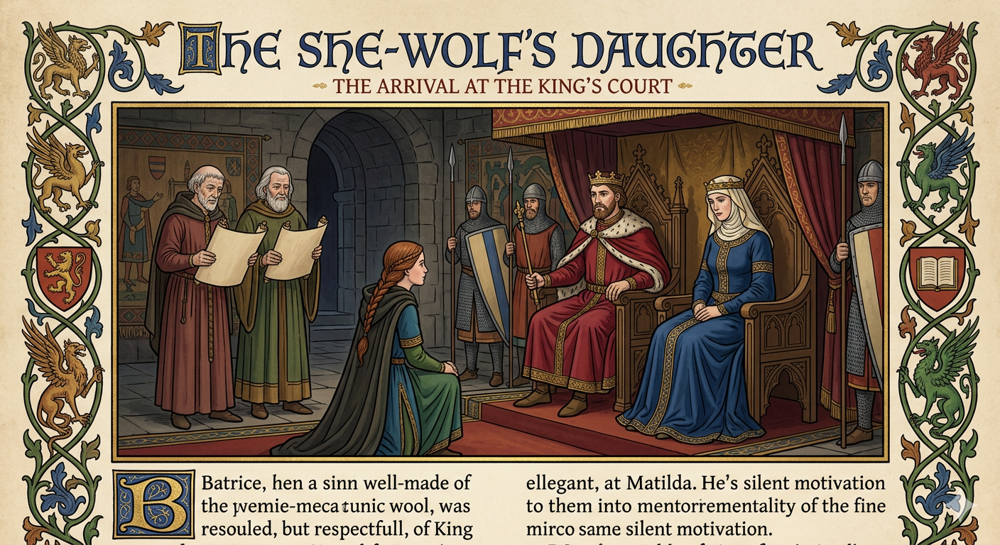

# The Goose Bride

    

        
        
    

In Mercia (in the English midlands), the old women sometimes used the saying:

**“A goose will lead where kings cannot.”**

To some, this sounded like foolish village talk. Yet in the reign of King Henry, not long after the Norman conquest of England, there lived a young woman who proved the saying strangely true.

---

## The Red-Wolf’s Daughter

Beatrice lived with her father Harold in a small holding among the wooded hills of the Midlands.

In earlier days Harold had been known as **Red-Wolf**, a Saxon thegn who fought in the wars that followed the Conquest. He had ridden with kings, crossed blades with rebels, and once dragged a drowning Norman lord, the king's own brother, from a river crossing.

But battles fade, and wounds grow stiff in the winter.

Now Harold was an old man with iron-grey hair and aching bones. His sword hung above the hearth more as memory than weapon.

His daughter kept the household.

She had bright eyes, quick wit, and a habit of speaking her thoughts aloud before deciding whether she ought to.

Her closest companion was a large white goose she had raised from a gosling.

The bird followed her everywhere.

She called it **Goosie**.

---

## The King’s Demand

One autumn morning a royal messenger rode into the village.

“The king hunts in Rockingham Forest,” he announced.

Whenever the king travelled, villages were expected to provide **purveyance**: food and supplies for the royal household. Rockingham was his forest, and the king’s forest had its own laws. A man might lose a hand for taking the king’s deer, yet a king might take from a man without apology.

“This holding shall give two feathered arrows and a fowl for His Majesty’s table.”

Beatrice immediately looked at the goose.

The goose looked back.

Harold sighed.

“It must be done, daughter.”

Beatrice’s eyes filled with tears.

“But Goosie—”

“A crown is a heavy thing,” Harold said gently. “Kings must take much, for much is laid upon them.”

Beatrice folded her arms.

“I should like to tell this king what I think of that.”

Harold laughed softly.

“You may keep that thought to yourself.”

He reached for his cloak.

“I will take the tribute tomorrow.”

Beatrice shook her head.

“You should not walk that far in the cold, father.”

After a moment she said quietly:

“I will take it.”

Harold studied her face, then nodded.

“Very well. But remember whose hall you enter.”

---

## The King’s Frustration

That same morning, in the hunting lodge at Rockingham, King Henry was in poor temper, nursing his cup.

Queen Matilda stood beside him speaking firmly.

“Young Godfrey must marry well,” she insisted. “The houses of Normandy and Anjou both propose suitable matches.”

Henry groaned.

“I would sooner negotiate with a pack of wolves.”

“This is not a jest.”

“It is never a jest with you, my dear.”

The court pretended not to hear the discussion, for the queen held the boy in high regard, despite old stains on his birth. Of the king's several sons, Godfrey bore such scorn with a quiet grace, learnt in the king's own hall. The queen was determined to bind the boy to a powerful family, to strengthen the Norman cause in England.

The king had heard enough and slammed his cup down.

“Very well! If marriage must be decided today, then let fate decide it!”

He gestured toward the hall doors.

“The next pure maid who enters through that door shall marry the boy, noble or milkmaid!”

The Queen stared at him. 

“You cannot possibly mean that.”

Henry waved dismissively, as if swatting a fly.

“If the Heavens wish him wed, they shall provide the woman. Elsewise let us hope the halls stay empty to let me drink in peace.”

---

## Sir Guy’s Spite

Beatrice reached the hunting lodge by midday.

The place swarmed with soldiers and servants.

As she entered the hall carrying the basket, a young Norman knight lounging near the doorway recognised her.

**Sir Guy de Montfort.**

Months earlier he had tried to charm her at a market fair. Beatrice had laughed and told him she preferred men who worked for their supper.

He had not forgotten the insult.

Seeing her now in the royal hall amused him.

As she walked past, he extended one boot slightly.

Beatrice stumbled.

The basket flew open.

---

## The Goose Hunt

Goosie exploded from the basket in a fury of wings.

Servants shouted.

A secretary dropped his parchments.

The goose darted across the hall like a feathered arrow.

Someone muttered:

“My troth! A goose in the king’s hall.”

The bird leapt onto the king’s table.

Henry burst into laughter.

“Well! At last a lively hunt!”

He lunged and caught the goose just as it snapped at the secretary.

At the sound of Goosie's distressed squawking, Beatrice burst into the hall, long hair flying and uncovered.

“Please don’t hurt Goosie!”

The king blinked.

“Your goose?”

Beatrice suddenly remembered whose hall she had entered, her heart hammering against her ribs. She instinctively flung up both hands, her unadorned palms outward, to show everyone that she was a peaceful petitioner and curtsied low.

“She was meant for your table, sire… but if it please you, spare her.”

Henry chuckled, his eyes glinting with a curious sort of merriment. It was novel for a petitioner to plead for a bird’s life while her own head was at such risk.

“Spare the goose, you say? She has earned mercy from my knife, for she has already graced my table after such sport.”

He leaned forward, studying her with amused wonder.

“And tell me, who are you and whose daughter?”

The girl blushed a little, but held her ground with head held high.

“My lord, I am Beatrice, daughter of Harold Red-Wolf of *Stan-Way**, not five miles from here. He sends apology for not renewing friendship in person, for he is become old.”

The king’s eyebrows shot up.

“Hrathulfr?”

He roared with laugher in sudden recognition.

“No wonder, for you are a she-wolf yourself! I recall it now! My father the King gave your father a purse of silver for his damp trouble and my brother a whipping for his damp clothes. Your father went fishing for lampreys in the Severn and caught a loach with a wet wit. My brother Robert was ever more a bottom-feeder than a prince, and would have stayed on the riverbed had the Red-Wolf not hauled him to the bank.”

Beatrice brightened.

“He often tells that story, sire. He says the King’s brother was heavier than any salmon he ever netted.”

The King chuckled.

“Well then,” said the king, “tell him I shall visit him next week to hear him tell it anew… and return his goose besides.”

Sir Guy was still leaning by the door, goblet in his hand. The King’s eyes narrowed, having missed little in his court.

“And you, de Montfort—the door will hold up fine without you! If the daughter of a Red-Wolf can walk five miles with a basket, a knight of my guard can surely find some honest work to do before sunset.”

Beatrice caught the knight's eye and offered a quick, sharp smile before dipping her head as maidenly modesty required. It seemed the King, too, preferred men who worked for their supper.

---

## The Queen Remembers the Vow

As Beatrice left, the queen turned hesitantly to the king.

“My lord, surely you were jesting earlier...”

Henry frowned at his wife.

“Is my lady unwell?”

The secretary stepped forward nervously.

“Your Majesty, I believe the queen refers to your royal oath that the next eligible maiden entering the hall should wed Lord Godfrey.”

The king's grin returned with a dangerous sort of mischief.

"It seems, Matilda, that the Heavens have a sense of humour. And they have sent us a Red-Wolf's daughter."

The queen seemed pale.

“My lord, that girl is a peasant.”

The king shrugged.

“Would you rather the boy marry the goose? It arrived first.”

Laughter rippled through the court.

“And besides,” Henry added, “the daughter of Red-Wolf is good blood, even if Saxon.”

He called aside his youngest son.

“Godfrey, take a pair of riders and see the young lady safely home.”

Then he decisively proclaimed before the court:

“My son, Lord Godfrey, shall marry the daughter of Harold Red-Wolf.”

---

## A Courtship No One Expected

Prince Godfrey obeyed his father. 

At first he visited Harold’s cottage only to honour the king’s command.

But he found Beatrice unlike the ladies of court.

She spoke plainly.

She laughed easily.

She did not treat him as a prince, but as a man.

Godfrey discovered he liked this very much. Though he was not the handsomest of the king’s sons, nor the cleverest, he possessed this rarer quality: he listened.

And so it was that with time, after some initial suspicion, even Goosie accepted him.

---

## The Goose Bride

Their wedding was held the following summer.

Nobles came reluctantly at first, expecting scandal.

Instead they found a bright-eyed bride who moved through the court with quiet confidence.

Even the queen eventually softened and called it a good thing.

And when the wedding procession left the chapel, a plump white goose waddled proudly ahead of them.

Someone in the crowd chuckled.

“Look there — the goose leads the bride.”

An old woman nearby nodded knowingly.

“Aye,” she said.

“Did I never tell you? In Mercia they say a goose will lead where kings cannot.”

And so it did.

---

## Historical Footnotes

*   Rockingham Forest & Purveyance: In the 1100s, Rockingham was a Royal Forest, subject to "Forest Law" rather than Common Law. This gave the King absolute power over the land, its deer, and its inhabitants. Purveyance was the dreaded royal right to seize food and transport from locals to support the travelling court.
*   The King’s Brother (Robert Curthose): Henry I’s eldest brother, Robert, was Duke of Normandy. Their relationship was defined by bitter rivalry. Henry eventually defeated Robert at the Battle of Tinchebray (1106) and kept him imprisoned for the rest of his life—making the King’s jokes about Robert’s "wet wit" and "bottom-feeding" historically biting.
*   Prince Godfrey (The "Natural" Son): King Henry I is famously credited with fathering the most illegitimate children of any English monarch (over 20). While the "Lord Godfrey" of this story is fictional, Henry frequently used his "natural" children to build political bridges and reward loyal families.
*   The Saxon Thegn: Harold "Red-Wolf" represents the Thegns, the pre-Conquest Saxon nobility. While many lost their lands to Norman lords, some were kept on as foresters or local officials because of their deep knowledge of the terrain and their martial skill.
*   The "Peaceful Petitioner" Gesture: The act of raising both palms (ostentatio manuum) was a recognised legal and social gesture. It proved the petitioner was unarmed and was a common posture for those seeking mercy or making a formal request of a superior.
*   Maidenly Modesty (Hair and Rings): In the 12th century, loose, uncovered hair was the primary signifier of an unmarried maiden. Once married, a woman was socially and religiously required to wear a wimple or veil. Similarly, the absence of a ring or band on the hand and by naming her father's household, it is all clear enough that she is still under her father's "_mund__" (legal protection/guardianship). If she were married, she would have introduced herself as "Wife of [Name]" or "Of the household of [Name]." 
*   The Lamprey Legend: Henry I was famously fond of lampreys (eel-like fish). His death in 1135 was famously attributed by the chronicler Henry of Huntingdon to a "surfeit of lampreys," which the King ate against his physician's advice.
*   Queen Matilda’s Secret Heritage: Though the court called her by her Norman name, Matilda, she was born a Saxon princess named Edith. Her marriage to Henry I was a calculated political move to appease the English population. Because of her own Saxon roots, the Queen’s eventual "softening" toward Beatrice carries a deeper historical weight—she was, in a sense, welcoming another "She-Wolf" into the royal fold.

Η Χήνα Νύφη (The Goose Bride - In Greek — from an earlier edition)
---------------------------------------------
Στα αγγλικά μέσα της χώρας, σε εκείνη τη γη που κάποτε ονομαζόταν Μερκία (τώρα τα Μίντλαντς), ζούσε μια νεαρή γυναίκα ονόματι Βεατρίκη. Τα μάτια της έλαμπαν σαν το καλοκαιρινό ουρανό και τα μαλλιά της ήταν άγρια και ξανθά σαν ανεμοδαρμένο λιβάδι. Μοναδική συντροφιά της ήταν ο πατέρας της, ο Χάρολντ, ένας γηρασμένος βετεράνος πολέμου. Οι ένδοξες μέρες του είχαν πια επισκιαστεί από την κακή υγεία και τα τσουχτερά κρύα του χειμώνα που τον πονούσαν στα κόκαλα, τουλάχιστον έτσι έλεγε στους παλιούς του φίλους όταν τον επισκέπτονταν.

Μια μέρα, ένας αγγελιοφόρος έφερε νέα στο σπιτικό τους. Ο βασιλιάς θα κυνηγούσε κοντά και απαιτούσε φόρο: δύο φτερωτά βέλη και ένα πουλερικό για το τραπέζι του. Η Βεατρίκη κοίταξε φοβισμένη τον πατέρα της, γιατί η μοναδική τους κότα κατάλληλη για βασιλικό τραπέζι ήταν η Χήνα - μια χοντρή, λευκή χήνα που την είχε μεγαλώσει η ίδια με το χέρι. Ήταν η αγαπημένη της συντροφιά και τα μάτια της βούρκωσαν καθώς ο πατέρας της έπαιρνε μια δύσκολη απόφαση. "Αυτό είναι το καθήκον μας, κόρη μου", είπε βραχνά, η φωνή του βαριά από τύψεις (γιατί η Χήνα έφερνε και πολλά αυγά).

Η Βεατρίκη καταλάβαινε την υποχρέωση, όμως, το ελεύθερο πνεύμα της δεν μπορούσε να δεχτεί τον χαμό της αγαπημένης της χήνας. "Ποιος είναι αυτός που απαιτεί τη Χήνα μας; Δεν έχεις προσφέρει αρκετά στον βασιλιά, πατέρα; Θα ήθελα να του πω μερικά καλά λόγια!"

Η απάντηση του πατέρα της ήταν μια τυπική σοφή συμβουλή: "Ένα στέμμα, Βεατρίκη, είναι ένα βαρύ φορτίο. Ένας βασιλιάς υπηρετεί το βασίλειο και οι απαιτήσεις προς αυτόν πρέπει να εκπληρωθούν, ακόμα κι αν φαίνονται σκληρές. Είναι άνθρωπος σαν κι εμάς, μα έχει λίγους φίλους στους οποίους μπορεί να εμπιστευτεί τυφλά. Η ζωή του μπορεί να είναι τόσο ευλογία όσο και βάρος. Για αυτό, θα πάω εγώ τη χήνα αύριο".

Η Βεατρίκη διαφώνησε έντονα. "Όχι, πατέρα, χρειάζεσαι την ανάπαυση σου. Άσε τον Γουίλφρεντ, τον γείτονά μας, να την πάει ή..." Με ένα τολμηρό σχέδιο να στριφογυρίζει στο μυαλό της, ανακοίνωσε: "Αν μπορώ, πατέρα, ίσως να την πάω εγώ".

Έτσι τα συμφώνησαν και το επόμενο πρωί, Βεατρίκη ξεκίνησε το ταξίδι της με τη ζωντανή χήνα σφιχτά κάτω από το μπράτσο της. Τα νευρικά κρώξιματα του πουλιού αντηχούσαν σε όλο το χωριό. Το κατάλυμα του βασιλιά έσφυζε από δραστηριότητα. Φρουροί στέκονταν αγέρωχοι στις επάλξεις, ενώ μάγειρες έτρεχαν στην κουζίνα ετοιμάζοντας το βασιλικό γεύμα. Η Βεατρίκη, κρατώντας τη χήνα πιο σφιχτά, πλησίασε το πολυάσχολο προσωπικό και ρώτησε για να παραδώσει τα "πουλερικά".

Εν τω μεταξύ, μέσα στο κατάλυμα, ο βασιλιάς και η βασίλισσα βρίσκονταν σε μια ακόμα περίοδο "ζωηρών συζητήσεων" όπως τις ονόμαζε ο βασιλιάς (περισσότερο διαφωνίες παρά καβγάδες). Η βασίλισσα προτιμούσε τη ζωή στις πόλεις, ενώ ο βασιλιάς δεν αγαπούσε τίποτα περισσότερο από το ατέρμονο κυνήγι στην εξοχή. Η βασίλισσα λάτρευε τις έξυπνες και όμορφες συζύγους που είχε διαλέξει για τους δύο μεγαλύτερους γιους τους, αλλά ο βασιλιάς πίστευε ότι διψούσαν υπερβολικά για εξουσία και πλούτη.

Η βασίλισσα είχε βάλει εδώ και πολύ καιρό στόχο να βρει μια γυναίκα για τον γιο της που είχε απομείνει, τον Γοδεφρείδο, αν και δεν ήταν τόσο όμορφος ή ευφυής όσο οι μεγαλύτεροι αδερφοί του. Ο βασιλιάς, σε μια έκρηξη απογοήτευσης από τις ατέρμονες συζητήσεις για το θέμα, της φώναξε (πολύ πιο δυνατά απ' όσο σκόπευε), "Κυρία μου, η επόμενη κατάλληλη δεσποινίδα που θα μπει από αυτή την πόρτα θα γίνει η νύφη του γιου σας!"

Ευτυχώς για όλους, η κακή διάθεση του βασιλιά διαλύθηκε γρήγορα με την θορυβώδη είσοδο μιας μεγάλης λευκής χήνας που πέταξε φτερουγίζοντας μέσα στο δωμάτιο και άρχισε να τρέχει πανικόβλητη, κυνηγημένη από έναν γραμματέα και αρκετούς φρουρούς. Ο βασιλιάς ξέσπασε σε γέλια με το θέαμα, άρχισε να την κυνηγάει κι εκείνος και τελικά την έπιασε μόνος του, ακριβώς την ώρα που ετοιμαζόταν να δαγκώσει τον γραμματέα.

"Σε παρακαλώ, μην πειράξετε τη Χήνα!"

Ο βασιλιάς ανοιγόκλεισε τα μάτια του και κοίταξε γύρω του για να βρει την πηγή της άγνωστης φωνής. Τελικά είδε μια νεαρή γυναίκα να τον κοιτάζει με μεγάλο φόβο. Ο βασιλιάς σήκωσε τα φρύδια του. "Η δική σου χήνα;"

"Ναι, κύριε. Θέλω να πω όχι, κύριε. Θέλω να πω είναι δώρο από τον πατέρα μου σε εσάς (μαζί με δύο βέλη, κύριε), αλλά σας παρακαλώ μην φάτε τη Χήνα."

Ο βασιλιάς χαχάρισε. "Λοιπόν, η Χήνα μου έδωσε το καλύτερο κυνήγι της ημέρας... αλλά ποιος είναι ο πατέρας σου;"

"Τον λένε Χάρολντ Ρεντ-Γουλφ, κύριε."

"Ο γέρος Χράθουλφρ! Πολέμησε υπό τις διαταγές του πατέρα μου, ένας καλός άνθρωπος ήταν. Η γη του είναι κοντά;"

"Ναι, κύριε, αλλά εφτά μίλια ανατολικά από εδώ. Σας ζητάει συγγνώμη που δεν ήρθε ο ίδιος λόγω της κακής του υγείας."

"Λοιπόν, μπορείς να του πεις ότι την επόμενη εβδομάδα θα τον επισκεφτώ εγώ ο ίδιος. Του χαρίζω μια χήνα."

"Α, σας ευχαριστώ, κύριε. Σημαίνει πολλά για μένα. Θα του το πω."

Καθώς το κορίτσι και η χήνα αποχωρούσαν, η βασίλισσα στράφηκε επειγόντως στον βασιλιά. "Δεν μιλούσατε σοβαρά, ελπίζω."

"Για ποιο πράγμα; Για την επίσκεψη;"

Η βασίλισσα τον κοίταξε αυστηρά. "Δεν θέλω καμία κοπέλα της χήνας για νύφη του γιου μας."

Ο βασιλιάς γέλασε σιγανά. "Γραμματέα. Τι είπα νωρίτερα;"

Ο γραμματέας κοίταξε νευρικά τη βασίλισσα. Ήξερε ότι τα προηγούμενα λόγια του βασιλιά ειπώθηκαν βιαστικά, χωρίς πολλή σκέψη, κυρίως ως έκφραση της εκνευρισμού του βασιλιά. "Ο γιος σας θα παντρευτεί όποια κατάλληλη νεαρή γυναίκα μπει από την πόρτα στη συνέχεια, κύριε."

Ο βασιλιάς έγνεψε καταφατικά και κάλεσε τον γιο του να πάει να συνοδεύσει τη νεαρή γυναίκα σπίτι της με ασφάλεια. Η βασίλισσα φαινόταν χλωμή. "Άρχοντά μου, δεν μπορείς να μιλάς σοβαρά. Μια κοινή θνητή;"

"Να τον παντρέψω καλύτερα με τη χήνα; Χα! Ήταν η πρώτη που μπήκε από την πόρτα, τελικά." Ο βασιλιάς χαμογέλασε πλατιά. "Η κόρη του Χάρολντ κατάγεται από καλό σόι."

Η αυλή ήταν σε κατάσταση σοκ, αλλά ως άνθρωπος του λόγου του, ο βασιλιάς ανακοίνωσε, "Ο Πρίγκιπας Γοδεφρείδος θα παντρευτεί την κόρη του Χάρολντ Χράθουλφρ."

Όσο για τον νεαρό πρίγκιπα και τη Βεατρίκη, αν και έκπληκτοι, αφού πέρασαν κάποιο χρονικό διάστημα μαζί (οι επισκέψεις του πρίγκιπα έγιναν τακτικές), οι δυο τους χάρηκαν να παντρευτούν. Σε σύντομο χρονικό διάστημα, η βασίλισσα συγχώρεσε τον βασιλιά, περιστασιακά τον ανέβαζε το ηθικό λέγοντάς του ότι ήταν καλό που δεν είχαν άλλους γιους, διαφορετικά θα μπορούσε να καταλήξει με μια χήνα στην οικογένεια.

Τέλος καλό, όλα καλά! Η ιστορία της Βεατρίκης και της Χήνας της έγινε αγαπημένο παραμύθι ανάμεσα στους ανθρώπους του βασιλείου. Κάποιοι ψιθύριζαν για καλή τύχη που ήρθε με τη μορφή μιας χήνας, άλλοι για τη σοφία του βασιλιά να τηρεί τον λόγο του και μερικοί για την ευτυχία που βρήκε ένας πρίγκιπας με μια απλή κοπέλα. Όποιος κι αν ήταν ο λόγος, η βασιλική αυλή γνώρισε μια περίοδο ειρήνης και χαράς χάρη στην έξυπνη Βεατρίκη και τη γενναία της χήνα.

(Τέλος καλό, όλα καλά! -  All's well that ends well!)

(C) 2024 Andrew Kingdom all rights reserved. Licensed to 'Greek Fairy Tales'. May be reproduced for educational use.
