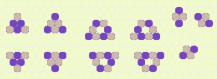

# Some mathematical finds I've made over the years.
By Andrew Kingdom.
(I'll update the details when I have time.)

## [Four-colour theorum formula](https://en.wikipedia.org/wiki/Four_color_theorem)

The four-colour theory states that any map can be coloured in using a maximum of four colours without using the same colour for neighbouring regions. This has been proven using a computer.

My discovery was a partial-geometric method (collapsing all combinations down to a single set of incomplete-shapes) to prove all combinations on paper, which I believe hadn't been done previously. This can also be done using a divided 2D toroidal (donut) shape series, but I'm not 100% sure it covers all possibilies.

Circa 2007

## [Hexagonal Conway's Life](https://en.wikipedia.org/wiki/Conway%27s_Game_of_Life)

Cellular automaton based on a six-sided grid rather than John Conway's orthogonal grid. It occurred to me that Conway's rules were imbalanced and that a hexagonal structure was more natural and stable, which proved to be the case and the rules are much simpler.

(Published online in 2003.)

## [Primality test formula](https://en.wikipedia.org/wiki/Primality_test)

My discovery was essentially the same as Wilson's theorum, (p−1)!≡−1(mod p).

(Published in maths groups online circa 2000.)

## [Pythagorean Triple Integers](https://en.wikipedia.org/wiki/Pythagorean_triple)

These are numbers that perfectly fulfil the 'Pythagorus' formula a2 + b2 = c2.

Example: (3,4,5) meaning 3 x 3 + 4 x 4 = 5 x 5.

These were discovered by the ancient Egyptians, Babylonians and others.

My discovery was a simple set of formulas to generate all possible integer triples, loosely similar to the following:
a=k(m2−n2), b=2⋅k⋅m⋅n, c=k(m2+n2), where k is a multiplier.

(Published in maths groups online circa 1988.)

[^a]: UK. USA: math
