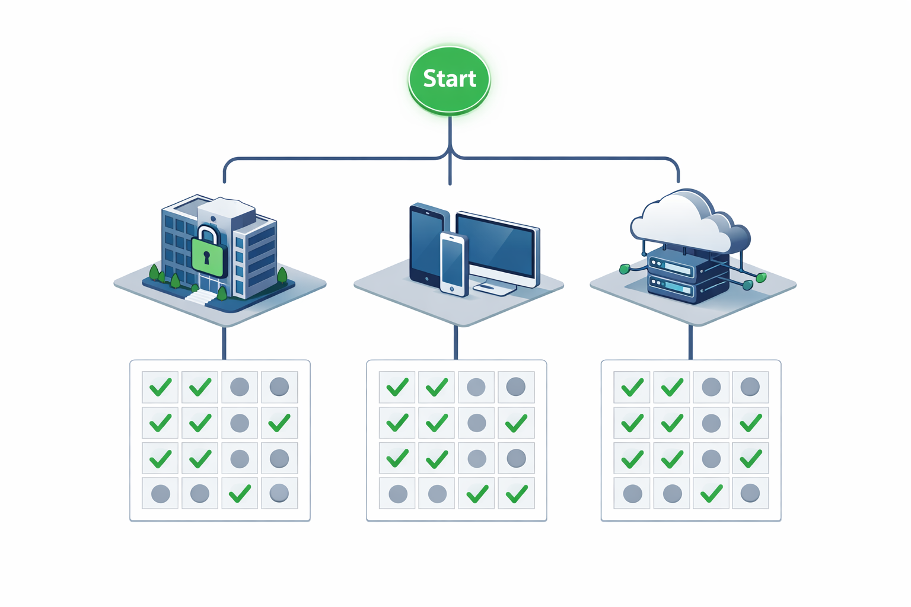

](opensrc-licensing-tool_files/licensing-decision-tree-020644.png)

# Project Licensing & Platform Classification Guide
## A tool to evaluate open-source license compatibility on any platform.

*This guide provides a structured framework for evaluating software licensing obligations based on distribution intent and target runtime environment. It does not constitute legal advice. Consult a qualified lawyer specializing in software intellectual property for specific legal determinations.*

*This guide is an educational framework, not a substitute for professional legal advice specific to your circumstances.*

> **Note for Consumer-Facing Distributions:** If you are distributing software to consumers, this guide helps you understand your technical obligations. You may also need to provide a plain-language summary of your license terms to end-users before purchase—consult your legal counsel for jurisdiction-specific disclosure requirements.

> **Note on Terminology:** In this guide, "distribution" refers broadly to making software available to external parties, whether by download, physical transfer, or network access. The precise legal definition varies by jurisdiction—consult your lawyer for guidance specific to your location.

---

### Section 1: Define Your Distribution Model

**Q1. Who uses this software?**

Select your distribution scenario:

**A) Only internal employees or contractors of my organization.**
- The software is never distributed outside the organization.
- *Result:* Jump to **Section 2: Handle Internal Corporate Use**.

**B) External users who download and install a binary on their own devices.**
- You ship compiled executables, mobile apps, or embedded firmware to customers.
- *Result:* Jump to **Section 3: Evaluate Your Distributed Binary Options**.

**C) External users who access the software exclusively over a network (SaaS / web application).**
- You run the software on your own servers. Users interact via browser or API client. No binary is provided to them.
- *Result:* Jump to **Section 4: Assess Network-Delivered Services**.

**D) I do not know yet.**
- The target platform and distribution model are undetermined.
- *Result:* Jump to **Section 5: Apply Safe Defaults for Undecided Projects**.

---

### Section 2: Handle Internal Corporate Use

**Applies when:** The software is never distributed outside the organization.

**Classification:** **Class: Private**

**Obligation:** None with respect to public source disclosure. Licensing obligations arise only when you distribute software to external parties. Internal use—even of GPL or AGPL code—does not require public release. However, if you modify GPL or AGPL code for internal use, you should make those modifications available to your internal users (e.g., on an internal repository).

**To comply in practice:** Maintain a dependency manifest. If you modify any GNU General Public License (GPL) or GNU Affero General Public License (AGPL) code, make the modified source available to your internal employees (e.g., on an internal Git server). No external disclosure is required.

**Next Step:** Proceed with development. Your licensing obligations are minimal. Revisit this guide only if you later decide to distribute the software externally.

*For consolidated classification lookup, see Section 7.*

---

### Section 3: Evaluate Your Distributed Binary Options

**Applies when:** You are shipping a compiled application to external users (desktop, mobile, embedded) **and** your own application code is proprietary / closed-source.

> **Critical Assumption:** The following matrix assumes you wish to **keep your core application source code closed**. If you are voluntarily open-sourcing your entire application, these restrictions do not apply—you may use any license freely.

**Step 3.1: Classify your target platform's capabilities.**

| Class | Designation | Technical Primitives Present | Example Environments |
| :--- | :--- | :--- | :--- |
| **A** | **Full-Service** | Dynamic linking (`dlopen` / `LoadLibrary`). Process forking (`fork`/`exec`). Full IPC (UDS, pipes). | Linux, Windows, macOS, Android, FreeBSD. |
| **B** | **Restricted** | Dynamic linking present. Process forking heavily restricted or unavailable for user-space applications. | Consoles, Smart TVs, macOS App Store, Windows Store. |
| **C** | **Locked-Single-Image** | No dynamic linking. No sub-process creation. All code must be compiled into a single, pre-signed binary. | iOS, iPadOS, watchOS, secure embedded RTOS, UEFI payloads. |

**Step 3.2: Cross-reference your dependencies against your platform class.**

| Your Platform Class | MIT / BSD / Apache (Permissive) | GNU Lesser General Public License (LGPL) | GNU General Public License / AGPL (Strong Copyleft) |
| :--- | :--- | :--- | :--- |
| **A (Full-Service)** | ✅ **Constructable.** Static linking permitted. | ✅ **Constructable.** Dynamic linking is available. Provide relinking object files to users *(this means providing the compiled intermediate files—not your full source code—that allow users to relink the application with a modified LGPL library)*. | ✅ **Constructable.** Run as a separate OS process with high-level IPC. |
| **B (Restricted)** | ✅ **Constructable.** Static linking permitted. | ⚠️ **Constructable with overhead.** Dynamic linking exists but is tightly bundled. Relinking obligations apply. Consult legal counsel. | ❌ **Unconstructable.** Process forking is unavailable. GPL/AGPL requirements cannot be physically fulfilled. |
| **C (Locked-Single-Image)** | ✅ **Constructable.** Static linking permitted. | ❌ **Unconstructable.** No dynamic linking. Static linking triggers LGPL source-disclosure obligations for proprietary code. | ❌ **Unconstructable.** No sub-process creation. GPL/AGPL isolation cannot be achieved. |

**Step 3.3: Determine your assigned Class (Result)**

| Outcome | Classification | Meaning |
| :--- | :--- | :--- |
| You used only Permissive licenses on any platform. | **Class: Permissive-Compliant** | Zero restrictions. Ship anywhere. |
| You used LGPL on a Full-Service platform. | **Class: Exchangeable-Link** | Compliant if you dynamically link and provide relinking objects. |
| You used GPL/AGPL on a Full-Service platform. | **Class: Sovereign-Process** | Compliant if you run the component in a separate process with standard IPC. |
| You used LGPL on a Restricted platform, or GPL on Restricted/Locked. | **Class: Unsupported (Consult Counsel)** | The platform lacks the machinery to fulfill the license. Your options: (1) move this feature to a backend server, (2) replace the dependency, or (3) open-source your entire application. See Section 6 for context on this classification. |

**Next Step:** Once you have determined your Class, proceed to **Section 7: Consult the Quick Reference Lookup** to confirm your classification against the master table.

---

### Section 4: Assess Network-Delivered Services

**Applies when:** Users interact with the software remotely. No binary is provided to the end-user.

**Classification:** **Class: Network-Backend**

**Step 4.1: Review obligations by license type.**

| License Type | Obligation |
| :--- | :--- |
| **MIT / BSD / Apache** | Attribution only. No source disclosure required. |
| **GNU General Public License (GPL)** | No network disclosure clause. Running a GPL application on a server, without distributing its binary, does not trigger source disclosure for your proprietary code. |
| **GNU Affero General Public License (AGPL)** | Modifying AGPL code carries risk: you must publicly offer the modified source to all network users (AGPL Section 13). Using it unmodified carries less risk: you must still offer the source of the AGPL code itself—but this is already publicly available. This obligation is typically satisfied by providing a link to the upstream source repository. |

**Step 4.2: Evaluate AGPL coupling risk.**

The AGPL's boundary is determined by *how* your application connects to the AGPL component. This is relevant whether you are in the US, Europe, or elsewhere—the legal concept of a "derivative work" or "combined work" is interpreted based on technical integration, not geography.

| Integration Method | Legal Classification | Your Action |
| :--- | :--- | :--- |
| **High-level API** (HTTP REST, gRPC, JSON-RPC, standard OS pipes) | **Independent works.** The AGPL component is a separate service. | Only publish your modifications to the AGPL component itself. Your proprietary code is safe. |
| **Tight coupling** (Shared memory, native memory pointers, same execution loop, language bindings mirroring internal structures) | **Potential derivative work.** The boundary is blurred. | Consult legal counsel. Your proprietary code may be subject to disclosure. |

**To comply in practice:** Interface with AGPL components exclusively over well-defined, language-agnostic protocols. Avoid shared memory and direct function-call integrations.

**Next Step:** Once you have determined your compliance posture, proceed to **Section 7: Consult the Quick Reference Lookup** to confirm your classification.

---

### Section 5: Apply Safe Defaults for Undecided Projects

**Applies when:** You do not yet know where or how you will distribute your software.

**The Neutral Principle:**
Licensing obligations arise only upon external distribution of the combined work. Internal development does not trigger disclosure requirements.

**Step 5.1: Follow the safe development path.**

1. Develop with **MIT, BSD, or Apache 2.0** dependencies exclusively.
2. Keep your core application code **unpublished** or under your own proprietary terms.
3. These licenses are constructable on *every* platform (Class A, B, and C) and impose no downstream constraints.

**Why this preserves flexibility:**
You can always choose to relicense your own code under GPL later, or swap in GPL/LGPL dependencies once you know your target platform. The reverse is not true—once you distribute a binary containing GPL code, that specific version is irrevocably GPL-licensed to those recipients.

**Consultant's Summary:** *"Build with permissive code until you know your platform. You can add copyleft later; you cannot easily remove it once shipped."*

**Next Step:** When you later determine your target platform and distribution model, return to **Section 1** and select the appropriate path.

---

### Section 6: Understand Critical Perspectives on This Guide

*This section summarizes how the guide withstands scrutiny from key constituencies. It maintains neutrality while acknowledging their positions. This section is provided for context only. Your obligations are determined by the license text and applicable law, not by any organization's interpretation.*

**From the Free Software Foundation (FSF) & Copyleft Advocates:**
- **Position:** "Mere aggregation" (process isolation) is a legal *defense*, not an absolute guarantee. Tight coupling over pipes may still create a derivative work.
- **Guide response:** Section 4.2 explicitly flags tight coupling as **Derivative Work Risk** and advises consulting counsel. The guide does not offer false assurance.

**From Corporate Legal Counsel (IP Defense):**
- **Position:** Class C (Locked-Single-Image) platforms represent unacceptable liability for LGPL or GPL use. Static linking is flatly prohibited as a business policy.
- **Guide response:** Class C entries are marked **"Unconstructable"** with clear warnings. The guide offers the practical workaround (move to backend server) without arguing the corporate stance.

**From the Open Source Initiative (OSI) & License Stewards:**
- **Position:** The GPL does not "ban" platforms; it conditions distribution on source provision. Framing copyleft as a "restriction" misrepresents its intent.
- **Guide response:** The guide uses **"Unconstructable"** and **"Mechanical Mismatch"**—not "banned" or "prohibited." It recognizes GPL irrevocability neutrally and frames compliance as architectural adaptation, not license avoidance.

**Neutrality Assessment:** This guide makes no value judgments. It states: *"License X requires System Primitive Y. System Z lacks Primitive Y. Therefore, compliance requires architectural adaptation or license substitution."* It is a compass, not a judge.

**Next Step:** Return to the relevant section for your scenario, or proceed to **Section 7** for the consolidated lookup.

---

### Section 7: Consult the Quick Reference Lookup

*Use this master table to confirm your classification once you have completed the relevant section above.*

| Your Intent | Your Platform | Your Dependency | Assigned Class |
| :--- | :--- | :--- | :--- |
| Internal only | Any | Any | **Class: Private** |
| SaaS / Web | Server (Any OS) | MIT/BSD/Apache / GPL (unmodified) / AGPL (unmodified, high-level API) | **Class: Network-Backend (Compliant)** |
| SaaS / Web | Server | AGPL (modified) | **Class: Network-Backend (Publish Patches)** |
| SaaS / Web | Server | AGPL (tightly coupled) | **Derivative Work Risk (Consult Counsel)** |
| Distributed Binary | Class A / B / C | MIT / BSD / Apache | **Class: Permissive-Compliant** |
| Distributed Binary | Class A | LGPL | **Class: Exchangeable-Link** |
| Distributed Binary | Class A | GPL / AGPL | **Class: Sovereign-Process** |
| Distributed Binary | Class B | LGPL | **Class: Restricted-Exchange (Consult Counsel)** |
| Distributed Binary | Class B / C | GPL / AGPL | **Class: Unsupported (Missing Primitives)** — *See Section 6 for context.* |
| Distributed Binary | Class C | LGPL | **Class: Unsupported (Missing Dynamic Linking)** — *See Section 6 for context.* |
| Undecided | Unknown | Unknown | **Class: Undecided (Use MIT/BSD defaults)** |

---

### International Applicability Note

This guide is designed to be jurisdiction-neutral. Its core framework is based on *technical mechanics*—system primitives such as dynamic linking, process forking, and IPC—which are universal across operating systems. The legal obligations described derive from the license texts themselves, not from any particular country's legal definitions.

GPL and AGPL enforcement has been successfully litigated in multiple jurisdictions, including the United States, Germany, France, and other European countries. The principles in this guide reflect that international enforcement reality.

**Other Licenses:** This guide focuses on MIT, BSD, Apache, LGPL, GPL, and AGPL—the most common licenses in open-source software. Other licenses (such as the European Union Public License, or EUPL) may have different requirements. If you are using a license not covered here, consult your legal counsel for guidance.

---

*End of guide.*
