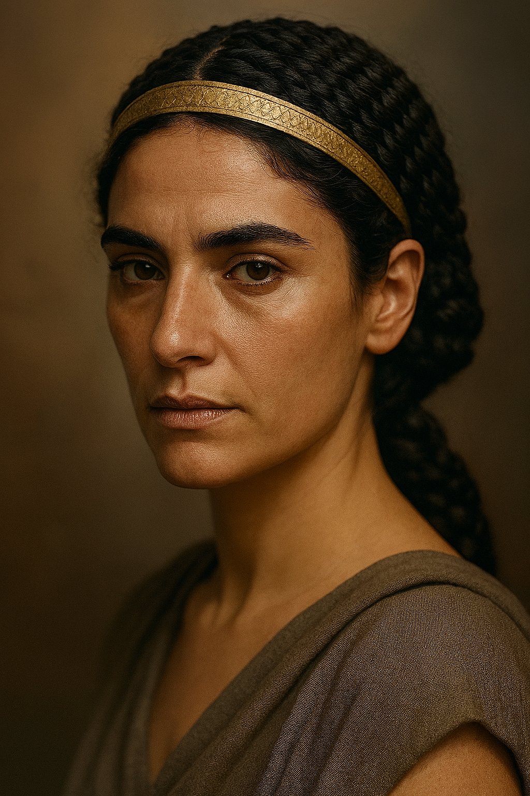

# Reconstructing Cleopatra VII: A Methodological Triangulation of Sculptural, Numismatic, and Contemporary Analogues

## Introduction
The historical image of Cleopatra VII has long been contested, shaped as much by Roman propaganda and Renaissance imagination as by archaeological evidence. Recent discoveries, such as the possible Cleopatra statue from Taposiris Magna, invite renewed attempts at reconstructing her appearance. This paper outlines a methodology for extrapolating a plausible photorealistic portrait of Cleopatra by triangulating three evidence streams: (1) sculptural remains, (2) numismatic and dynastic portraiture, and (3) modern analogues with physiognomic similarity. The goal is to balance historical fidelity with a contemporary photographic sensibility, producing an image that feels both ancient and immediate.

---

## Image



## Methodology

### 1. Sculptural Evidence
- **Berlin Cleopatra Bust (Altes Museum, 40–30 BCE):** Provides a lifelike Roman‑era representation with diadem, aquiline nose, and melon coiffure.  
- **Taposiris Magna Statue (2024 discovery):** Softer features, petite nose, braided encircling hairstyle; possibly Cleopatra or another Ptolemaic queen.  
- **Renaissance “German Cleopatra” (16th c.):** Useful as a record of European reception, but not reliable for physiognomic accuracy.

### 2. Numismatic and Dynastic Portraiture
- **Cleopatra’s coinage:** Emphasizes power through masculine features—hooked nose, strong jawline, almond eyes.  
- **Ptolemaic lineage:** Family portraits show continuity of sharp noses and deep‑set eyes.  
- **Children (esp. Caesarion):** Softer features suggest Cleopatra’s own physiognomy balanced strength with refinement.

### 3. Modern Analogues
- Comparative physiognomy with contemporary Mediterranean and Near Eastern women (e.g., Lebanese, Greek, North African descent).  
- Features such as almond eyes, convex nasal bridge, and full lips provide living reference points for texture, complexion, and charisma.

---

## Triangulation
By cross‑referencing these three evidence streams:
- **Nose:** Between the convexity of coin portraits and the refinement of the Taposiris Magna statue.  
- **Eyes:** Almond‑shaped, deep‑set, intelligent gaze.  
- **Mouth:** Full lips with subtle asymmetry, suggesting charisma.  
- **Skin tone:** Light olive to medium, with natural variation.  
- **Hair:** Dark, braided in the melon coiffure, adorned with a diadem.  
- **Expression:** Regal yet magnetic, reflecting ancient accounts of her persuasive charm.

---

## Prompt Design for Photorealistic Rendering
To operationalize this triangulation in image generation, the following modular prompt was developed:

```
Photorealistic portrait of Cleopatra VII, blending ancient authenticity with modern freshness. 
She has an oval face with a strong jawline, light olive skin with natural variation and subtle sun-kissed warmth. 
Her nose is prominent with a slight convex bridge, her almond-shaped deep-set eyes are sharp and intelligent, framed by arched brows. 
Her lips are full with a faint asymmetry, suggesting charisma. 
Her dark brown hair is styled in the Ptolemaic “melon” coiffure, braided into a bun with a few loose tendrils, adorned with a golden diadem. 
She wears a fine linen tunic with a gold-thread border and a jeweled clasp at the shoulder. 
Lighting is warm Mediterranean sunlight, highlighting her diadem and casting dramatic shadows across her face. 
Her expression is regal, magnetic, and subtly knowing.
```

This prompt is designed to be **reproducible, modular, and adjustable**, allowing for iterative refinement while maintaining fidelity to the triangulated evidence.

---

## Conclusion
The reconstruction of Cleopatra VII’s appearance requires careful negotiation between fragmentary ancient evidence and modern interpretive tools. By triangulating sculptural remains, dynastic portraiture, and physiognomic analogues, we can approach a historically grounded yet visually compelling representation. The proposed prompt operationalizes this synthesis, producing an image that is both archaeologically plausible and resonant with contemporary viewers. This methodology demonstrates how digital tools can bridge the gap between ancient iconography and modern visualization, offering a fresh yet authentic Cleopatra for the 21st century.

