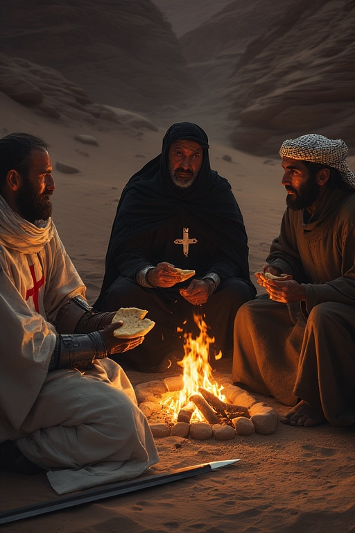

### Of Bread, Salt, and Blood

Give ear to my tale and know thou that at times the **desert is indeed the master of all men**, for surely it forges truces deeper than the laws of mere men. And so it was, far from the gaze of Popes and Sultans, that three souls were glad for the warmth of meager flames from humble **thorn-scrub**, in the hollow of the cracked earth. The sun, that great furnace, had completed its journey and now the **evening stars sang over the western sky**.

The very presence of these men spoke of war, yet the threads of the **All-Wise Eternal One** at times commend a peace, a respite, which only a fool ignores.

To the right hand sits **Ahmed, the Muslim traveler**, a man of patience. His eyes, undimmed by the desert dust, are **steady and knowing** as he partakes of the seasoned flatbread, for he is already a partaker of the grace offered. He watches the passionate debate not with enmity, but with the **quiet dignity of one who seeks to truly know the man of the Book and the man of the Sword.**

Across the fire sits **Antoine, the Templar**, a soul under divine siege. Though his sword rests sheathed nearby, his spirit refuses to yield. He **clutches two untouched portions of the precious bread** against the white wool of his habit, visually testifying to the militant vow he places above mercy. He argues the **Law of Righteous War**, which commands the enemy's destruction, against the quiet, simple power of the **Law of Mercy and the older Law of the Land**.

In the centre is **Elias, the Hospitaller**, his **dark mantle a shadow of true humility**. It is he who dares to make the moral argument manifest. He holds forth a **single broken piece of the loaf and a scatter of white salt**, an offering that speaks louder than a thousand battle cries. This, he proclaims, is the **holy and unbreakable pact of "bread and salt,"** a pact understood by all peoples. Elias challenges not just Antoine’s piety, but his **political pragmatism**, knowing well the Templar Order often made such truces and treaties themselves.

Thus, in that small circle of firelight, the three great Laws of the age—**Militancy, Mercy, and the Necessity of the Levant**—are weighed; that perilous choice between sworn duty and the undeniable truth of a shared humanity.

And the tale remains: **who among them shall break first? Tell me if you know his name.**

---
(C) 2025 Andrew Kingdom all rights reserved. May be reproduced for educational use. This content was produced for a daily challenge on one of the sites the author uses.
